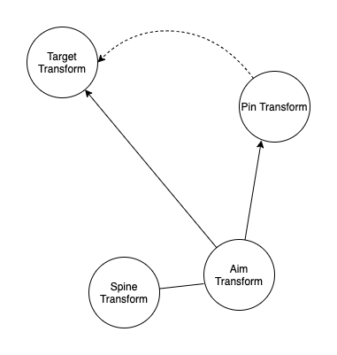

游戏中一个非常重要的概念是游戏循环。在视觉上连续的动画，每一帧在游戏循环（Update）可能都是从头开始计算的。例如每次都从头开始计算到当前时间的状态应该是什么样，然后随着时间流逝，就能产生连续的视觉效果，而实际上每一帧和之前的帧可能没有关系（也可能有，例如依赖于 Time.deltaTime 就是用累积的方法实现连续变化）。游戏循环决定了游戏编程更倾向于轮询而不是状态判断，就像 IMGUI 和 RetainMode GUI 之间的区别。例如移动一个 GameObject 到 target position，通常不会判断 GameObject 到达了 target 就停止移动 GameObject，而是始终保持移动，只是到达 target 之后，移动的差为 0 而已。但是将 GameObject 从 0 移动到 100000 和从 0 移动到 0 是没有区别的，对于游戏引擎工作量都是相等的。游戏编程更倾向于轮询而不是状态判断，根本原因是游戏循环无论如何都要执行，GameObject 在 0 位置处渲染和在 100000 位置处渲染的工作量是完全一样的，每一帧都在执行，因此添加一个判断节省的只是将一个 Vector3 的 value 从 0 变成 1000000 的工作量，而不会节省渲染模型的工作量，而如果不去判断，反而节省了 if 的操作。App 开发中基于状态判断可以节省工作的原因是，App 中繁重的工作确实会因为状态变化可以执行，可以不执行（当没有任何操作时，App 不会重新渲染 UI）。而游戏引擎则是无论如何在每一帧都会将图形缓冲区情况，重新绘制，所有繁重的工作都会重做一遍，不管数据是否有变化。因此基于状态编程在游戏开发中不会节省工作。

IK 在 Blender 制作动画和在 Unity 实现 gameplay 之间的区别，就好像任何图形技术在 DCC（数字内容创造）工具中和在游戏引擎中的区别一样。DCC 中的技术不是实时的，而是用来编辑的，最终输出的内容是静态的，例如 IK 在制作动画时只是用来摆放骨骼的，和手动摆放是等价的，最终输出的动画片段中没有 IK 数据。而游戏引擎中的技术则是需要在 runtime 中实时运行的，例如动画中的 IK，不像在 Blender 中编辑一次就好了，而是在每个 Update 中都实时计算的，这样才能实现 gameplay。

IK 本身是一个瞬间的计算过程，给定一个 bone chains 和 target，计算 bone chains 上各个 bone 的旋转，使得 end effector 接近 target。

Unity（游戏引擎）中的动画 IK 本质上时骨骼动画的 Post Process 后处理。每一帧，动画片段输出数据对骨架中每个 bone 进行 transform（包含了各种 Blending，例如 Layer，BlendTree，Translation，CrossFade）等等。而这些动画数据都是对运行时游戏世界没有感知的，只是输出文件中的数据而已。而 IK 是在动画系统输出数据之后，对骨骼进行后处理，根据世界空间中 target 的位置，调整某个骨骼链 bone chains，使它的 end effector 尽可能接近它的 target。这样的调整可以是一次性的完全应用 IK 效果，也可以通过一个 weight 因子 blending IK 效果。但无论如何，IK 是在每次 Update（LastUpdate）都执行的，它的输入就是当前帧的动画系统输出 pose，和当前帧的 target（target 甚至 pole 都可以运行时动画），然后对相应 bone chain 进行调整（调整可以是完全地应用，也可以是加权的应用）。因此 IK 就像是一个没有状态的函数，它的输入只依赖于当前帧的状态。IK 对 bone chain 的调整只有 rotation，bone chain 上的骨骼只会被 IK 旋转，而且不保证（也不必保证）end effector 达到 target，只确保 end effector 尽可能接近 target（距离最小）。另外还可能有其他系统约束骨骼不能完全旋转到 IK 的效果，例如 Avatar Muscle Setting 定义了每个骨骼的旋转范围。但这是另一种技术，即多个系统混合叠加，最终效果是多个系统的综合。单看 IK 系统 就是对动画系统输出骨骼 pose 的后处理而已。

IK 只旋转骨骼，不保证 end effector 一定位于 target 上，也不必如此，IK 结果只是使 end effector 尽可能接近 target。例如，一个对胳膊骨骼链的 IK，只有在 target 到 bone chain root 的距离小于骨骼链长度时，胳膊才会弯曲，使 hand 握住 target，如果 target 距离 bone chain root 很远很远（长度远超过 bone chain），那么 IK 的结果是胳膊总是笔直地指向 target，因为这样 hand 距离 target 才最小。当 target 距离 root 小于 bone chain 的长度时，胳膊有很多方向可以弯曲，具体选择哪个方向呢？这就是 pole 的作用（和IK 为什么有 Pole 的概念），它作为弯曲方向的提示。当没有 pole 时，按照 bone chain 初始弯曲的方向作为提示，即如果 bone chain 初始就有一定程度的弯曲，那么 IK 弯曲 bone chain 时，也沿着这个方向。否则，就在 root-target-pole 这个平面上弯曲，弯曲的反向朝着 pole。

AimIK 对于保持 objects 稳定地瞄准目标非常好用。不过有时那些 objects 上有很多 swinging 动作，例如挥舞一把剑，而使用 AimIK 保持 sword 在挥舞过程中的朝向一个特定位置不是很好用。

还可能用 AimIK 来重定向挥舞动画例如挥剑或拳击。对这种场景，我们必须告诉 AimIK 每一帧无论当前 animated pose 是怎样的，它都是默认的 aiming pose 的 forward 方向。这可以通过在 AimIK solvers 之前旋转 AimIK 的 Aim Transform 朝向 target，或者调整 AimIK Axis 完成。s

AimIK : IK : SolverManager : MonoBehaviour

AimIK 本身是一个 MonoBehavior 组件，它包含一个 IKSolverAim，用来初始化和运行时更新 Solver 等工作。

AimIK 的成员：

- IKSolverAim solver

IK 的成员：

- IKSolver GetIKSolver()

SolverManager 的成员：

- bool fixTransforms = true
- 在 LastUpdate 中更新 solver

IKSovlerAim : IKSolverHeuristic : IKSolver

IKSolver 的成员：

- float IKPositionWeight
- Vector3 GetIKPosition()
- void SetIKPosition(Vector3 position)
- float GetIKPositionWeight()
- void SetIKPositionWeight(float weight) 
- Transform GetRoot()

IKSolverHeuristic:

- Transform target

  Solver IKPosition 将会自动设置到这个 target 的 position

- flaot tolerance

  当最后一次到达的 position 的最小距离。如果从上一次到达的 position 的距离小于这个 tolerance，将会停止解析。如果 tolerance 为 zero，将会迭代 maxIterations 次

- int maxIterations = 4

- bool useRotationLimits = true

- bool XY：Solve in 2D

- Bone[] bones：bones hierarchy

- bool SetChain(Transform[] hierarchy, Transform root)

- void AddBone(Transform bone)

- void FixTransforms()

IKSolverAim 的成员：

- Transform transform

  要瞄准到 IKPosition（dest）的 transform（source）

- Vector3 axis = Vector3.forward;

  transform 上的瞄准的 local axis

- Vector3 poleAxis = Vector3.up

  transform 上的 local axis，保持在 pole 平面（Up Vector）

- Vector3 polePosition：定义 pole 平面

- float poleWeight

- Transform poleTarget

  如果赋值，自动设置 polePosition 到这个 Transform 的 position，而不是 polePosition

- float clampWeight

  Clamping solver 的 rotation。0 为自由旋转，1 为完全 clamped 到 transform axis

  clampWeight = 1 时，axis 严格瞄准到 transform-IKPosition 的方向，否则允许一定的偏差

- Solve()

Heuristic（启发式）

AimBoxing 脚本：

```C#
public AimIK aimIK; 
public Transform pin; // The hitting point as in the animation
void LateUpdate() {
  aimIK.solver.transform.LookAt(pin.position);
  aimIK.solver.IKPosition = transform.position;
}
```

AimIK 的基本用法是将 spine 添加到 bones，然后选择 spine 的一个 child 作为 Aim Transform，它可以是 character 生物学的 bone，也可以是一个只用来瞄准的辅助 empty gameobject。

在 AimBox 中，AimIK 组件的 bones 被设置为 spine，然后在右肩的位置上放置了一个 Punch Aim Transform，IK 将会将它瞄准到 IK Position（Target）。

pin Transform 被设置为动画本身中拳头打击的位置（没有 IK 效果的时候），它被放置在 Model GameObject（Animator）下面，这样它就能在模型 local space 中保持相对不变。

每帧更新时，动画系统先输出正常数据（静态动画），然后在 LateUpdate 中，AimBoxing 脚本先将 Aim Transform 的方向调整为朝向 pin Transform（IK 前的预处理）。然后设置 IKPosition 为 Target 的 position。AimIK 中没有设置 Target，因此需要脚本手动设置 IKPosition。这样 IK 系统就基于当前 pose，旋转 spine 使 Aim Transform 尽可能到达 Target，但是因为 IK 系统只能旋转骨骼，而 Target 里 Aim Transform 非常远，因此 Aim Transform 不会到达 Target（它挂载在 character 骨骼身上，会带动 spine bone chain 旋转），而是旋转到最接近 Target 的位置。因为它的初始方向是瞄准到 pin Transform（静态动画中拳头打击到的位置）。

AimIK 每一帧都会调整 Aim Transform 朝向 Target，但是其他部分的动画尤其是胳膊可能还不是处于拳击的 pose，只有当胳膊动画播放到拳击的那一帧，拳头才会最接近 Target。但这个过程中始终保持 AimTransform 瞄准到 Target。只要保持 AimTransform 总是瞄准 Target，则当动画到达拳击那一帧的时候，拳头就最接近 Target 了。

这里可以用 AimIK 解决拳击 IK 动画的原理是，Aim Transform 在 IK 之前指向静态动画中拳击时刻拳头的位置。IK 每一帧将 Aim Transform 调整到 Target 方向，这是通过调整 spine 完成的，而相对角度在旋转过程中保持不变。因此 Aim Transform 的实际位置不是非常重要，只要使 spine 旋转方向使静态动画中拳头通过的位置位于 Aim Transform 和 Target 所在的直线上即可。AimBoxing 中 Aim Transform 被放置在右键的位置，但是改为其他位置也是没有问题的，关键是，让 IK 系统将 spine 旋转 AimTransform-PinTransform 到 AimTransform-TargetTransform 的相对角度。



无论是动画，还是 IK，操作的都是骨骼，即 character model 下面的 skeleton hierarchy。Skinned Mesh 是另一个独立的功能，与骨骼操作无关。而 skeleton hierarchy 就是一个简单的 GameObject hierarchy，GameObject 甚至没有任何组件。因此当有一个动画时，甚至不需要 Skinned Mesh，例如直接在 skeleton hierarchy 中的 GameObject 上挂载 Mesh Renderer 渲染一个简单的 Mesh。还有可以在导入的 Skeleton 上的 bone 上挂载新的 GameObject 用来挂载其他 Prop，甚至像这里的例子一样，用作 IK 的 Aim Transform。还有就是 skeleton 可以只操作脖子以下的 SkinnedMesh，而 Head 则使用一个单独的 Mesh，并直接挂载到 Neck GameObject 下面，并且不使用 Skinned Mesh 功能。总之一切一旦到了 Unity 里面，就可以想 Unity 中的任何东西一样使用。
