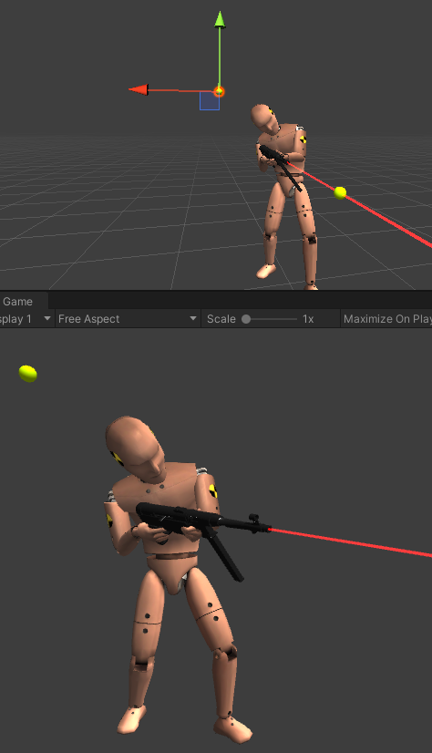
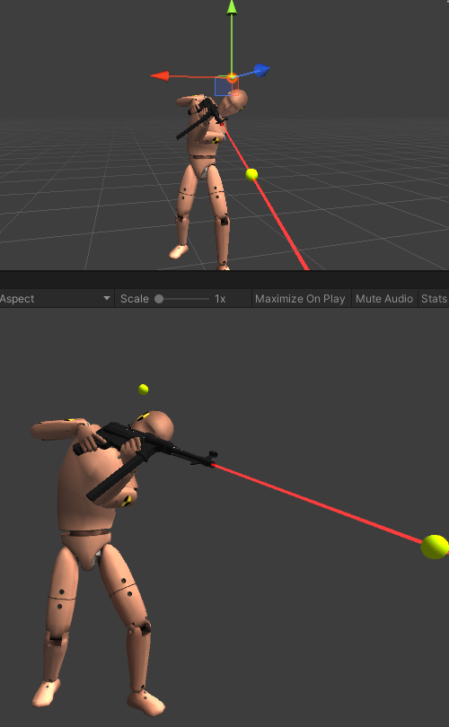

指派 Pole Target，Pole Axis 并在 AimIk 中增加 Pole Weight 的权重，来改变 pole 方向，即 Up Vector。

确保 aiming direction 和 pole direction 绝不会对齐。你不能够将一个 object 的两个 axes 旋转朝向同一个方向。

PoleTarget、Pole Axis、Pole Weight 是 AimIK 的组件属性。

PoleTarget -> 自动设置 solver Pole Position。Pole Positio IKPosition，Source Position 定义了 Pole 平面，Pole axis 位于这个平面上。

