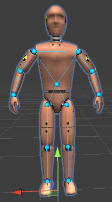

所有的 IK 组件，AimIK、LookAtIK、FABRIK、CCDIK，以及 FBBIK 都是 IK 对象，即一个 Component。

FBBIK 包含一个 IKSolverFullBodyBiped

IKSolverFullBodyBiped : IKSolverFullBody : ISolver

## IKConstraintBend

用于固定一个 node based 的 IK solver 中的 3-segment node chains 的 bend 方向的约束

- Transform bone1
- Transform bone2
- Transform bone3
- Transform bendGoal
- Vector3 direction：bend direction
- Quaternion rotationOffset：bend rotation offset
- float weight：如果 weight 是 1，将会覆盖 effector rotation，而且 joint 将会在这个方向上旋转。这允许独立于 effector rotation 直接操作 bend direction

## FBIKChain.ChildConstraint

FBIKChain 中 child chains 之间的线性约束

- CildConstraint(Transform bone1, Transform bone2, float pushElasticity, float pullElasticity)
- float pushElasticity：push 的弹性
- float pullElasticity：pull 的弹性
- void Solver(IKSolverFullBody solver)

## FBIKChain.Smoothing 枚举

- None
- Exponential
- Cubic

## FBIKChain

FBIKChain 用于模拟 Body 上的一个 bone chain。IKSolverFullBody 中的一个 bones chain

- float pin：pin weight。如果接近 1，chain 将被 child chains 影响更少
- float pull：pull parent chain 的权重
- float push：当 end-effector 接近时 shoulder/thigh（肩/大腿）时， end-effector pushing 其的权重
- float pushParent：传导 transfer 到 parent 的 push force 的程度（从 hand 或 foot 到 body）
- float reach：只用于 3-segmented chains（等价 IKSolverLimb），pulls 第一个 bone 接近第三个 bone
- Smoothing reachSmoothing：牺牲一些精确性来平滑 Reach 效果
- Smoothing pushSmoothing：平滑 Push 效果
- IKSolver.Node[] nodes：chain 上的 nodes
- int[] chindren：child chains
- ChildConstraint[] childConstraints：child constraints 用于诸如固定 left upper arm 和 right upper arm 的距离的场景（Blender 中的 distance 约束，约束都是独立的系统，一个接着一个地独立的执行约束逻辑）
- IKConstraintBend bendConstraint：获得 bend constraint（如果 chain 有 3 个 segments）

## IKMapping.BoneMap

包含一个 bone 的 mapping 信息

- Transform transform：bone 的 transform
- int chainIndex
- int nodeIndex
- Vector3 defaultLocalPosition：记录 bone 的初始（默认）位置
- Quaternion defaultLocalRotation
- Vector3 localSwingAxis, localTwistAxis, planePosition, ikPosition
- Quaternion defaultLocalTargetRotation
- float length
- Quaternion animatedRotation

## IKMapping

映射一个 bone 或一个 bone 集合到一个一个 node based IK solver。

只包含 BoneMap 定义和几个使用方法

## IKMappingSpine : IKMapping

映射一个 bone hierarchy 到被 hip 和 chest planes 定义的两个三角形

- Transform[] spineBones
- Transform leftUpperArmBone
- Transform rightUpperArmBone
- Transform leftThighBone
- Transform rightThighBone
- int iterations：FABRIK 算法的迭代数量。如果有两个 bones 被指派给 Spine，不会被使用
- float twistWeight：平滑地扭转 twisting spine bones 到 chest triangle 的方向的权重。相对昂贵，如果没有太多 spine twist 发生，设置它为 0

## IKMappingLimb : IKMapping

- enum BoneMapType : Parent, Bone1, Bone2, Bone3

  Limb Bone Map 类型

- Transform parentBone：可选的 parent bone（锁骨 clavicle）
- Transform bone1：upper arm 或 thigh
- Transform bone2：forearm 或 calf（小腿）
- Transform bone3：hand 或 foot
- float maintainRotationWeight：维持第三个 bone（hand 或 foot）相对于它在动画中的 rotation（foot 对齐地面）
- float weight：映射 limb 到它的 IK pose 的权重。这可以用于为这个 limb 关闭 IK 效果
- bool updatePlaneRotations：关闭此选项维持 limb bones 相对于其他 bones 的原始采样的 rotations

## IKEffector

Effector 用来维护 node based IK solvers

- Transform bone：被 effector 使用的 node transform
- Transform target：IK 的 target（可选的，也可以直接使用 position 和 rotation）
- float positionWeight
- float rotationWeight
- Vector3 position：effector 在 world space 中的位置
- Quaternion rotation：effector 相对于默认 rotation 的世界空间中 rotation
- Vector3 positionOffset：世界空间中的 position offset。每帧 solver 完成之后，positionOffset 将被重置为 0
- bool effectChildNodes：如果为 false，如果有任何 effector，它将忽略 child nodes
- float maintainRelativePositionWeight：保持 node 相对于被 plane bones 定义的 triangle（chest-spine-hip 三角形） 的 position（只应用于 end-effectors，即 limb 四肢的 effector）
- Transform[] childBones：可选地其他 bones 列表，positionOffset 和 effector 的 position 将会应用到它们上面
- Transform planeBone1：定义 parent plane 的第一个 bone
- Transform planeBone2：定义 parent plane 的第二个 bone
- Transform planeBone3：定义 parent plane 的第三个 bone
- Quaternion planeRotationOffset：被 Bend Constraints 使用

## IKSolverFullBody

- int interations：Solver 迭代的数量
- FBIKChain[] chain：root node chain，所有的 FBIKChain
- IKEffector[] effectors：所有的 effector
- IKMappingSpline spineMapping：映射 spine bones 到 solver（spine）
- IKMappingBone[] boneMappings：映射独立的 bones 到 solver（独立的挂载骨骼，挂载装备）
- IKMappingLimb[] limbMappings：映射 3-segment limbs 到 solver（limb）
- bool FABRIKPass = true：如果为 false，将不会 solve 一个 FABRIK pass，而且 arms/legs 将不能 pull body
- UpdateDelegate OnPreRead：读取 pose 之前调用
- UpdateDelegate OnPreSolve：solving 之前调用
- IterationDelegate OnPreIteration：每次 iteration 之前调用
- IterationDelegate OnPostIteration：每次 iteration 之后调用
- UpdateDelegate OnPreBend：应用 bend 约束之前调用
- UpdateDelegate OnPostBend：应用 bend 约束之后调用
- UpdateDelegate OnStoreDefaultLocalState：当存储默认 local state 时调用（FixTransform 将会重置 hierarchy 到的 state）
- UpdateDelegate OnFixTransforms：当被 solver 使用的 bones 重置到 default local state 时调用

## FullBodyBipedEffector

枚举

- Body
- LeftShoulder
- RightShoulder
- LeftThigh
- RightThigh
- LeftHand
- RightHand
- LeftFoot
- RightFoot

## FullBodyBipedChain

枚举

- LeftArm
- RightArm
- LeftLeg
- RightLeg

## IKSolverFullBodyBiped : IKSolverFullBody

- Transform rootNode：中心 root bone（body）
- float spineStiffness：spine 约束的僵硬程度
- float pullBodyVertical：hand effectors 垂直拉取 body 的权重（相对于 root rotation）
- float pullBodyHorizontal
- IKEffector bodyEffector：获取 body effector
- IKEffector leftShoulderEffector：左肩的 effector
- IKEffector rightShoulderEffector
- IKEffector leftThighEffector
- IKEffector rightThighEffector
- IKEffector leftHandEffector
- IKEffector rightHandEffector
- IKEffector leftFootEffector
- IKEffector rightFootEffector
- FBIKChain leftArmChain
- FBIKChain rightArmChain
- FBIKChain leftLegChain
- FBIKChain rightlegChain
- IKMappingLimb leftArmMapping 
- IKMappingLimb rightArmMapping 
- IKMappingLimb leftLegMapping 
- IKMappingLimb rightLegMapping 
- IKMappingLimb headMapping 

