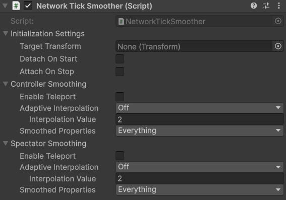

# Tick Smoothers

这些组件在 Tick 之间 smooth 一个 child graphical object。它们用于在大的 physics steps 预测和平滑 graphics。

如果你在 hierarchy 下有多个想要平滑的不同的 graphical 部分，你可以在一个 object 下面放多个 smoother components。一个很好的例子是 vehicle，它的车轮独立于 vehicle body 运动。

Smoother 将放在你想要平滑的 graphical object 上，这个 object 必须不能与 target object 相同，或者 target hierarchy 上更高的 object。只作为 target 的 child 最好。

# NetworkTickSmoother

Network Tick Smoother 组件负责在 network ticks 之间平滑 object 的 transformation 属性。它的注意目的是使 movement，rotation，和 scale，平滑流畅地过渡，即使 network updates 可能在离散的 steps 中到来。

NetworkTickSmoother 使用 NetworkBehaviour callbacks 初始化它的设置，只能放在 NetworkObject 下面。如果你需要对不是 NetworkObjects 的 objects 使用这种形式的 smoothing，应使用 OfflineTickSmoother。

有一些公开的 API 可以在运行时改变 smoother settings。例如改变 adaptive interpolation type（适应性插值类型），interpolation value，或者 teleport（瞬移）smoothed object，以及更多。

## Settings

### Initialization Settings

- Target Transform

  这是你的 graphical object 要 follow 的 transform。这通常是 root NetworkObject，但是当在一个 NetworkObject 下面使用多个 smoothers 时，也可以是其他 nested NetworkBehaviours。

- Detach On Start

  当 enable 时，这会从 smoother 挂载的 object detach，将它作为 root 放在 world space 中。就像 Unity Constraints 组件，两个 object 可以不是 parent-child，关系，同时通过 Constraints 组件约束。

  Detach 通常用于 smoothed object 是 camera target 的情况，给定的 cameras 不能很好处理 rollback 或很大的 tick steps。

- Attach On Stop

  当 enable 时，如果 network stop callbacks 时，重新将 graphical object 挂载到 target object 上，就像 network start callbacks 时 unparent 一样。

  通常你想要 reattach graphical objects。如果在 detached 期间，Target Transform 销毁了，smoother 挂载的 object 也会销毁它自身，就像 parented object 一样。

### Controller Smoothing

Controller Smoothing 设置确定 object 如何为 object 的 controller 进行平滑，这或者是 owner NetworkObject，或者是 server 如果没有 owner。

- Enable Teleport

  允许 graphical object 瞬移（teleport）到 target 的实际位置上，如果 position changes 非常大，很难短时间平滑过去了。理想情况下，你不需要这个设置，但是它是一个你想使用的可用选项。

  - Teleport Threshold：如果 graphical object 的位置距离实际位置（target）超过这个阈值，则 graphical object 会直接 teleport 到 target 位置，不会平滑过去。

- Adaptive Interpolation

  如果 enable，当 local clients 延迟变高时，会适应性增加 interpolation amount（input buffer queue 的数量，相当于流媒体预下载片段更长，因为需要更长的时间才能从 server 获取视频流片段，才能让 buffer 保持不为空，才能让播放器更流畅，只是初始播放延迟增加了）。

  更小的 adaptive interpolation 设置将会以更小的数量增加 interpolation 数量。

  如果 disable，总是使用 Flat 常量的 interpolation 数量。

  Flat interpolation 经常用于竞技游戏，或者反应类游戏 reaction based game（根据网络上的对手操作，考验玩家反应的游戏），来对所有玩家保持一致的 interpolation，这样才能保证公平性，而不是偏向网络差的玩家。

  Flat interpolation 也是精确 collider rollback 必须的，因为 collider rollback system（保存一定数量的 collider 历史位置和旋转，用于回溯历史上的 collider）需要精确地知道一个 client 可以看见的 interpolation（这样才能知道保存多少 frame 的 collider 历史），才能提供精确的 raycast hit 结果。

  Adaptive interpolation 最适合 casual 游戏，那里你会想要绝对平滑的体验，而不管 local client 延迟。

  - Interpolation Value：Flat interpolation amount。当 local client latency 增加时，interpolation 不会增加，保持这个数值。

- Smoothed Properties：

  确定哪些 transform 属性会被 smoothed。如果没有对特定属性设置 smoothing，则那个属性会在 world space 始终保持不变。例如，如果 uncheck Position 并移动 root，则这个组件所在的 object（child object）不会移动，除非你自己移动它。 

### Spectator Smoothing

Spectator Smoothing 与 Controller Smoothing 相对，它确定 object 如何为不是 owner 的 client 进行平滑，所有的设置都一样。

## Scale Smoothing

Scale Smoothing 的行为有一点不同。因为 nested objects 使用 localScale，它们不会随着 parent scale 变化，因此很难进行插值。

如果你想平滑地过渡 scale，必须开启 Detach（可选地加上 Reattach），这样 smoothed object 不会使它的 loosy（global）scale 被 Unity 修改（如果 target transform 或任何更高层级的 transform 改变了它的 scale）。

# Offline Tick Smoother

Offline Tick Smoother 组件确保 non-networked objects 的平滑和视觉上的一致运动，通过在 network updates 之间插值它们的 positions，rotations，和 scale。

OfflineTickSmoother 表现地就像 NetworkTickSmoother，除了它使用 InstanceFinder 初始化它的设置，并放在哪些不是 networked 的 objects 下面。

它负责在 network ticks 之间平滑一个 offline object 的 transformation 属性。

属性的意义和 NetworkTickSmoother 一样。

因为 non-networked object 不能被 owned，因此相比 NetworkTickSmoother，它只有一个 Smoothing Settings，只对 non-owner clients（所有 clients）。NetworkTickSmoother 对 Controller 和 Spectator 有单独的 Smoothing 设置。

这从另一个方面说明，Fishnet 不是：Controller 收集输入发送给服务器（它自己不执行），然后服务器执行输入，然后将 Input Data 发送给所有 clients（包括 Controller）统一执行（Replay）。

而是：Controller 收集输入后，先自己执行，然后将 Input Data 发送给服务器，服务器执行输入，然后将 Input Data 发送给除了 Controller 的所有 clients 进行重放动作。同时 server 已经更新的权威状态，发送完 Replicate 之后，发送 Reconcile，同所有 clients 同步 server 的权威状态。

# Misc

Smoother 组件同步 graphical 和 target，不管 target 是如何运动的，无论它是通过 NetworkTransform 同步的，还是通过 PredictionRigidbody 同步的，还是通过手动同步的（Rpc，Broadcast）。它只负责将 graphical object 的 transform 想 target transform 平滑过渡。
