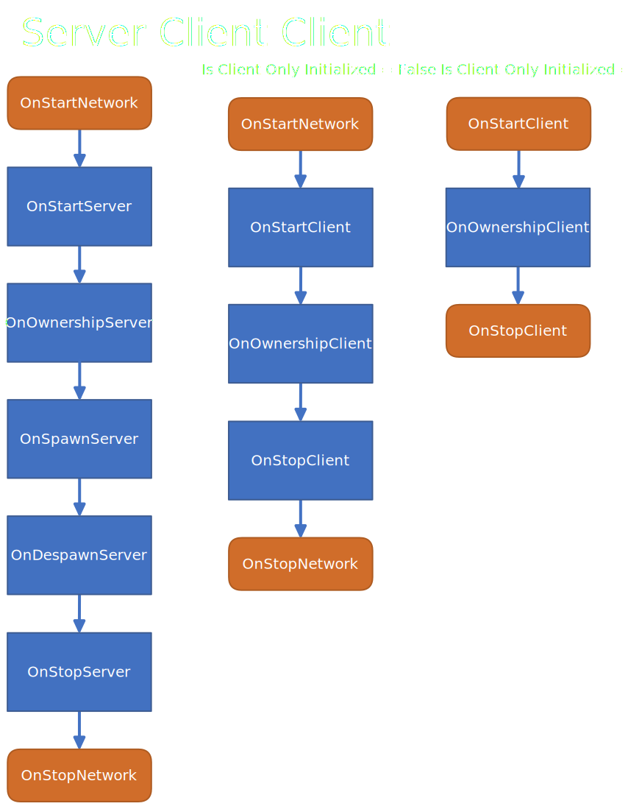
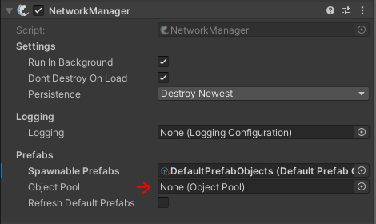
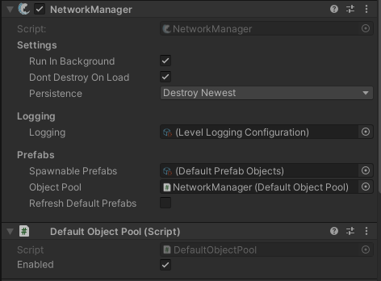
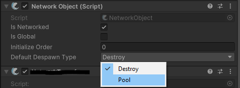

## NetworkObject

### NetworkObject

任何具有 NetworkObject 的 GameObject，被称为 NetworkObject。

当你添加一个 NetworkBehaviour 组件到 prefabs 或 scene objects 上，networkBehaviour 会在这个 object 或 parent objects 中搜索一个 NetworkObject。如果没有找到 NetworkObject，则会在 top-most object 上自动添加一个。

### Spawned NetworkObject

使用 ServerManager.Spawn() 方法 Instantiated 和 Spawned 的 NetworkObjects 称为 Spawned NetworkObject。在 NetworkObject 组件内部，IsSpawned 属性被标记为 True。

### Scene NetworkObject

任何作为 Scene 一部分的 NetworkObject（即不会在 scene 中 instantiated/spawned），称为 Scene NetworkObject。在 NetworkObject 组件内部，IsSceneObject 属性被标记为 True。

### Global NetworkObject

任何 IsGlobal 标记为 true 的 NetworkObject（无论是在 inspector 中还是在 code 中）都被称为 GlobalNetworkObject。

当在 server 上实例化以及在 clients 上 spawned 时，GlobalNetworkObjects 会自动放在 DontDestroyOnLoad scene 中。

Scene Objects 不能被标记为 global。所有 global objects 必须被标记为 instantiated 或 spawned。

### NestedNetworkObject

任何作为 NetworkObject child 的 NetworkObject，被称为 Nested NetworkObject，NetworkObject 组件内部 IsNested 属性被标记为 true。

Fishnet 允许在 scene 和 prefabs 中嵌入 NetworkObjects。

当 spawning 一个 root NetworkObject，任何 active 的 nested NetworkObjects 也会被 spawned。Nested NetworkObjects 会经历和 root 相同的 callbacks，以及共享相同信息，例如 IsOwner。

你可以在 Scene 或 Prefab 中有 deactivated 的 Nested NetworkObjects，稍后再 spawn 它们。

当 Nested NetworkObject 再 root 被 spawned 之后 spawned，owner 信息不会自动假设为 root 的 owner。你必须再调用 Spawn 时指示 client 是否应该获得 ownership。

在 Instantiating Prefab 和 Spawning Root Network Object 之间（这是两个步骤，第一个步骤先实例化 Prefab，然后调用 Server.Spawn 在网络上 Spawn 它），你可以改变 Nested NetworkObjects。这包括 SyncTypes，甚至 object 的 active 状态。这些修改在 root spawned 时自动同步。

Instantiating Prefab：是标准地在 Unity Scene 中实例化 Prefab 为 GameObject

Spawning NetworkObject：是调用 Server.Spawn 在网络上（所有客户端）生成这个 NetworkObject

NetworkObject 首先是普通的 GameObject，可以先存在于 Scene 或 Prefab 中，只有调用了 Server.Spawn 之后，它才会在其他 Clients 中生成。

```C#
//An example of changing the enabled state for NestedNob.
public GameObject MyPrefab;

private void SpawnPrefab()
{
    GameObject go = Instantiate(MyPrefab);
    GameObject nestedNob = go.transform.GetChild(0);
    nestedNob.SetActive(false);
    //MyPrefab will spawn with NestedNob disabled for server and all clients
    //until you spawn it at a later time.
    base.Spawn(go);
}
```

Nested NetworkObjects 可能被 spawned 或 despawned，但是它们不应该 detached。有一个例外是 nested scene NetworkObjects，它们可以被 detached。

## NetworkBehaviour

NetworkBehaviours 是 networking 的一个基础部分，它允许你很容易地同步数据，以及访问网络相关的信息。

当从 NetworkBehaviours 继承时，你就是在指示你的脚本会以某种方式利用网络。一旦 NetworkBehaviour 脚本添加到 object，NetworkObject 组件会自动 attached。

NetworkBehaviours 时 RPC，Sync 的基础，并且访问关键的网络信息。

### Properties

NetworkBehaviour 有一些 public 属性，其中很多你会经常使用。绝大部分属性只在 object 被初始化之后才可用。

- 如果作为 client，并且 network 已经被初始化，IsClientInitialized 为 true
- 如果作为 server 并且 network 已经被初始化，IsServerInitialized 为 true
- 如果作为 client 和 object 的 owner，IsOwner 为 true
- 如果作为 owner，或者作为 server 并且没有 owner，HasAuthority 为 true

### Callbacks

实现 Callback 时不需要包含 base.XYZ()。

绝大多数 callback 都有 server 和 client version，每个都有极大的潜力。要使用 callback，你必须继承 NetworkBehaviour，然后 override 想要使用的 callback。

```C#
public override void OnStartServer()
{
    // 当 server 初始化这个 object（NetworkBehaviour 所在的 Network Object）时运行
}
```

Spawn 相关的 callback 的执行顺序是不变的，但是一些 callbacks 可能在任何时间发生。

Unity Awake 和 OnEnable callbacks 总是在任何 network 活动（callback）之前发生。



- Server

  1. OnStartNetwork 初始化网络
  2. OnStartServer 初始化服务器
  3. OnOwnershipServer 获得 NetworkObject 拥有权时初始化
  4. OnSpawnServer NetworkObject 在网络上生成时初始化
  5. OnDespawnServer NetworkObject 在网络上销毁时初始化
  6. OnStopServer 服务器终止时调用
  7. OnStopNetwork 网络终止时调用

- Client(IsClientOnlyInitialized = False)

  1. OnStartNetwork 初始化网络
  2. OnStartClient 初始化客户端
  3. OnOwnershipClient 获得 NetworkObject 拥有权时初始化
  4. OnStopClient 客户端终止时调用
  5. OnStopNetwork 网络终止时调用

- Client(IsClientOnlyInitialized = True)

  1. OnStartClient 初始化客户端
  2. OnOwnershipClient 获得 NetworkObject 拥有权时初始化
  3. OnStopClient 客户端终止时调用

- OnStartNetwork

  一些 instances 中，你需要为 server 和 client 进行初始化。你可以通过 OnStartNetwork 而不是 OnStart 来为 Client 和 Server 节省一些 code 和时间。

  OnStartNetwork 只会调用一次，即使是 clientHost。

  ```C#
  public override void OnStartNetwork()
  {
      /*
      如果希望在这个方法中检查 ownership，不要使用 base.IsOwner，使用下面的代码。
      存在这个区别是为了支持 clientHost 条件。
      */
      if (base.Owner.IsLocalClient)
        SetupCamera();
  }
  ```

- OnStartServer

  ```C#
  这个 callback 首先执行。当 object 在 server 上初始化时发生。
  一旦调用这个 callback，Owner，ObjectId，已经更多属性就都设置好了。
  OnStartServer 最适合初始化脚本中的 server 方面，例如获取只有 server 需要的组件。
  它还可以用于基于游戏的当前状态设置 values。如果你在这个方法中改变 sync values，例如 SyncTypes，
  当这个 object 为 clients spawn 这个 object 时，这些改变会发送到 clients。
  例如：或许你想设置一个 player 的名字，它是一个 SyncVar。你就可以在这里做。当 object 在 client 上 spawn 时，这个变量将为 clients 设置。

  在使用 OnStartServer 时需注意：此时观察者（observers）尚未为这个 object 构建。例如，若尝试发送一个 ObserversRpc 调用，该调用将不会传递给任何客户端。不过，您仍可使用 ObserversRpc 并设置 BufferLast 参数为 true——这样当对象为客户端生成时，客户端仍能接收到该调用。（即此时为 object 调用 ObserversRpc，并不会发送到 clients，但是会缓存起来，当 observers 为 object 构建时，会将缓存的 rpc 发送给 clients）
  
  另一种方案是使用下文展示的 OnSpawnServer 方法，并向生成该对象的 connection 发送一个 TargetRpc 调用。
  ```

  对于 clientHost（Host 模式的 Instance 上），即使 object 已设置所有者（owner），客户端的 base.IsOwner 也不会返回 true。这是因为 IsOwner 是客户端侧的判断逻辑，而此时客户端尚未完成该对象的初始化。

  若你需要在 Host 模式中的 OnStartServer 中检查所有权归属，应改用 base.Owner.IsLocalClient 进行判断。

- OnOwnershipServer

  ```C#
  public override void OnOwnershipServer(NetworkConnection prevOwner)
  {
      /*
      当服务器将对象所有权转移给客户端时，会触发该回调。
      若在对象生成时某客户端获得所有权，OnOwnershipServer 会在 OnStartServer 调用后立即执行。
      prevOwner 参数表示刚刚失去所有权的连接。
      此外，当所有权在运行时被动态修改时，也会触发此回调。
      */
  }
  ```

- OnSpawnServer

  ```C#
  public override void OnSpawnServer(NetworkConneciton connection)
  {
      /*
      当该对象的生成消息成功发送至客户端后，系统会触发此回调函数。
      OnSpawnServer 在 server 上调用。当 object 在所有客户端彻底生成后，这个对象就算完全在网络上 spawned 了。因此在 server 上调用 OnSpawnServer 指示 server 已经完全生成了。
      例如：若某个对象需要同时对五个客户端可见，那么这个回调函数就会被调用五次——每次调用时传入的连接参数都会对应不同的客户端实例。
      该回调函数的主要用途是向正在生成该对象的特定客户端发送定制化的通信数据。
      */
  }
  ```

- OnDespawnServer

  ```C#
  public override void OnDespawnServer(NetworkConnection connection)
  {
      /*
      OnDespawnServer 与 OnSpawnServer 类似，不同之处在于它会在对象为客户端销毁（despawn）​前被调用。
      该方法可用于在客户端收到销毁消息前，向客户端发送相关信息，甚至发送该对象的面向对象通信内容（如 SyncTypes、RPCs 等）
      */
  }
  ```

  当服务器销毁（Despawn）一个 NetworkObject 时，所有待同步的变更数据都会随销毁消息一并发送给客户端。这能确保客户端在对象被销毁前，即使存在延迟，也能接收到最新的数据状态。

- OnStopServer

  ```C#
  public override void OnStopServer()
  {
      /*
      这是服务器端的最后一个回调函数。
      在对象即将被反初始化（deinitialize）前，系统会立即调用 OnStopServer。
      此时再向客户端发送针对该对象的特定通信已经为时过晚。
      虽然这个回调函数可以用于多种用途，但在场景对象销毁时重置同步值（如 SyncTypes）等操作，正是它的一个典型应用场景。
      */
  }
  ```

以下是客户端回调的相关说明。这些回调函数的执行始终晚于服务器端回调——即便在作为主机（Host）运行时也是如此。例如，典型的回调顺序可能如下：OnStartServer → OnOwnershipServer → OnSpawnServer → OnStartClient → OnOwnershipClient。

客户端回调与服务器端回调大体相同，唯一的区别在于它们仅在客户端连接成功建立后才会触发。因此，在各回调函数的说明中，我们将仅重点阐述它们之间的关键差异。

- OnStartClient

  ```C#
  public override void OnStartClient()
  {
      /*
      当对象对某个客户端可见时，该客户端会触发此回调。
      需要注意的是，在此回调执行前，诸如所有者（Owner）、对象ID（ObjectId）以及同步类型（SyncTypes）等网络同步属性早已完成同步。
      */
  }
  ```

  任何 buffered 的 rpc 会在 OnStartClient 之后调用。

  对比 Mirror 的 OnLocalPlayer，Fishnet 中应该使用 OnStartClient + base.IsOwner 检查。

- OnOwnershipClient

  ```C#
  public override void OnOwnershipClient(NetworkConnection prevOwner)
  {
      /*
      当前所有者可通过 base.Owner 获取。
      prevOwner 则记录了失去所有权的连接对象——若此前不存在所有者，则该值为 -1。
      */
  }
  ```

- OnStopClient

  ```C#
  public override void OnStopClient()
  {
      /*
      与服务器端类似，该回调在对象即将被反初始化（deinitialized）前被调用。此时再向服务器发送针对该对象的通信已为时过晚。
      */
  }
  ```

- OnStopNetwork

  ```C#
  public override void OnStopNetwork()
  {
      /*
      在 OnStopServer 和 OnStopClient 之后调用。
      */
  }
  ```

## Spawning and Despawning

要在网络中保持对象的存在，必须满足两个条件：首先，该对象需要挂载 NetworkObject 组件；其次，必须通过服务器进行生成。生成对象的流程分为两步：先实例化对象 Insstantiate，再调用 Spawn 方法将其生成。为方便开发者使用，系统提供了多种 Spawn 方法可供选择，这些方法最终都能实现相同的生成效果。

Networked addressable prefabs 需通过不同于常规方式注册到 NetworkManager。

Spawning Without an Owner 通过传递 owner=null 完成，或者简单地不传递 owner 参数。

```C#
GameObject go = Instantiate(_yourPrefab);
InstanceFinder.ServerManager.Spawn(go, null);

GameObject go = Instantiate(_yourPrefab);
InstanceFinder.ServerManager.Spawn(go);
```

若要指定 owner Spawning

```C#
GameObject go = Instantiate(_yourPrefab);
InstanceFinder.ServerManager.Spawn(go, ownerConnection);
```

还可以在任何继承 NetworkBehaviour 的脚本中访问 spawn 方法，或者通过访问 NetworkObject.

```C#
GameObject go = Instantiate(_yourPrefab);
base.Spawn(go, ownerConnection); //networkBehaviour.
//or
networkObject.Spawn(go, ownerConnection); //referencing a NetworkObject.
```

Despawning 可以和 spawning 一样的方式访问。通过一个 NetworkBehaviour 脚本，或者一个 NetworkObject 引用，或者直接通过 ServerManager。

```C#
base.Despawn(); //NetworkBehaviour，Despawns the NetworkObject
networkObject.Despawn(); //通过引用一个 NetworkObject
InstanceFinder.ServerManager.Despawn(gameObject); //通过 ServerManager
```

当 despawning 时，你可以选择 pool 这个 object，而不是销毁它。有一些可选参数来改变这个行为。

```C#
base.Despawn(DespawnType.Pool)； // Pool 这个 object，而不是销毁它
```

您可以通过检查 NetworkBehaviour 或 NetworkObject 中的 IsSpawned 属性，随时判断一个对象是否处于已生成状态。

场景对象（Scene Objects）的生成与销毁机制与普通实例化对象类似，不同之处在于：需要传入已实例化/已放置的场景对象引用。当场景对象被销毁时，系统会将其禁用（Disabled）而非彻底销毁（Destroyed）。

### Spawn Payloads

Spawn Payloads 允许开发者在对象生成调用时附带传输额外信息。

NetworkBehaviour 组件支持写入和读取附加数据，并能将这些 data 与 NetworkObject 的 Spawn Payloads 一同发送。这一机制对于同步对象的初始状态特别有用。

要实现该功能，需要重写 NetworkBehaviour 中的 WritePayload 和 ReadPayload 方法。

当 writing 和 reading 时，读取和写入的数据的顺序和数量非常重要，必须完全相同。

#### Write Payload

WritePayload方法的第一个参数必须是NetworkConnection类型——该参数表示生成操作的目标客户端，由FishNet在调用方法时自动提供。
第二个参数应为Writer类型，它代表当前正在使用的写入器引用，你需要通过它向生成载荷（Payload）中写入数据。

```C#
public override void WritePayload(NetworkConnection connection, Writer writer)
{
    // Writes the string stored in the class variable playerName to the spawn payload.
    writer.WriteString("playerName);
    // Writes the integer 42 to the payload.
    writer.WriteInt32(42);
}
```

#### Read Payload

ReadPayload方法的第一个参数必须是NetworkConnection类型——该参数表示当前生成操作的目标客户端，由FishNet在调用方法时自动传入。

第二个参数应为Reader类型，它代表正在使用的读取器引用，您需要通过它从生成载荷（Payload）中提取数据。

```C#
public override void ReadPayload(NetworkConnection connection, Reader reader)
{
    // Reads a string from the payload. Since a string was written first it must be read first too.
    playerName = reader.ReadStringAllocated();
    // Reads an integer from the payload.
    playerScore = reader.ReadInt32();
}
```

#### More Advanced Example

```C#
public class SpawnPayloadExample : NetworkBehaviour
{
    private ArraySegment<byte> _cachedPayload = ArraySegment<byte>.Empty;

    public override void WritePayload(NetworkConnection connection, Writer writer)
    {
        /* If you are using predicted spawning and want to write the
         * payload if you are the spawning client, this might help!
         */
        bool isPredictedSpawner = NetworkObject.PredictedSpawner.IsLocalClient;

         /*
         * 需要特别说明的是：即使是在预测生成（predicted spawn）的情况下，服务器在为客户端生成对象时仍会调用WritePayload方法。
         * 当客户端发起预测生成请求时，服务器不仅会接收该预测生成的ReadPayload数据，同时还会获得向其他非预测生成者客户端发送载荷的机会。
         * 若您需要转发预测生成者的载荷数据，建议先将这些值在本地缓存，再通过本方法进行发送。
         */

        if (isPredictedSpawner)
        {
            // As the predicted spawner let's write our own payload!
        }
        // If not the predicted spawner, we are the server sending a payload to other clients.
        else
        {
            // Write our cached payload, or don't, send whatever you want!

            // Check if not empty first.
            if (_cachedPayload != ArraySegment<byte>.Empty)
                writer.WriteArraySegmentAndSize(_cachedPayload);
        }
    }
    
    public override void ReadPayload(NetworkConnection connection, Reader reader)
    {
        /* You can also check if the payload is coming from the predicted spawner as well.
         *
         * ReadPayload would be first called on the server, and if the connection IsValid, we know
         * that the connection is a predicted spawner, as that is the only time connection would be
         * valid on the server.
         */
        bool isFromPredictedSpawner = IsServerStarted && connection.IsValid;

        /* Another way using a similar workflow to WritePayload. */
        bool isFromPredictedSpawner = IsServerStarted && connection == NetworkObject.PredictedSpawner;

        /* When the connection is not valid, as noted in the parameter comments, this means
         * the server is the sender.
         */
        bool isFromServer = !connection.IsValid;

        /* If you're the server and wish to cache a payload received from a predicted spawner,
         * this is the place to do it. We are caching into an arraysegment named _cachedPayload --
         * see WritePayload on how to forward this to other clients. 
         */
        if (isFromPredictedSpawner)
        {
            int readerStart = reader.Position;

            // Do all your reads as you would.

            int readAmount = reader.Position - readerStart;
            //Let's use a pooled array so we don't allocate.
            byte[] payload = ArrayPool<byte>.Shared.Rent(readAmount);
            /* Copy into payload array from where the reader started, up to to
             * the calculated readAmount. 
             */
            Array.Copy(reader.GetBuffer(), sourceIndex: readerStart, payload, destinationIndex: 0, readAmount);

            _cachedPayload = new(payload, 0, readAmount);

            // /* You will probably want to return the rented array when OnStop callbacks occur. */
            // if (_cachedPayload != ArraySegment<byte>.Empty)
            //     ArrayPool<byte>.Shared.Return(_cachedPayload.Array);
        }
    }
}
```

### Predicted Spawning

预测生成（Predicted Spawning）允许客户端在本地立即生成对象并直接使用网络功能（包括RPC调用），无需等待服务器确认。

这与预测运动类似。预测运动是，客户端在收到 player 输入后，立即在本地按照预测开始角色的移动，同时向 server 发送输入，等到 server 传回权威运动状态后，在 recoil 到权威状态，使得客户端玩家感受更加平滑。预测生成测试预测另一种情况，就是客户端收到 player 输入后，应该生成新的 object（例如手雷、技能）等等，为了让玩家感受更加平滑，客户端直接预测生成这个 object，同时向 server 发送输入，而不是等到 server 传回权威确认信息再生成这个 object。

当前版本中，预测生成（Predicted Spawning）在生成过程中暂不支持嵌套操作。我们计划在4.0版本的开发过程中移除此限制。

"预测生成"（Predicted Spawning）这一术语同样包含"预测销毁"的含义——即在等待服务器响应期间，客户端可先行本地销毁对象。

#### Global Settings

默认情况下，预测生成（Predicted Spawning）功能处于禁用状态。如需启用该功能，您必须通过ServerManager调整相关设置。若项目中尚未添加ServerManager组件，则需先将其挂载到NetworkManager对象上才能进行设置修改。

您可以通过以下方式配置该功能：

- 在ServerManager组件中勾选"Allow Predicted Spawning"选项以启用预测生成
- 调整"Reserved Object Ids"数值参数

#### Settings Per Object

即使全局启用了预测生成（Predicted Spawning），仍需为每个NetworkObject单独设置允许预测生成或销毁的选项。这样做有三个重要意义：其一，可以确保只有您指定的对象才能使用该功能；其二，能够针对不同对象限制预测生成的能力范围；其三，允许您通过自定义代码对预测生成过程进行更严格的验证和控制。

若需要对预制体（Prefabs）或场景对象启用预测生成功能，请为其添加PredictedSpawn组件。

您可以通过继承PredictedSpawn组件来实现方法重写，从而自定义预测生成的行为逻辑。

#### Using Predicted Spawning

在全局启用并针对特定对象配置后，客户端即可像服务器一样执行预测生成（Predicted Spawning）和预测销毁（Predicted Despawning）操作。所有原有的生成与销毁方法均可直接使用，甚至包括指定对象生成时的所有权归属等高级功能。

### Object Pooling

Fish-Networking 内置了对象池功能，可使服务器和客户端将已加载预制体的实例保留在内存中以供后续使用。这有望为服务器和客户端提供更高效的 spawning 性能。

#### General

在使用 FishNet 反注册（Despawning）已生成的网络对象（NetworkObjects）时，与其直接销毁对象，你可能更希望将其禁用并存储起来，以便后续重复利用。这正是对象池（Object Pooling）的核心机制。

FishNet 提供了默认实现，允许你将已实例化的对象禁用并加入对象池，而非直接销毁。该功能同时适用于客户端和服务器端。

此外，你还可以预先加载（Pre-warm）资源以备后续使用，具体方法将在本指南后续部分详细说明。

提醒：Scene中的NetworkObjects不会被添加到对象池中，当它们被销毁（Despawn）时，系统会直接将其禁用而非真正销毁。

#### Setup

如【NetworkManager组件】页面所述，该组件提供一个可分配字段（名为ObjectPool）。您可以在此处指定任何继承自ObjectPool基类的脚本。

默认情况下，在编辑器中查看NetworkManager时，此字段不会预置任何内容。但当进入播放模式时，NetworkManager会自动填充默认实现方案，并将该脚本挂载到NetworkManager所属的游戏对象上。

具体界面可参考下方NetworkManager的屏幕截图

Editor Mode：什么都不分配，除非你实现自己的 Object Pool



Play Mode：自动分配默认 Object Pool



默认情况下对象池处于启用状态，但网络对象只有在修改默认回收行为或通过显式调用回收方法时才会使用该池。以下是这两种情况的示例说明。

- Default Despawn Behaviour

  在NetworkObject组件上，可以设置该脚本所在对象的默认回收行为。

  此设置默认为"销毁"模式，若希望Fish-Networking框架自动使用默认对象池，请务必将其切换为"池化"模式。

  

- Manual Despawn Behaviour

  对于特定情况可以手动改变 despawn behaviour。

  ```C#
  //When calling Fishnets Despawn from any location you can pass a enum 
  //perameter to deviate from the default behavior.
  ServerManager.Despawn(nob, DespawnType.Pool);
  ```

- Spawning NetworkObjects

  在使用对象池时，您需要在网络生成（spawn）这些对象之前，先从池中获取NetworkObject实例。这样做可以从对象池中复用对象，而不是创建新的实例。

  ```C#
  //There are many overrides which can a variety of information.
  //You can use GameObjects, NetworkObjects, PrefabIds, CollectionIds,
  //spawn positions, and more.
  NetworkObject nob = NetworkManager.GetPooledInstantiated(...);
  //Spawn normally.
  ServerManager.Spawn(nob);
  ```

  如果确定某个特定对象不需要使用对象池，仍然可以采用上述代码实现方式，只需在NetworkObject组件中将"默认回收类型"设置为"销毁"，或者直接通过常规方式实例化并生成该对象。

#### Pre-Warming the ObjectPool

如果需要在运行时使用前手动将网络对象存入对象池，可以通过NetworkManager提供的API实现这一操作。

即预先在对象池中创建一组 Object，等待被使用。

以下是对象池预热（pre-warming）的基础实现示例。

```C#
[SerializeField]
private NetworkObject _nobPrefab;

private void Start()
{
    /// <summary>
    /// Instantiates a number of objects and adds them to the pool.
    /// </summary>
    /// <param name="prefab">Prefab to cache.</param>
    /// <param name="count">Quantity to spawn.</param>
    /// <param name="asServer">True if storing prefabs for the server collection.</param>
    InstanceFinder.NetworkManager.CacheObjects(_nobPrefab, 100, IsServer);
}
```

#### Custom Implementation

FishNet允许用户自定义对象池实现方式。具体步骤如下：  

1. 创建一个继承自`ObjectPool`类的自定义类；  
2. 将该类的组件放入场景中（通常直接挂载到`NetworkManager`对象上）；  
3. 在`NetworkManager`中，将自定义组件赋值给`ObjectPool`字段。