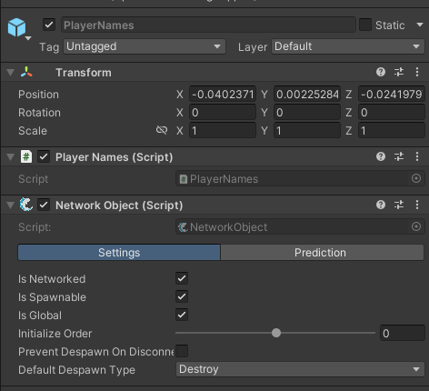
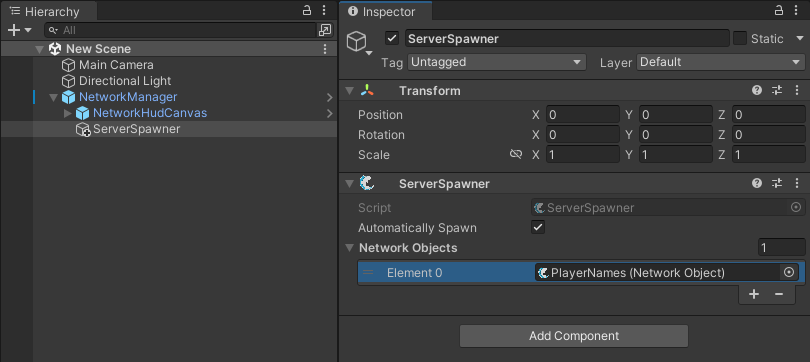

理解如何使用 ownership，以及它如何影响 clients 和 server 对任何 project 是至关重要的。

## What is Ownership?

所有权是 Fish-Net 的核心概念，用于确定哪个客户端拥有对某个对象的控制权。

在 Fish-Net 中，每个 NetworkObject 都可以被分配给一个客户端作为其所有者，或者该对象也可以没有分配所有者。只有服务器有权限更改对象的所有权，不过服务器本身不能成为任何对象的所有者。

当某个客户端拥有一个对象时，它就被视为该对象的合法使用者，可以执行诸如移动角色或使用武器等操作。所有权也可以临时授予，用于与世界对象的交互，比如操作炮塔。

所有权检查对于确保对对象的正确控制至关重要。常见场景包括：

- 验证某个客户端是否有权操作某个对象
- 检查玩家相关数值（如名称或分数）的所有权状态
- 确保只有所有者才能执行特定的网络调用（例如 ServerRpc）

**只有具有所有权的 client 才可以对 NetworkObject 执行 ServerRpc，即请求 Server 对这个对象执行操作**

**每个 client 只能对自己拥有 ownership 的 NetworkObject 向 server 发送 rpc 请求**

## 分配所有权

Ownership 有几种方式授予：

- 带所有权生成 Spawning with Ownership：当创建一个 object，ownership 可以被分配给特定 connection

  ```C#
  Gameobject go = Instantiate(_yourPrefab);
  InstanceFinder.ServerManager.Spawn(go, ownerConnection);
  ```

- 改变或新加 Ownership：如果 object 已经 spawned，ownership 可以在任何时候修改。之前的 owners 被新的 owner 取代

  ```C#
  networkObject.GiveOwnership(newOwnerConnection);
  ```

- 移除 Ownership：Ownership 可以在需要的时候从 client 回收

  ```C#
  networkObject.RemoveOwnership();
  ```

ownerConnection 和 newOwnerConnection 代表一个 NetworkConnection，其被设置为新的 owner。

## 检查所有权 Checking Ownership

Ownership 可以通过 NetworkObject 或 NetworkBehaviour 属性检查：

```C#
base.IsOwner; // 如果 local client 拥有这个 object，返回 true
base.Owner; // 获取当前 owner 的 NetworkConnection
base.IsController; // 如果是 local client 并且拥有这个 object，或者是 server 并且没有指定任何 owner，返回 true
```

## Simple Movement Example

客户端必须拥有对象的所有权才能执行特定操作。以下是一个仅限对象所有者执行的移动逻辑示例：

```C#
void Update()
{
    // The client's game instance will have several player objects in it if there 
    // are multiple players playing, but he will only own one of them and should
    // should only move that one that he owns.
    if (base.IsOwner)
    {
        float hor = Input.GetAxisRaw("Horizontal");
        float ver = Input.GetAxisRaw("Vertical");
        transform.position += new Vector3(hor, 0f, ver);
    }
}
```

当该移动逻辑与设置为"客户端权威"模式的网络变换组件（Network Transform）配合使用时，玩家的移动操作将被发送至服务器，并在所有客户端之间同步。

## Transferring Ownership

只有 server 可以 assign，transfer，remove ownership。典型地，ownership 在 spawning object 时授予。

- 自动分配所有权：PlayerSpawner 脚本（位于 NetworkManager 预制体中）会确保生成的玩家对象由其对应的客户端持有所有权。
- 立即分配所有权：若客户端需要即时获得所有权（例如无延迟地控制炮塔），可使用 PredictedOwner 组件。该组件支持扩展以实现自定义逻辑。

## 使用 Ownership 读取 values

这个指南要求在 ServerManager 上启用共享 ID（Share Ids），即服务器与所有客户端共享所有的 ClientIds，这样客户端能知道其他客户端（Conneciton）的 ID，然后可以通过 ID 读取其他 player 的信息。共享 ID 默认处于启用状态，且不会向客户端泄露任何敏感信息。

我们将演示如何为每个客户端分配显示名称，并将该名称显示在玩家对象上。

这里假设 scene 中已经有 NetworkManger object.

### PlayerNames

首先，在空场景对象上创建一个新脚本并命名为 PlayerNames；该脚本需要继承 NetworkBehaviour 类。

将脚本添加到场景对象后，系统会自动为同一对象添加 NetworkObject 组件。请在 NetworkObject 组件中启用「全局同步」选项，将该对象制作成预制体，然后从场景中删除该对象。



请注意，在 NetworkObject 组件中我们还将初始化顺序（Initialize Order）设为 -128。这样做能确保该 NetworkObject 优先于其他所有对象完成初始化，从而保证其 OnStart 回调在其他脚本之前执行。虽然这一步骤通常并非必需，但考虑到该脚本本质上是用于管理玩家名称的全局控制器，赋予其更高的执行优先级是推荐的最佳实践。

NetworkConnection 也是可以序列化并在网络上传递的，共享 ID 就是共享这些 NetworkConnection。

然后以下面的 code 填充 PlayerNames 脚本：

```C#
using System;
using FishNet.Connection;
using FishNet.Object;
using FishNet.Object.Synchronizing;
using FishNet.Transporting;
using Random = UnityEngine.Random;

public class PlayerNames : NetworkBehaviour
{
    /* Since this is a syncType it will automatically be synchronized to clients
     * whenever it updates, and when clients spawn this object! */
    
    /// <summary>
    /// Called when a player name is updated.
    /// </summary>
    public event Action<NetworkConnection, string> OnPlayerNameChanged;
    
    /// <summary>
    /// Names of all connected clients.
    /// </summary>
    public readonly SyncDictionary<NetworkConnection, string> Names = new();

    private void Awake()
    {
        Names.OnChange += NamesOnOnChange;
    }

    public override void OnStartNetwork()
    {
        //Register this to the NetworkManager so it can be found easily by any script!
        base.NetworkManager.RegisterInstance(this);
    }

    public override void OnStartServer()
    {
        base.ServerManager.OnRemoteConnectionState += ServerManagerOnOnRemoteConnectionState;
    }

    public override void OnStopServer() 
    {
        base.ServerManager.OnRemoteConnectionState -= ServerManagerOnOnRemoteConnectionState;
    }

    public override void OnStopNetwork()
    {
        //Unregister to clean up.
        if (base.NetworkManager != null)
            base.NetworkManager.UnregisterInstance<PlayerNames>();
    }

    private void ServerManagerOnOnRemoteConnectionState(NetworkConnection conn, RemoteConnectionStateArgs args)
    {
        //If disconnecting remove from the dictionary.
        if (args.ConnectionState == RemoteConnectionState.Stopped) 
        {
            Names.Remove(conn);
        }
        //If connecting then add.
        else if (args.ConnectionState == RemoteConnectionState.Started)
        {
            /* When a player connects assign them a random number
             * as their name. */
            
            //Another cog in the machine.
            string randomName = Random.Range(1000, 999999).ToString();
            Names.Add(conn, randomName);
        }
    }
    
    /// <summary>
    /// Calls whenever the _names collection updates.
    /// </summary>
    private void NamesOnOnChange(SyncDictionaryOperation op, NetworkConnection key, string value, bool asserver)
    {
        //If an add or modify then invoke.
        if (op == SyncDictionaryOperation.Add || op == SyncDictionaryOperation.Set)
            OnPlayerNameChanged?.Invoke(key, value);
    }
    
    /// <summary>
    /// Allows a client to call this RPC, updating their name.
    /// </summary>
    [ServerRpc(RequireOwnership = false)]
    public void ServerSetName(string newName, NetworkConnection caller = null)
    {
        //Caller will never be null; the server will assign it automatically when a client calls this since RequireOwnership is false.
        // ReSharper disable once AssignNullToNotNullAttribute
        Names[caller] = newName;
    }
}

```

上面的 code 片段在 client 连接时会给 player 一个随机名字，并允许 clients 通过调用 SetName RPC 修改它们的名字。

### Automatically Spawning PlayerNames

完成预制体创建后，请选中场景中的 NetworkManager，在其下创建一个名为 ServerSpawner 的子对象，并挂载 ServerSpawner 脚本。虽然该脚本可放置在场景或游戏的任意位置，但为简化操作流程，我们建议将其嵌套在 NetworkManager 下方。添加脚本后，将新创建的 PlayerNames 预制体拖入「Network Objects」字段，并确保勾选「Automatically Spawn」选项。



### Displaying Player Names

接下来，我们将创建一个非常简单的脚本，用于修改 TextMeshPro 组件上的文本值。这是一个非常基础的示例，通常可以应用于玩家角色对象。类似的方法也可用于聊天名称显示等多种场景。

创建一个名为 CharacterName 的新脚本，并添加以下内容：

```C#
using FishNet.Connection;
using FishNet.Object;
using TMPro;
using UnityEngine;

public class CharacterName : NetworkBehaviour
{
    /// <summary>
    /// Text box used to display the name of this character.
    /// </summary>
    [Tooltip("Text box used to display the name of this character.")]
    [SerializeField]
    private TextMeshProUGUI _text;

    //Cached value for unsubscribing to save a little perf.
    private PlayerNames _playerNames;
    
    public override void OnStartClient() 
    {
        //If owner is not set then do not get the name, as this does not belong to a client.
        if (!base.Owner.IsValid)
            return;
        
        //Get the PlayerNames instance to read this characters name(the player name).
        _playerNames = base.NetworkManager.GetInstance<PlayerNames>();

        //If cannot be found exit method; this shouldn't ever happen.
        if (!_playerNames.Names.TryGetValue(base.Owner, out string theName))
            return;

        _text.text = theName;

        //Also listen for updates for
        _playerNames.OnPlayerNameChanged += PlayerNamesOnOnPlayerNameChanged;
    }
    
    public override void OnStopClient() 
    {
        //Unsubscribe from events to clean up.
        if (_playerNames != null)
            _playerNames.OnPlayerNameChanged -= PlayerNamesOnOnPlayerNameChanged;
    }
    
    
    /// <summary>
    /// Called when a player name changes after initially being set, or when added for the first time.
    /// </summary>
    private void PlayerNamesOnOnPlayerNameChanged(NetworkConnection conn, string theName)
    {
        //If the name being changed is not for this owner then do not update anything.
        if (conn != base.Owner)
            return;

        //Set new name.
        _text.text = theName;
    }

}
```

当包含上述脚本的对象生成时，_text 字段会自动更新为当前所有者的玩家名称。此外，若所有者在游戏过程中更改名称，文本内容也将随之同步更新。

请注意本指南中我们如何运用 NetworkManager.Register、Unregister 和 GetInstance 方法。这一机制为访问全局网络脚本提供了极为便捷的解决方案。