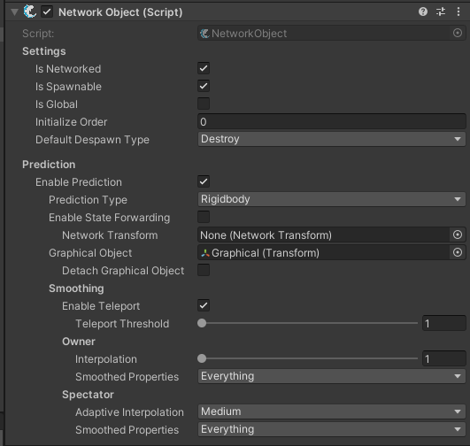

# Configuring NetworkObject

要在 NetworkObject 脚本中使用 prediction 方法，​​必须为 prediction 配置 NetworkObject 检查器（inspector）​​。

当前 NetworkObject 检查器的所有选项如下所示，选项有很多，但是很多选项根据你的设置可能不可见，绝大多数只是在那里为你提供对游戏的更多精细调整。

要开始使用预测功能，首先需要选择启用预测（Enable Prediction）。接下来，你需要设置预测类型（Prediction Type）。如果你使用的是刚体（Rigidbody）或二维刚体（Rigidbody2D），请相应地设置预测类型。对于非物理对象（例如角色控制器），请选择“其他”（Other）。

## State Forwarding（状态转发）

状态同步。

状态转发（State forwarding）会让所有客户端像服务器一样运行相同的输入操作。如果你希望所有客户端和服务器都基于相同的输入逻辑运行（类似于对象由客户端或服务器拥有的情况），这个功能会很有用。不过，状态转发对CPU的要求更高，因为它需要维护一个状态缓冲区，并且对象必须进行状态调和以修正错误，同时还要重新运行过去的状态。

尽管存在额外开销，状态转发通常仍是最受欢迎的方法，因为你可以获得与客户端和服务器完全相同的代码执行方式，从而实现更可靠的模拟效果，而且编码起来可能也更简单。

如果禁用状态转发，只有对象的所有者和服务器会运行输入操作，并且只有所有者会为其拥有的对象保留缓冲区。这也意味着，你必须将任何对客户端显示非自有对象动作至关重要的信息转发给客户端，例如使用NetworkAnimator来中继动画，或者使用RPC发送枪声等音频。移动操作也不会被转发，因此你可能需要附加一个NetworkTransform，并在NetworkTransform字段中进行指定。指定NetworkTransform会尝试根据其他的 NetworkObject 检查器设置将其配置为基于预测运行。如果发现这导致了问题，可以简单地将该字段留空。

## Graphical Object

这是用于保持 NetworkObject 图形表现的对象。所谓"图形"，指的是任何需要跨帧平滑过渡的视觉元素，以及需要修正潜在不同步问题的显示内容。特别说明：你可以留空此字段，但这样会失去诸如平滑处理等附加功能选项。

在使用图形对象时，务必注意不要在其上或其子级放置任何可能受平滑处理负面影响的组件（比如控制玩家移动的胶囊体碰撞器）。在网络预测周期中，预测方法会以TimeManager.TickDelta作为帧间隔时间运行——这类似于你在使用FixedUpdate移动时创建客户端权威物理控制器的情况。即使采用客户端权威模式，如果对根对象进行平滑处理（补偿FixedUpdate期间的位移），最终根对象的位置会与物理引擎计算结果产生偏差，从而导致运动系统和碰撞检测出现异常。

基于上述原因，通常建议将与游戏玩法相关的碰撞体/触发器（或影响NetworkObject变换的组件）直接放在NetworkObject所在的同一游戏对象上，或者至少不要放在图形对象内部。

如需深入了解其工作原理，查看此处组件说明。分离图形对象是一项辅助功能，其适用性取决于具体项目配置。默认情况下图形对象会保持原有父子关系。当启用此功能时，图形对象会在每帧结束后回滚到变换属性的初始状态，然后再平滑过渡到该帧结束时的目标变换状态。这种设计使得在较低帧率下仍能实现平滑的变换更新，而非直接跳跃到帧间隔对应的位移量。

但保持图形对象附着状态可能对某些动画系统或摄像机造成问题——第三方资源通常无法正确处理"瞬间回退后渐进平滑"的变换行为，可能导致异常表现。摄像机也可能显示出图形对象存在卡顿或抖动（尽管实际运行完全正常）。通过分离图形对象，可以避免每帧回滚操作，使其直接在世界空间中平滑移动至目标位置。多数情况下分离处理效果更佳，但并非适用于所有场景，因此默认保持附着状态。

## Smoothing

smoothing 选择只有在设置了 graphical object 时出现。绝大多数设置在 NetworkObject 组件的信息页有详细介绍。

有一些特定情形，你可能想要定制 smoothing 来控制实际上平滑什么（属性）。

在某些情况下，你可能希望自定义平滑控制，以决定哪些属性由系统平滑处理，哪些由你自己控制，这时就可以使用“平滑属性”功能。

你会发现，针对对象所有者（Owner）和观察者（Spectator，非所有者），分别有对应的平滑属性设置。

例如，许多开发者希望自行控制旋转（Rotation），而让FishNet处理位置（Position）和缩放（Scale），此时只需在平滑属性中取消勾选“Rotation”即可。

修改平滑设置​​不会影响预测结果​​，前提是遵循图形对象（Graphical Object）的使用规则。

观察者选项中的“自适应插值”用于控制被观察对象的插值程度：

- ​​低值​​：减少插值，可能使不同步问题更明显（从视觉上更容易察觉卡顿或延迟）；
​- ​高值​​：增加插值，降低不同步的可见性，使画面更平滑。

需根据游戏类型调整，或通过API动态修改以适配不同网络环境。
