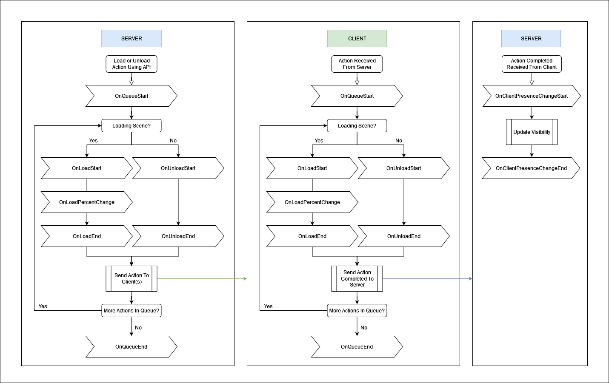

## General

SceneManager 提供了多种事件机制来辅助开发，且事件的触发顺序是稳定可靠的。

下图展示了事件执行的预期顺序。你也可以在 Fish-Networking 导入包的 Example/All/SceneManager 路径下找到该示意图。

加载和卸载是异步、排队的，因为加载、卸载场景是耗时操作，而且可能同时执行多个加载、卸载，还涉及网络。通过回调函数通知场景加载、卸载的过程。

需要注意的是，客户端和服务器对队列及事件的处理流程完全一致。唯一的特殊例外是 OnClientPresence 变更事件，具体说明如下文。

## Events

### OnClientLoadedStartScenes

每当客户端首次加载起始场景时，该事件就会被触发。起始场景可以是你设置的任何全局场景；如果没有设置全局场景，则为你进入游戏时所加载的场景。PlayerSpawner.cs 示例展示了 OnClientLoadedStartScenes 事件的使用方法。该事件包含 connection 信息（即加载了这些场景的客户端），以及一个布尔值，用于指示回调是在服务器端（值为 true）还是在客户端（值为 false）执行的。

如果你只想知道某个特定 connection 何时加载了起始场景，NetworkConnection 类也提供了一个类似事件 OnLoadedStartScenes。

### OnQueueStart, OnQueueEnd

当发生场景切换队列时，会调用 OnQueueStart 和 OnQueueEnd 事件。OnQueueStart 只会在某个场景成功开始加载或卸载时被调用。该队列可能会处理任意数量的场景事件。例如：如果在某个场景仍在加载的过程中又收到卸载该场景的指令，则该卸载操作会被放入队列中等待执行。OnQueueEnd 将在加载和卸载都完成之后被调用。

### OnLoadStart, OnUnloadStart

OnLoadStart 和 OnUnloadStart 在队列条目开始处理之前触发。对于队列中的每个条目，这两个事件都会被调用。例如：如果你连续两次调用 SceneManager.LoadGlobalScenes()，则 OnQueueStart 仅会触发一次，而 OnLoadStart 会触发两次。当某个场景的加载开始时，会调用 OnLoadStart；当某个场景的卸载开始时，会调用 OnUnloadStart。

加载和卸载事件都包含一个结构体，其中有一个名为 QueueData 的字段。QueueData 保存了有关该队列条目的信息。提供这些数据是为了方便你使用。

### OnLoadPercentChange

仅在加载场景时可用的事件是 **OnLoadPercentChange** 。该事件包含了当前队列条目中场景已加载的百分比信息。与启动类事件类似，它也会提供 **QueueData**。此外，你还会获得一个 **float 类型** 的 **Percent** 值，表示当前场景加载的总体进度。这个信息可用于显示加载界面，或者执行各种初始化任务。

### OnLoadEnd

**OnLoadEnd** 事件会在队列条目中的所有场景加载完成后被调用。该事件只有在所有场景完全加载完毕，并且（如果适用）活动场景已经设置后才会触发。与 **OnLoadStart** 事件类似，该事件也会提供 **QueueData**。此外，它还提供了两个字段：**LoadedScenes** 和 **SkippedSceneNames**。  

- **LoadedScenes** 提供了已加载场景的 **Scene 引用**，你可以据此获取具体加载了哪些场景。  
- **SkippedSceneNames** 包含了未被加载的场景名称（字符串形式）；这通常发生在这些场景已经被加载的情况下。

你可能希望在场景加载完成后为玩家生成对象，但最好等到特定客户端开始观察该场景后再执行此操作，以避免竞态条件。因此，更推荐使用 **OnClientPresenceChange** 事件之一，或者通过场景中的 **NetworkBehaviour** 调用 **OnSpawnServer** 方法。

### OnUnloadEnd

在场景卸载完成后，将触发 **OnUnloadEnd** 事件。该事件包含 **QueueData** 和 **UnloadedSceneHandles**。与之前一样，**QueueData** 提供了有关该队列条目的信息。而 **UnloadedSceneHandles** 是一个集合，其中包含了被卸载场景的句柄（handles）。

### OnClientPresenceChangeStart, OnClientPresenceChangeEnd

这两个事件仅在服务器端可用，用于指示某个客户端**正在被添加到某个场景中**，或者**正在从某个场景中移除**。这两个事件都只有在客户端**完全加载或卸载该场景之后**才会被触发。

- **Start 变体**（例如 OnClientPresentStart）会在客户端的**观察者状态更新之前**被调用；
- **End 变体**（例如 OnClientPresentEnd）则会在客户端的**观察者状态更新之后**被调用。

具体来说，如果一个客户端加入某个场景，**OnClientPresentStart** 会在该客户端**能够看到该场景中的任何网络对象之前**被调用；而 **OnClientPresentEnd** 则会在该客户端**已经能够看到这些网络对象之后**被调用。

这两个事件都包含相同的结构体，其中包含以下信息：

- **Scene**：表示客户端正在被添加或移除的场景；
- **Connection**：表示该客户端的 **NetworkConnection**；
- **Added**：一个布尔值，如果客户端**正被添加到场景中**，则为 **true**；如果客户端**正被从场景中移除**，则为 **false**。
