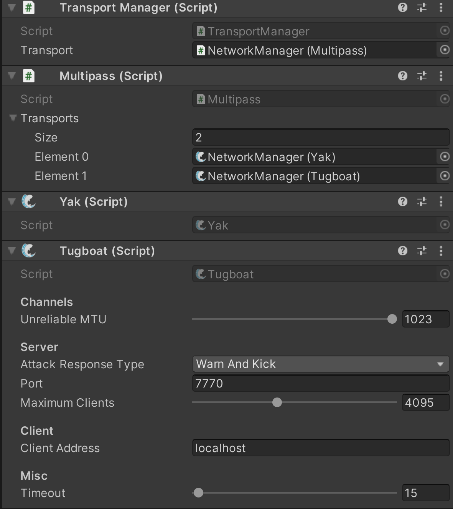

部分 Transport 提供了超出 Inspector 配置范围的额外功能。本节将提供各官方传输层特有功能的使用指南。

你可以直接访问特定的传输层。通过获取 Multipass 的引用并调用 multipassReference.GetTransport<Type>() 即可实现。

Multipass 内的 Transports 集合也是公开可访问的。

## Setup

与其他传输层一样，要使用 **Multipass**，必须先将其添加到一个游戏对象上（通常是你的 **NetworkManager** 对象）。

添加 **Multipass** 后，必须将其指定为 **TransportManager** 中要使用的传输层。

如果 **TransportManager** 没有自动添加到你的 **NetworkManager** 上，你可能需要先手动添加该组件。

一旦 **Multipass** 被添加并在 **TransportManager** 中指定后，再添加你希望支持的其他任意传输层。

将每个已添加的传输层的引用拖拽到 **Multipass** 下的 **Transports** 列表中。

确保 Multipass 中的每个 transport 在监听不同的端口。



## Client

一个 client 只使用 Multipass 中的一个 transport，而 server 可能同时监听所有 transports。

要使 client actions 工作，你必须指定对 client 使用哪个 transport。

```C#
//This can be done easily using the TransportManager.
Multipass mp = transportManager.GetTransport<Multipass>();

//In this example if the build is a webGL build
//then use Bayou, otherwise use Tugboat.

#if UNITY_WEBGL && !UNITY_EDITOR
    mp.SetClientTransport<Bayou>();
#else
    mp.SetClientTransport<Tugboat>();
#endif
```

这个例子显示使用 Bayou 和 Tugboat，但是你当然可以使用你自己的逻辑使用任意多个 transports。

设置好客户端传输层后，你就可以像只使用单一传输层时那样正常执行各项功能操作。

## Server

如组件设置部分所述，​GlobalServerActions​ 会在 ​Multipass​ 中指定的所有传输层上执行服务器端操作。若在 ​GlobalServerActions​ 为 ​true​ 时调用 ​ServerManager.StartConnection()​，服务器将在所有传输层上启动；否则将抛出错误。

```C#
//Start all servers transports. This requires GlobalServerActions to be true.
serverManagerReference.StartConnection();
```

你也可以通过指定要使用的传输层索引，来访问单个传输层的功能。

```C#
//Start the connection on index 0.
Multipass mp = TransportManager.GetTransport<Multipass>();
//The true parameter is to indicate you are starting a server.
mp.StartConnection(true, 0);
```