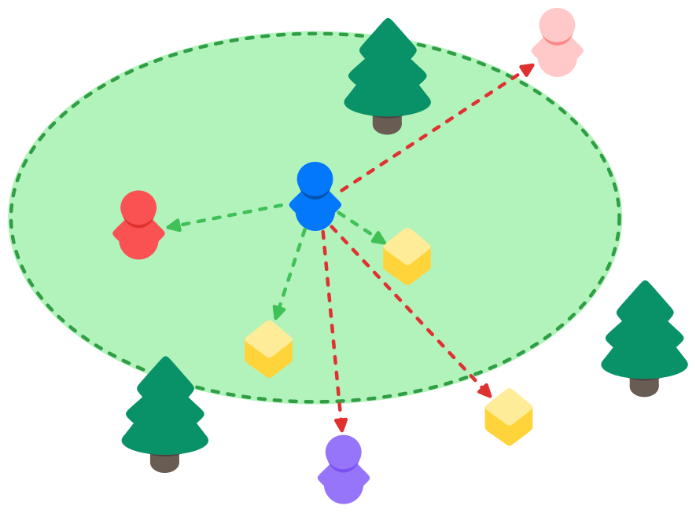

# DistanceCondition

​​距离条件（Distance Condition）​确保只有当某个对象与客户端所拥有的所有对象都保持至少指定的最小距离时，该对象才会被该客户端观察到。距离条件属于​​计时条件（Timed Condition）​​。

## 设置

- Add Order

  这控制 observer condition 在 object 上求值的顺序。

  当存在计算复杂度差异较大的观察者条件时，此功能将非常实用——它允许你自主控制这些条件的评估顺序。
  
  需要注意的是，计时条件（Timed Condition）始终会在非计时条件之后进行评估。

- Is Constant

  用于声明条件的设置或数据在运行时是否保持不变。
  
  其目的是通过避免对执行过程中未变化的条件进行不必要的更新或重新计算，来优化性能。
  
  该功能目前尚未实现，但可供未来使用，且已可设置。

- Maximum Distance

  客户端拥有的任意对象要观察目标对象时，必须与该目标对象保持的最大距离。
  
  如果客户端拥有的所有网络对象（NetworkObjects）都超出此距离范围，则该目标对象对其不可见。

- Hide Distance Percent

  该设置决定了在最大距离之外额外增加的缓冲区域——当对象即将被隐藏时生效。
  
  "隐藏距离百分比"（Hide Distance Percent）的作用是防止客户端接近最大距离阈值时，物体在可见与不可见状态间闪烁。
  
  通过添加基于百分比的距离缓冲，可实现更平滑的对象隐藏过渡。

  具体而言：若将最大距离设为100单位，同时将隐藏距离百分比设为0.5（即50%），则物体将保持可见状态直至客户端距离达到150单位。这种机制确保了物体不会在刚越过初始可见边界时立即消失。
