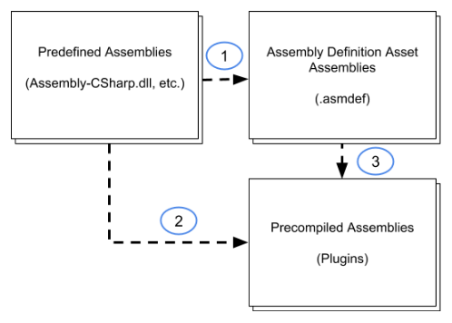

# 程序集定义

Assembly Definitions 和 Assembly References 可以创建用来组织 scripts 为 assemblies 的 assets。

一个 Assembly 是一个 C# code library，它包含脚本中定义并编译好的 classes 和 structs，还定义对其他 assemblies 的引用。

通过定义 assemblies，可以以模块化和可重用的方式组织 code。定义的 Assemblies 中的 Scripts 不再添加到默认的 assemblies，而且只能访问指定的其他 assemblies 中的 scripts。

将 code 划分为多个程序集，可以避免当改变一个脚本时，重新编译其他的程序集的脚本，这可以降低 code changes 时的编译时间。

## 定义 assemblies

为每个想要的 assembly 创建一个 folder，所有属于这个 assembly 的脚本都放在这个 folder 内。然后创建一个 Assembly Definition assets 来指定 assembly properties。

Unity 将 folder 中的所有脚本都编译到一个 assembly 中，所有 child folder 中脚本也是如此，除非它定义了自己的 Assembly Definition 或 Assembly Reference asset。

要将一个 non-child folder 中的脚本包含到一个 assembly 中，在那个 folder 中创建一个 Assembly Reference asset，并设置它来引用 target assembly 的 Assembly Definition asset。例如可以将项目中所有的 Editor scripts 合并到一个 assembly 中，不管那些目录在哪里。

## Reference 和 dependencies

当一个类型（class 或 struct）使用另一个类型，则第一个类型依赖第二个类型。当 Unity 编译一个脚本，它还必须能访问它依赖的类型。类似的，当编译好的 code 运行时，它必须能访问它的依赖的编译好版本（dll）。如果两个类型在不同的 assemblies，包含 dependent type 的那个 assembly 必须声明对它依赖的 assembly 的 reference。

可以使用 Assembly Definition 的选项来控制 assemblies 之间的引用，这些选项包括：

- Auto Referenced：预定义 assemblies（Assembly-CSharp）是否引用这个 assembly
- Assembly Definition References：引用 Assembly Definitions 创建的 project assemblies
- Override References + Assembly References：引用预编译的 assemblies（plugin dll）
- No Engine References：是否引用 UnityEngine assemblies

注意：Assembly Definition 创建的 assemblies 中的 classes 不能使用 predefined assemblies（Assembly-CSharp）。因为 Assembly-CSharp 是 Main Assembly，其他的程序集都是自包含的插件，只用来向外提供服务，不需要也不应该引用使用者。

### Default references

默认 predefined assemblies（Assembly-CSharp）引用所有其他 assemblies，包括：

- Assembly Definitions 定义的 assemblies
- 作为插件添加到项目中的 precompiled assemblies（dll）

此外，使用 Assembly Definition asset 创建的 assemblies 自动引用所有 precompiled assemblies，即程序内自定义的程序集可以自动引用作为插件添加到项目中的 dll，不需要手动指定引用。

默认设置中， predefined assemblies 中的 classes 可以使用项目中任何一个 assemblies 中定义的 types。类似的，使用 Assembly Definition asset 创建的自定义 assemblies 可以使用任何 precompiled（plug-in dll）assemblies 定义的 types。

可以通过关闭 Assembly Definition asset Inspector 中的 Auto Referenced option 来防止这个 assembly 被 predefined assemblies 引用。关闭 auto-referenced 意味着当你改变这个 assembly 中的 code 时，predefined assemblies 不会被重新编译，但是也意味着 predefined assemblies 不能直接使用 assembly 中的 code。这里的 assembly 的依赖和对类型的“使用”指的是编译期间能找到类型的定义，否则无法编译。但是对于通过反射使用另一个 assembly，不需要这样的引用，可以通过反射 code 直接使用。

改变被依赖的程序集会导致依赖的程序集重新编译，因为因为前者的符号表可能发生变化（包括创建、修改、删除之前定义好的类型），编译一个程序集需要 Unity 向 C# 编译器传入要引用的 dll。如果一个 dll 发生变化，它的依赖程序集也应该重新编译。但是可能只需要重新 link，而不需要编译源代码。

类似的，可以通过关闭 Plugin Inspector 的 Auto Referenced property 来防止一个 plugin assembly 被自动引用。这同时影响 predefined assemblies 和 Assembly Definition 创建的自定义程序集。

当关闭一个 plug-in 的 Auto Referenced 后，还可以在一个 Assembly Definition asset 中显式引用它，打开 Assembly Definition asset 的 Override References 选项可以为其添加对 plug-in 的引用。

注意：不能声明为 precompiled assemblies（dll） 显式地声明引用（因为它们已经被预编译为自包含的 dll，不需要引用外部程序集）。Predefined assemblies 只能使用 auto-referenced assemblies 中的 code。

### Cyclical references

循环引用会报错：Assembly with cyclic references detected。若出现循环引用，必须重构代码打破循环，或者将它们放在同一个程序集中。

## Assembly Definition Asset 选项

- Name：assembly 的名字，必须在项目中唯一。考虑使用反转域名命名法减少命名冲突，尤其是如果在不止一个项目中使用这个程序集

- Allow 'unsafe' Code：是否允许 assembly 红使用 C# 的 unsafe 关键字。开启后，Unity 编译 assembly 时向 C# 编译器传递 /unsafe 选项

- Auto referenced：指示 predefined assemblies 是否应该引用这个 project assembly。关闭这选项后，Unity 在编译（Assembly-CSharp）期间不会自动引用这个程序集。这对于 Unity 是否将它包含到 build 中没有任何作用。

- No Engine References：开启这个选项后，Unity 在编译这个程序集时，不会添加对 UnityEditor 或 UnityEngine 的引用

- Override References：开启 Override References 设置可以手动指定这个 assembly 依赖哪些 precompiled assemblies（dll，在编译时添加这些 dll）。当开启这个选项，Inspector 显示 Assembly References section，可以用来指定 references。

  一个预编译程序集时 Unity 之外编译好的 dll 库。默认地，项目中定义的 assemblies 会引用所有添加到项目中的 precompiled assemblies，与 predefined assemblies 一样。当开启 Override References 后，这个 assembly 只会引用 Assembly References 中显式添加的 assemblies。

  注意：要防止 Project assemblies（Assembly Definition asset）自动应用一个 precompiled assembly，可以关闭后者的 Auto Referenced option。

- Root Namespace：这个 assembly definition 中的 scripts 默认的 namespace。如果使用 Rider 或 Visual Studio 为 code editor，它们自动添加这个 namespace 到为这个 assembly definition 创建的 namespace。对其他 code editor 可能没有作用。

编译程序集 A 时，添加对依赖的程序集 B 的引用，是为了让 A 中使用 B 中类型的 script 可以被成功编译，即在 code 中直接使用 B 中的类型。但是如果通过反射来检查和使用 B，则在编译时不需要添加对 B 的引用，只需要在运行时 B 在内存中即可。

## Misc

当添加一个 dll 到 Unity Editor 中时，Editor 程序集会加载这个 dll 到内存中。注意移除 dll asset 不会导致已加载的 dll 从 Editor 内存中移除，脚本中仍然可以使用 dll 中的类型和代码，不会报错。只有重新启动 Editor 后，使用 dll 的脚本才会报错找不到类型。

