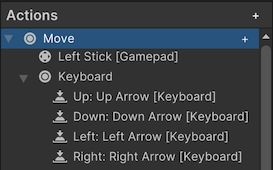

动作（Actions）是输入系统中的一个重要概念。它们使你能够将输入的目的与执行该输入的设备控件分离开来。通过动作，你可以以一种灵活的方式将输入目的与设备控件关联在一起。

例如，在游戏中某个输入的目的可能是让玩家角色移动。与该动作关联的设备控件可能是游戏手柄左侧摇杆的移动。

动作与其所对应的设备控件之间的关联称为绑定（Binding），你可以在**输入动作编辑器**（Input Actions Editor）中设置这些绑定。当你在代码中使用动作时，无需直接引用特定的设备，因为绑定已经定义了使用哪个设备的控件来执行该动作。

要在代码中使用动作，你必须使用输入动作编辑器来建立动作与一个或多个设备控件之间的映射。例如，在下面的截图中，展示了“Move（移动）”动作，以及它绑定的游戏手柄左摇杆和键盘方向键。这样你就可以在代码中统一处理“移动”这个行为，而不需要关心具体是哪个设备触发的。



你随后可以在代码中获取对该动作的引用，并检查其值，或者附加一个回调方法，以便在该动作被触发时收到通知。

动作（Actions）还使得创建一个允许玩家在运行时自定义其输入绑定的系统变得更加简单，这对于游戏来说是一个常见的需求。

- 动作（Actions）是仅在运行时可用的功能，你不能在编辑器窗口的代码中使用它们。
- 你可以不使用动作和绑定，直接读取特定设备控件的输入。这种方式灵活性较差，但在某些情况下实现起来更快。
- 虽然你可以在这个窗口中重新排列动作的顺序，但这种排序仅用于视觉上的便利，并不会影响代码中动作触发的顺序。如果有多个动作在同一帧中被触发，输入系统报告它们的顺序是不确定的。为了避免问题，请不要编写依赖于它们以特定顺序被报告的代码。

# Overview

当在 Input System 编写 actions 相关代码时，有很多可以使用的 API：

- InputSystem.actions：引用 project-wide Actions 中的 actions 集合
- InputActionMap：命名 Actions 集合。这个 API 对应 Input Action Editor 中 Action Maps 列
- InputAction：命名 Aciton，可以返回它绑定的 controls 的当前 value，也可以触发回调来响应输入。这个 API 对应 Input Action Editor 中的 Actions 列
- InputBinding：Action 和具体 device controls 的绑定

每个动作（Action）都有一个名称（`InputAction.name`），该名称在其所属的动作映射（Action Map）中必须是唯一的（如果有指定动作映射，请参见 `InputAction.actionMap`）。每个动作还有一个唯一的 ID（`InputAction.id`），你可以使用该 ID 来引用这个动作。即使你重命名了该动作，其 ID 也不会改变。

每个动作映射（Action Map）也有一个名称（`InputActionMap.name`），该名称在所有存在的动作映射中也必须是唯一的。每个动作映射同样拥有一个唯一的 ID（`InputActionMap.id`），你可以用这个 ID 来引用对应的动作映射。即使你重命名了该动作映射，其 ID 同样保持不变。

# Creating Actions

创建动作（Actions）的最简单方法是在项目设置（Project Settings）窗口中使用输入动作编辑器（Input Actions Editor）。这是官方推荐的主要工作流程，适用于大多数场景。

然而，由于输入系统 API 非常开放，还有许多其他方式可以创建动作，适用于一些不太常见的场景。例如，可以通过从 JSON 数据中加载动作，或者完全在代码中创建动作。例如在 MonoBehaviours 中直接创建 Actions：

```C#
using UnityEngine;
using UnityEngine.InputSystem;

public class ExampleScript : MonoBehaviour
{
    public InputAction move;
    public InputAction jump;
}
```

这与在 Input Action Asset 创建 InputAction 一样，只不过前者在 Asset 中保存 Action，后者在 Scene 或 Prefab 中保存 Action。

当你以这种方式嵌入动作时，即在 `MonoBehaviour` 中定义序列化的 `InputAction` 字段，GameObject 的检查器（Inspector）窗口将显示一个类似于动作编辑器中 Action 列的界面，允许你为这些动作设置绑定。例如。

- 若要添加或移除动作（Actions）或绑定（Bindings），请点击标题栏中的添加（+）或移除（-）图标
- 若要编辑绑定，可以双击对应的绑定项 
- 若要编辑动作，可以在动作映射（Action Map）中双击该动作，或者点击单个动作属性右侧的齿轮图标
- 你也可以右键点击条目以打开上下文菜单，并且可以拖动条目。按住 Alt 键并拖动某个条目可以复制该条目

与项目设置窗口中的 project-wide action 不同，嵌入在 `MonoBehaviour` 组件中的动作（Actions）和动作映射（Action Maps）必须手动启用和禁用。

使用此工作流程时，序列化的动作配置会与父游戏对象一起作为场景的一部分存储，而不是与动作资源（Action Asset）一起序列化。如果你希望将 Control Bindings 和 Behaviour 捆绑到单个 `MonoBehaviour` 或预制件（Prefab）中以便于一起分发，这将非常有用。然而，这也可能使得组织你的全部 Control Bindings 变得更加困难，因为它们可能会分布在多个预制件或场景中。

## 从 JSON 中加载 Actions

可以从一组 Action Maps 或整体 InputActionAsset 形式的 Json 文件中 load Actions.

```C#
// Load a set of action maps from JSON.
var maps = InputActionMap.FromJson(json);
// Load an entire InputActionAsset from JSON.
var asset = InputActionAsset.FromJson(json);
```

## 在 code 中创建 Actions

可以完全在 code 中创建和配置 Actions，包括指定 control bindings。

```C#
// Create free-standing Actions.
var lookAction = new InputAction("look", binding: "<Gamepad>/leftStick");
var moveAction = new InputAction("move", binding: "<Gamepad>/rightStick");

lookAction.AddBinding("<Mouse>/delta");
moveAction.AddCompositeBinding("Dpad")
    .With("Up", "<Keyboard>/w")
    .With("Down", "<Keyboard>/s")
    .With("Left", "<Keyboard>/a")
    .With("Right", "<Keyboard>/d");

// Create an Action Map with Actions.
var map = new InputActionMap("Gameplay");
var lookAction = map.AddAction("look");
lookAction.AddBinding("<Gamepad>/leftStick");

// Create an Action Asset.
var asset = ScriptableObject.CreateInstance<InputActionAsset>();
var gameplayMap = new InputActionMap("gameplay");
asset.AddActionMap(gameplayMap);
var lookAction = gameplayMap.AddAction("look", "<Gamepad>/leftStick");
```

以这种方式在播放模式（Play mode）下创建的任何 action，在退出播放模式后都不会保留在 Input Action Asset 中。这意味着你可以在编辑器中以一种真实的方式测试你的应用程序，而无需担心意外修改了该资源。

## Enabling actions

动作（Actions）具有一个启用状态（enabled state），这意味着你可以根据不同的情况启用或禁用它们。

如果你将某个动作资源（Action Asset）设置为项目范围（project-wide），那么其中包含的动作默认是启用状态，可以直接使用。

而对于定义在其他位置的动作，例如位于未设置为项目范围的动作资源中，或是直接在代码中定义的动作，它们初始时处于禁用状态，在响应输入之前必须手动启用。

你可以单独启用某个动作，也可以通过启用包含这些动作的动作映射（Action Map）来批量启用一组动作。

```C#
// Enable a single action.
lookAction.Enable();

// Enable an en entire action map.
gameplayActions.Enable();
```

当你启用一个动作（Action）时，输入系统会解析其绑定（bindings），除非该操作已经执行过，或者该动作可用的设备集合未发生变化。有关此过程的更多详细信息，请参阅关于绑定解析的文档。

当某个动作处于启用状态时，你无法修改其配置中的某些部分，例如动作绑定（Action Bindings）。若要使动作或动作映射停止响应输入，应调用 `Disable` 方法。

在启用状态下，动作会持续监控它所绑定的控件（Control）。如果某个已绑定的控件状态发生变化，动作会处理这一变化。如果该控件的变化代表了一次交互（Interaction）的变化，动作将生成相应的响应。这一切都发生在输入系统的更新逻辑期间。根据输入设置中选择的更新模式，这一过程可能每帧发生一次、每次固定更新（Fixed Update）发生一次，或者在设置为手动更新时由你手动触发。
