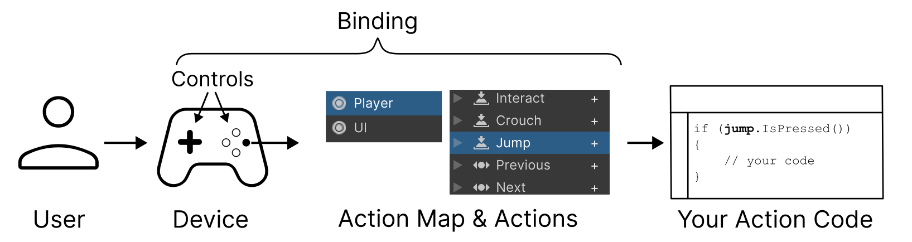

Control 表示输入设备上的具体控件，例如键盘上的按键，游戏手柄的按键摇杆等。

- Input Device：物理输入设备硬件，例如键盘，游戏手柄，鼠标，touchscreen，它允许用户发送输入到 Unity
- Control：Device 上的独立控件，每个可以向 Unity 发送不同类型的输入。例如 gamepad 包含多个按钮、摇杆、和 trigger，一个鼠标在底部包含 X 和 Y 轴传感器，以及上面各种按钮和滚轮
- Action：Actions 是一个高层概念，它描述 user 可能在 game 或 app 中想要做的意见事情（例如 Move，Jump，Navigate 等等）。它们是作为 input 的结果，user 可以在 game 或 app 中可以做的事情，而不管它们使用的是什么 device，什么 control。Actions 通常具有概念性可描述的名字，并且应该是动词，例如 Run，Jump，Crouch，Use，Start，Quit 等等。一个 Action 可以绑定到多个 Device 的多个 Control 上
- Action Map：Action Maps 允许你将 Actions 组织为 groups，它代表一个特定场景，其中一组 actions 放在一起有意义的。你可以同时 enable 或 disable 一个 action map 的所有 actions。因此按照相关性的上下文，将 actions 组织为一个 group 是很有用的。例如，你可以有一个 action map 用于控制 player，另一个用于 game 的 UI
- Binding：一个 binding 在一个 Action 和特定 Device control 创建一个连接。例如 Move action 可以绑定到键盘上的方向键和 WSAD 键，也可以绑定到 joypad 的 left stick，也可以绑定到 VR controller 的主 2D axis。多个这样的绑定意味着你的 game 可以接收跨平台的 input
- Action Code：你自己脚本的部分，它基于配置的 actions 执行。在你的 code 中，可以使用 actions references 来读取当前 value 或者 action 的 state（也称为 polling，轮询），或者当 actions 执行时，设置一个 callback 来调用你自己的方法
- Action Asset：一个 asset type，它包含一个保存的 Action Maps，Actions 和 Binding 的配置。你可以在项目中作为 project-wide actions 指定一个 Action Asset，这允许你可以在 code 很容易地通过 InputSystem.actions 访问那些 actions，类似旧的 Input
