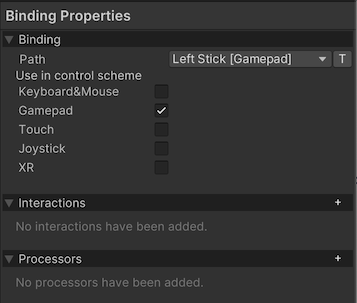
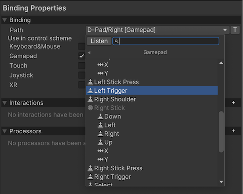
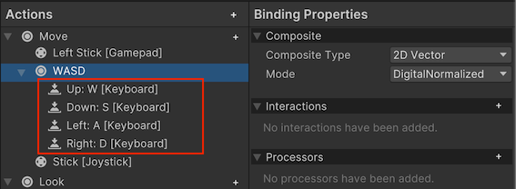
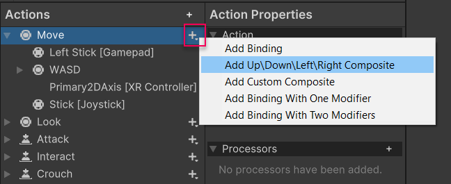

Input Actions Editor 允许编辑 Action Assets，它包含一个保存的 Input Actions 和 Bindings 配置。

它允许将 Actions 组织为 Action Maps，每个 map 代表一个应用场景（例如 UI，gameplay 等等）。

它还允许定义 Control Schemes，scheme 可以 enable/disable 一组 devices，或者响应哪种类型设备被使用。这通常用于当你希望基于 player 使用的设备类型（鼠标、keyboard、gamepad）来定制 UI 的情况。

## Action Type

Action Type 可以选择以下类型：

- Button
- Value
- PassThrough

这些选项涉及此操作应表示离散的开/关按钮式交互，还是在使用控件时可随时间变化的值。

对于键盘按键、鼠标点击或手柄按钮等设备控制，请选择 ​Button​（按钮）。
对于鼠标移动、摇杆或手柄摇杆、设备方向等能在一段时间内持续提供变化输入的设备控制，请选择 ​Value​（数值）。

Button（按钮）​和Value（数值）​类型的操作还会提供相关数据，例如操作的开始与结束状态，以及在多个 Bindings 映射到同一 action 时的冲突解决方案。

第三种选项 ​PassThrough（直通）​​ 同样属于数值类型，因此适用于与 ​Value​ 相同的设备控制类型。不同之处在于，设为 ​PassThrough​ 的操作仅提供来自绑定设备控制的基本数值信息，既不会包含操作阶段相关的额外数据，也不会在多个控制映射到同一操作时执行冲突解决。

直通操作（Pass-Through Actions）​​ 会绕过上述针对数值操作的冲突解决流程，且不采用“由特定控件驱动操作”这一机制。任何绑定控件的数值变化都会直接触发回调，并传递该控件的当前值。若需同时处理一组控件的所有输入，此模式会非常实用。即当一个 action 绑定多个 control 时，Button/Value 只会通过冲突解决返回一种使用的 Control，而 Pass-Through 则忽略冲突解决，每个控件的变化都会触发回调，有 script 自己解决冲突。

## Control Type

Control Type 允许选择 action 期望的 control 类型（float 还是 vector2）。它限制了再 UI 中设置 bindings 显式的 controls，还限制了哪些 controls 可以绑定到 action。它决定了 Action 的值类型，例如 float 还是 vector2，只有能产生这些值类型的设备控件才能绑定到这个 action 上。

例如，如果选择 2D axis，只有提供 2D vector 的 control 才可以用作 bingding control path。

系统还提供了更具体的控件类型选项（如"摇杆(Stick)"、"方向键(Dpad)"或"触控(Touch)"），这些类型会进一步筛选可用绑定。当您为操作选择绑定时，若指定了这类特定控件类型，可用控件列表将仅限于符合该类型的控件。

## Bindings

你可以添加多个 bindings 到 action，这通常用于支持多种 input device 类型。例如默认 actions set，Move action 被绑定到 gamepad stick 和 WSAD 键上，这意味着来自这些 binding 的任何 input 都会执行这个 action。具体是哪个 bindings 触发 action，依赖于哪个 bindings 的 control 的信号强。如果只有一个 control 有信号，那就是这个 control。如果多个 bindings 的 control 同时都有信号（都在输入），则解析冲突：即哪个 control 的信号强。

一个 ActionMap 下有多个 Action。一个 Action 下有多个 Bindings。每个 Binding 有一个名字。点击 Binding 可以在属性窗口设置 binding 的属性。



### Picking Controls

任何 Binding 的最重要属性是它绑定到的 control path。要编辑它，打开 Path 下拉菜单，展示一个 Control picker 窗口。



在 Control picker 窗口，可以浏览一个 Input Sytem 可以识别和绑定的 Input Devices 和 Controls 的树形结构。

Unity 会根据 Action 的 Control Type 属性（float or vector2）过滤这个列表。例如如果 Control type 是 Vector2，这个列表只能选择能产生 2D value 的 Control，例如摇杆。

设备与控制树（Device and Control tree）采用从通用到具体的层级化结构。例如：

- ​通用路径​：
  \<Gamepad\>/buttonSouth 可匹配所有游戏手柄的底部动作按钮（如Xbox的"A键"或任天堂的"B键"）。
- ​专用路径​：
  若导航至 Gamepad > More Specific Gamepads 并选择 PS4 Controller，此时路径 <DualShockGamepad>/buttonSouth ​仅匹配PlayStation 手柄的"Cross键"（○键）​，其他品牌手柄不会响应。

相比浏览控件树去找到你想要的控件，更简单的方法是让输入系统监听输入。为此，请选择“监听”按钮。最开始时，控件列表是空的。一旦你开始按下按钮或操作你想要绑定的设备上的控件，控件选择窗口就会开始列出与你按下的控件匹配的绑定项。选择其中任意一个绑定项来查看它们。

最后，你可以选择手动编辑绑定路径，而不使用控件选择器。为此，请点击控制路径弹出窗口旁边的“T”按钮。这会将弹出窗口变为一个文本字段，你可以在其中输入任何绑定字符串。这也允许你在绑定中使用通配符（*）字符。例如，你可以使用类似 `<Touchscreen>/touch*/press` 的绑定路径，来匹配触屏上任意手指的按下操作，而不必手动绑定到 `<Touchscreen>/touch0/press`、`<Touchscreen>/touch1/press` 等路径。

### Editing Composite Bindings

复合绑定（Composite Bindings）是由多个部分组成的绑定，这些部分共同形成一个控件 Control。例如，一个二维向量复合绑定（2D Vector Composite）使用四个按钮（左、右、上、下）来模拟一个二维摇杆的输入。



要在 Input Action asset 编辑器窗口中创建复合绑定 Composite Binding，请选择您想要添加绑定的 action 旁边的添加（+）图标，然后从弹出菜单中选择复合绑定类型 Composite Binding。



这样做会在 action 中为Composite Binding 创建多个绑定条目：一个是整个复合绑定的，然后在其下一层，为每个复合部分分别创建一个。复合绑定本身不具有绑定路径属性，但它的各个部分有此属性，并且你可以像编辑其他绑定一样编辑这些部分。一旦你绑定了复合绑定的所有部分，这些部分就能协同工作，就如同你将单个控件绑定到该动作上一样。

注意：菜单中显示的复合绑定集取决于动作的值类型。这意味着，例如，如果动作的类型设置为“Button（按钮）”，那么只有能够返回浮点数值类型的复合绑定会显示出来。这确保了所选的复合绑定与动作设定的值类型相匹配，从而保证功能的正确性。这里 float 表示按钮的压力，当压力超过一定阈值时，按钮才会触发。

# Editing Control Schemes

Input Action Assets 可以拥有多个控制方案（Control Schemes），这让你能够为不同类型的设备启用或禁用动作的不同绑定集。通过这种方式，你可以根据用户使用的设备类型灵活调整输入设置，确保在各种设备上都能获得良好的输入体验。

Input Action Assets 支持多控制方案（Control Schemes），这是新输入系统的核心功能之一。

Unity Input System 中的 **Control Schemes（控制方案）** 主要用于管理不同输入设备（如键盘、鼠标、游戏手柄等）的绑定规则，实现以下核心功能：

## 1. **设备专属输入管理**
   - 每个 Control Scheme 可定义一组特定设备的绑定（Bindings），例如：
     - *键盘鼠标方案*：绑定 WASD 和鼠标输入  
     - *手柄方案*：绑定摇杆和肩键输入  
   - 运行时系统会根据当前激活的 Control Scheme 自动过滤无关设备的输入，避免冲突。

## 2. **动态切换设备**
   - 通过 `PlayerInput` 组件的 `SwitchCurrentControlScheme()` 方法或自动切换（Auto-Switch）功能，可实时响应设备热插拔或玩家手动切换。
   - 例如：当玩家从键盘切换到手柄时，系统会自动禁用键盘绑定并启用手柄绑定。

## 3. **本地多人游戏支持**
   - 为每个玩家分配独立的 Control Scheme（如“Player1_Gamepad”“Player2_Keyboard”），确保输入事件精准对应到各自的角色。

## 4. **优化性能与逻辑**
   - 仅处理当前活跃设备的输入，减少不必要的检测开销。
   - 可通过 `ControlsChanged` 事件监听设备切换，动态更新 UI 提示（如显示当前设备的按键图标）。

## 配置示例（编辑器操作）：

1. 在 Input Action Asset 中创建多个 Control Scheme  
2. 将每个 Binding 分配到对应的 Scheme  
3. 通过代码控制切换：  
   ```csharp
   // 获取当前设备方案
   var scheme = InputSystem.GetControlScheme("KeyboardMouse");
   // 切换到键盘鼠标方案
   PlayerInput.SwitchCurrentControlScheme("KeyboardMouse", Keyboard.current, Mouse.current);
   ```

## 注意事项：
- **"Any" 模式**：未指定 Scheme 的 Binding 会在所有方案中生效。
- **自动切换**：启用 `Auto-Switch` 时，系统会优先响应最后活动的设备输入。

该设计显著提升了多平台输入管理的效率，是替代旧版Input Manager的关键特性之一。

在Unity Input System中，使用与不使用Control Scheme的主要区别体现在设备管理、输入过滤和运行时效率上，具体对比如下：

## 1. **设备隔离与输入冲突**
- **使用Control Scheme**  
  每个方案（如`KeyboardMouse`/`Gamepad`）会严格隔离对应设备的绑定。例如：当激活`Gamepad`方案时，系统会自动禁用键盘绑定的检测，避免手柄和键盘输入同时响应导致的角色行为冲突。
- **不使用Control Scheme**  
  所有绑定默认全局生效，不同设备的输入会叠加触发（如WASD和手柄摇杆同时控制移动），容易导致操作混乱。

## 2. **运行时性能**
- **使用Control Scheme**  
  仅处理当前活跃方案对应的设备输入，减少不必要的输入检测开销。例如：手机触控方案激活时，不会浪费资源监听键盘事件。
- **不使用Control Scheme**  
  需持续监听所有绑定设备，尤其在移动端可能造成额外的电量消耗和性能负担。

## 3. **多玩家支持**
- **使用Control Scheme**  
  可为每个玩家分配独立方案（如`Player1_Gamepad`/`Player2_Keyboard`），通过`PlayerInput`组件区分输入源，完美支持本地多人游戏(每个 Player 一个 PlayerInput，每个 PlayerInput 选择一个 Scheme)
- **不使用Control Scheme**  
  需手动编写代码区分玩家输入设备，增加开发复杂度。

## 4. **设备热插拔处理**
- **使用Control Scheme**  
  启用`Auto-Switch`时，系统会自动切换至最新活跃设备的方案（如插入手柄后立即启用手柄绑定）。
- **不使用Control Scheme**  
  需手动检测设备连接状态并调整输入逻辑。

## 5. **代码复杂度对比**
```csharp
// 使用Control Scheme的切换代码（简洁）
PlayerInput.SwitchCurrentControlScheme("Gamepad", Gamepad.current);

// 不使用时的手动管理（冗长）
void Update() {
    if (Gamepad.current != null) {
        // 手柄逻辑
    } else {
        // 键盘逻辑
    }
}
```

## 典型场景建议
- **推荐使用Control Scheme**：  
  多平台发布、本地多人游戏、需要严格设备隔离的项目。
- **可不使用Control Scheme**：  
  单一输入设备的原型开发或极简小游戏。

通过合理使用Control Scheme，可提升输入系统的可维护性和跨平台兼容性，这是Unity新版Input System的核心优势之一。