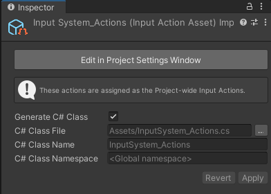
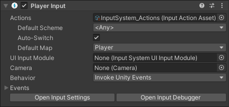

**Input Action Asset** 是一种资源文件，包含一组输入动作（Input Actions）的定义及其相关的绑定（Bindings）和控制方案（Control Schemes）。这些资源文件以 `.inputactions` 为扩展名，并以纯 JSON 格式存储。

当你在项目设置中配置默认的全局动作时，输入系统会自动创建一个动作资源。你也可以直接在项目窗口（Project Window）中创建新的动作资源。

对于大多数常见场景来说，通常不需要使用多个输入动作资源。更简单的方式是在 **项目设置（Project Settings）** 窗口中配置项目的全局动作定义。

# Creating Input Action Assets

要在 Unity 中创建一个包含输入动作（Input Actions）的资源文件，可以在项目窗口中右键点击，然后选择 **Create > Input Actions**，或者通过 Unity 主菜单栏选择 **Assets > Create > Input Actions**。

# Editing Input Action Assets

要打开动作编辑器（Action Editor），可以在项目浏览器（Project Browser）中双击一个 `.inputactions` 资源文件，或者在该资源的检查器（Inspector）中点击 **Edit Asset（编辑资源）** 按钮。你可以同时打开多个编辑器窗口，但不能为同一个资源打开多个窗口。

打开的动作编辑器与项目设置（Project Settings）窗口中的动作编辑器是完全相同的。

# Using Input Action Assets

# Type-safe C# API Generation

Input Action Assets 允许你根据动作定义生成一个 C# 类，从而使你能够以类型安全的方式在代码中引用你的 Action。这意味着你可以避免通过字符串来查找你的动作，提高了代码的可读性和安全性。

## Auto-generating script code for Actions

在脚本中使用 `.inputactions` 资源的一种非常便捷方式是为其自动生成一个 C# 包装类（wrapper class）。这可以省去手动通过名称查找动作（Actions）和动作映射（Action Maps）的麻烦，同时也提供了更简便的方式来设置回调函数。

要启用此功能，请在 `.inputactions` 资源的检查器（Inspector）中，勾选导入器属性（importer properties）里的 **Generate C# Class（生成 C# 类）** 选项，然后点击 **Apply（应用）**。



你可以选择要给 path name，class name，生成的脚本名字，或者保持默认值。这生成一个 C# script，简化了对 Asset 的使用：

```C#
using UnityEngine;
using UnityEngine.InputSystem;

// IGameplayActions is an interface generated from the "gameplay" action map
// we added (note that if you called the action map differently, the name of
// the interface will be different). This was triggered by the "Generate Interfaces"
// checkbox.
public class MyPlayerScript : MonoBehaviour, IGameplayActions
{
    // MyPlayerControls is the C# class that Unity generated.
    // It encapsulates the data from the .inputactions asset we created
    // and automatically looks up all the maps and actions for us.
    MyPlayerControls controls;

    public void OnEnable()
    {
        if (controls == null)
        {
            controls = new MyPlayerControls();
            // Tell the "gameplay" action map that we want to get told about
            // when actions get triggered.
            controls.gameplay.SetCallbacks(this);
        }
        controls.gameplay.Enable();
    }

    public void OnDisable()
    {
        controls.gameplay.Disable();
    }

    public void OnUse(InputAction.CallbackContext context)
    {
        // 'Use' code here.
    }

    public void OnMove(InputAction.CallbackContext context)
    {
        // 'Move' code here.
    }

}
```

要重新生成 .cs 文件，在 Project Browser 中右键点击 .inputactions asset，选择 Reimport。

## Using Action Assets with PlayerInput

**Player Input** 组件为处理一个或多个玩家的输入提供了一种便捷的方式。你可以将你的动作资源（Action Asset）分配给 Player Input 组件，这样它就可以自动为你激活对应的动作映射（Action Maps）并选择合适的控制方案（Control Schemes）。



## Modifying Input Action Assets at runtime

在运行时修改输入动作资源（Input Action Asset）有多种方式。但需要注意的是，在播放模式（Play mode）期间对输入动作资源所做的任何修改，在退出播放模式后都不会被保存。这意味着你可以在编辑器中以一种真实的方式测试你的应用程序，而无需担心意外修改了原始资源文件。

## The Default Actions Asset
