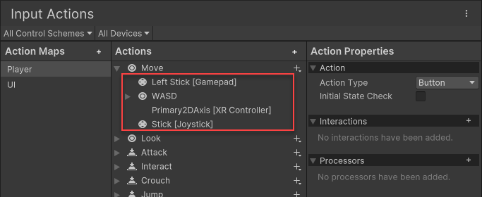

一个 `InputBinding` 表示一个动作（Action）与一个或多个由控件路径（Control path）标识的控件之间的连接。例如，游戏手柄的右扳机（一个控件）可以绑定到名为 "accelerate"（加速）的动作上，这样在你的游戏中，拉动右扳机就会使车辆加速。

你可以为一个动作添加多个绑定，这通常对于支持多种类型的输入设备非常有用。例如，在默认的动作集合中，"Move"（移动）动作绑定了游戏手柄的左侧摇杆和键盘的 WSAD 键，这意味着通过这些绑定中的任何一个输入都可以触发该动作。

你也可以将来自同一设备的多个控件绑定到同一个动作上。例如，游戏手柄的左扳机和右扳机都可以映射到同一个动作，这样在游戏中拉动任意一个扳机都会产生相同的效果。

Actions Editor Window 中的默认 Move action，可见多个 bindings 与其关联。



每个 Binding 有以下属性：

- path

  Control Path 标识 Action 应该从哪个 controls 接收输入。例如 \<Gamepad\>/leftStick

- overridePath

  **覆盖路径（overridePath）** 是一个用于替代 `path` 的控件路径。与 `path` 不同，`overridePath` 并不会被持久化保存，因此你可以使用它对绑定（Binding）中的路径进行非破坏性的临时覆盖。

  如果 `overridePath` 被设置为非 null 的值，则该路径会生效，并覆盖原本的 `path`。  

  如果你想获取当前实际生效的路径（即 `path` 或 `overridePath` 中的一个），可以查询 `effectivePath` 属性。

- action

  Binding 应该触发的 Action 的 name 或 ID。注意它可以是 null 或 empty（例如 composites bindings）。非大小写敏感。

- groups

  该绑定所属的**绑定组（Binding groups）**，以分号分隔的列表形式表示。可以为 null 或空。  

  绑定组可以是任意名称，但通常主要用于控制方案（Control Schemes）。该字段不区分大小写。

  例如 "Keyboard&Mouse;Gamepad"。

- interactions

  应用于该绑定（Binding）输入的**交互（Interactions）**列表，以分号分隔。注意，Unity 会将作用于该动作（Action）本身的交互（如果有的话）追加到此列表中。该字段不区分大小写。

  例如 "slowTap;hold(duration=0.75)"。

- processors

  应用于该绑定（Binding）输入的**处理器（Processors）**列表，以分号分隔。注意，Unity 会将作用于该动作（Action）本身的处理器（如果有的话）追加到此列表中。该字段不区分大小写。

  Bindings 上的 processor 会在提供输入值的控件上已有的处理器基础上额外应用。例如，如果你在一个绑定上添加了一个 `stickDeadzone` 处理器，并将其绑定到 `<Gamepad>/leftStick`，那么死区将会被应用两次：一次来自左摇杆控件（Control）上的 `stickDeadzone` 处理器，另一次则来自该绑定上的处理器。

  例如 "invert;axisDeadzone(min=0.1,max=0.95)"

- id

  Binding 的唯一 ID。例如当在 user settings 中存储 Binding overrides 时，可以用它来标识 Binding。

- name

  Binding 的可选名字。标识 Composites 内部的 part names。

- isComposite

  Binding 是否作为 Composite。

- isPartOfComposite

  Binding 是否是 Composite 的一部分。

要查询 Action 的 Bindings，可以使用 InputAction.bindings。要查询一个 Action Map 中所有 all Actions 的 Binding flat list，使用 InputActionMap.bindings。

# Composite Bindings

有时，你可能希望将多个控件（Controls）协同使用，以模拟另一种类型的控件。一个最常见的例子是使用键盘上的 W、A、S、D 键组合成一个 2D 向量控件（Vector2 Control），其作用等同于鼠标位移值或游戏手柄摇杆的输入。另一个例子是使用两个按键来模拟一个一维轴（1D axis），相当于鼠标的滚轮轴。

使用普通的绑定（Bindings）实现这类功能会比较困难。例如，你可以将一个 `ButtonControl` 绑定到期望接收 `Vector2` 类型值的动作上，但当输入系统尝试从只能提供浮点值（float）的控件中读取 `Vector2` 时，会在运行时抛出异常。

**复合绑定（Composite Bindings）** 解决了这个问题。复合绑定本身并不直接绑定到控件；相反，它们从其他已经绑定控件的绑定中获取值，并在运行时动态合成输入数据。

例如，你可以创建一个名为 `2DVector` 的复合绑定，它由四个方向键的绑定组成，并根据这些键的状态生成一个二维向量。

要了解如何在编辑器界面中创建复合绑定，请参阅关于 **编辑复合绑定（editing Composite Bindings）** 的文档。

如果你想在代码中创建复合绑定，可以使用 `AddCompositeBinding` 语法来实现。

```C#
myAction.AddCompositeBinding("Axis")
    .With("Positive", "<Gamepad>/rightTrigger")
    .With("Negative", "<Gamepad>/leftTrigger");
```

每个复合绑定（Composite）由一个 `InputBinding.isComposite` 设置为 `true` 的绑定组成，随后是一个或多个 `InputBinding.isPartOfComposite` 设置为 `true` 的 Binding。换句话说，`InputActionMap.bindings` 或 `InputAction.bindings` 中连续的几个条目组合在一起就构成了一个复合绑定（Composite）。

请注意，每个复合绑定的组成部分可以被任意多次绑定。

```C#
// Make both shoulders and triggers pull on the axis.
myAction.AddCompositeBinding("Axis")
    .With("Positive", "<Gamepad>/rightTrigger")
    .With("Positive", "<Gamepad>/rightShoulder")
    .With("Negative", "<Gamepad>/leftTrigger");
    .With("Negative", "<Gamepad>/leftShoulder");
```

Composites 可以有 parameters，就像 Interations 和 Processors。

```C#
myAction.AddCompositeBinding("Axis(whichSideWins=1)");
```

系统目前内置了五种复合绑定（Composite）类型：**1D 轴（1D-Axis）**、**2D 向量（2D-Vector）**、**3D 向量（3D-Vector）**、**单个修饰键（One Modifier）** 和 **两个修饰键（Two Modifiers）**。除此之外，你还可以自定义添加自己的复合绑定类型。

# Looking up Bindings

你可以通过 Action 的 `InputAction.bindings` 属性来获取其 bindings 信息，该属性返回一个只读的 `InputBinding` 结构体数组。

```C#
// Get bindings of "fire" action.
var fireBindings = playerInput.actions["fire"].bindings;
```

此外，一个 `InputActionMap` 中所有动作的绑定都可以通过 `InputActionMap.bindings` 属性访问。这些绑定通过存储在 `InputBinding.action` 属性中的动作 ID 或动作名称与对应的动作相关联。

```C#
// Get all bindings in "gameplay" action map.
var gameplayBindings = playerInput.actions.FindActionMap("gameplay").bindings;
```

你还可以使用 `InputActionRebindingExtensions.GetBindingIndex` 方法，查找特定绑定在 `InputAction.bindings` 中的具体索引位置。

```C#
// Find the binding in the "Keyboard" control scheme.
playerInput.actions["fire"].GetBindingIndex(group: "Keyboard");

// Find the first binding to the space key in the "gameplay" action map.
playerInput.FindActionMap("gameplay").GetBindingIndex(
    new InputBinding { path = "<Keyboard>/space" });
```

最后，你还可以通过 `GetBindingIndexForControl` 方法查找与特定控件对应的绑定。这样一来，你就可以将例如在 `InputAction` 的控件数组中找到的某个控件，回溯到其对应的 `InputBinding`。

```C#
// Find the binding that binds LMB to "fire". If there is no such binding,
// bindingIndex will be -1.
var fireAction = playerInput.actions["fire"];
var bindingIndex = fireAction.GetBindingIndexForControl(Mouse.current.leftButton);
if (binding == -1)
    Debug.Log("Fire is not bound to LMB of the current mouse.");
```

# Changing Bindings

通常情况下，你可以通过 `InputActionSetupExtensions.ChangeBinding` 方法来修改现有的绑定。该方法返回一个访问器（accessor），可用于修改目标 `InputBinding` 的属性。

需要注意的是，该访问器的大多数写入操作都是**破坏性的**，也就是说它们会覆盖绑定上已有的值或设置。

如果你希望进行**非破坏性的更改**（即保留原有配置的部分内容），请参阅 **Applying Overrides（应用覆盖）** 相关内容。

# Interactive rebinding

# Saving and loading rebinds

# Control Schemes

一个绑定（Binding）可以属于任意数量的绑定组（Binding groups）。Unity 在 `InputBinding` 类中使用一个以分号分隔的字符串来存储这些组，字段为 `InputBinding.groups`。你可以自由地使用这些组对绑定进行任意分类。

为了在 `InputActionMap` 或 `InputActionAsset` 中启用不同的绑定组集合，你可以使用 `InputActionMap.bindingMask` / `InputActionAsset.bindingMask` 属性来过滤生效的绑定组。

输入系统利用这一机制来实现将绑定分组为不同 **InputControlSchemes（控制方案）** 的功能。

**控制方案（Control Schemes）** 使用绑定组将 `InputActionMap` 或 `InputActionAsset` 中的绑定映射到不同类型的设备（Devices）上。  
`PlayerInput` 类则利用这些信息，在有新玩家加入游戏时，根据其使用的设备自动启用匹配的控制方案。

# Details