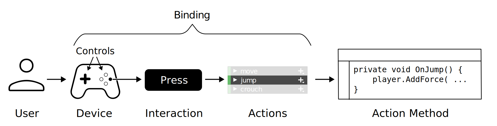

# InputSystem

InputSystem 允许玩具使用 device，touch，或 gestures 控制游戏或应用程序。

Unity 支持两个独立的输入系统：

- 旧的 Input Manager，它是 core Unity platform 的一部分
- InputSystem，更灵活，目的是替换 Input Manager

## Basic Concepts

- Actions

  在 device 交互和游戏 code 之间的抽象层，作为 input 的 result，不管使用的哪种输入设备执行的输入。Actions 通常有一个对程序来说适当的名字，它应该是一个动词，例如 Jump，Crouch，Use，Start，Quit。Input System 可以帮助你管理和编辑 actions，或者你可以自己实现它们。

- Action Asset

  在一个资源文件中定义并配置一组 actions，包括绑定 controls，将相关 actions 分组到 Action Maps 中，指定哪些 controls 属于不同的 Control Schemes。

- Embeded Actions

  直接在 scripts 中定义的 Actions 字段（而不是在 Action Asset 中，ScriptableObject）。这些 action 和 action asset 中定义的那些 action 一样。但是因为它们的定位为 script 中的单独字段，因此不能将 Actions 分组为 Action Maps 和 Control Schemes。

- Binding

  Action 和 Device Controls 之间的绑定。

## Extended concepts

TODO

## Workflows

There are multiple ways to use the Input System, and the workflow that’s right for you depends on how quickly you want to get up and running, how flexible you want your input code to be, and whether you prefer to set things up in the Unity Editor, or in code.

不同的 workflow 提供了不同的灵活度与抽象性。

### Workflow - Direct

在代码中显式引用 device controls，并直接读取 values。最快的 set up 一个 device 的方式，但是最缺乏灵活性。

### Workflow - Embedded Actions

在代码中使用 InputAction 字段，在 Inspector UI 中配置 device controls bindings。

### Workflow - Actions Asset

在 ScriptableObject asset 定义 actions bindings，代码中不直接定义 actions。

### Workflow - PlayerInput Component

使用 Actions Asset 时，PlayerInput 组件提供 Inspector UI 来连接 actions 到脚本中的 event handlers，不再需要任何 Input System 和 Action Methods 之间的中间桥接代码。
