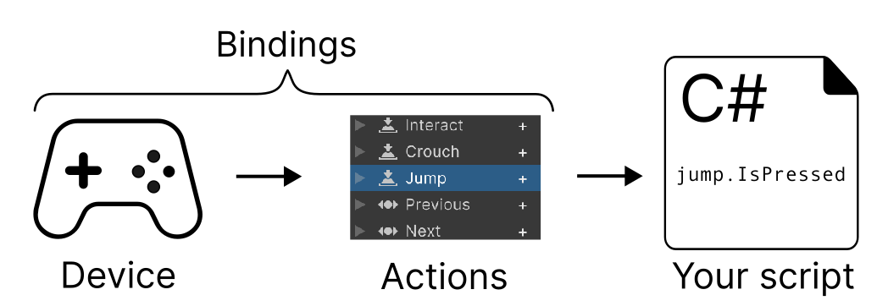
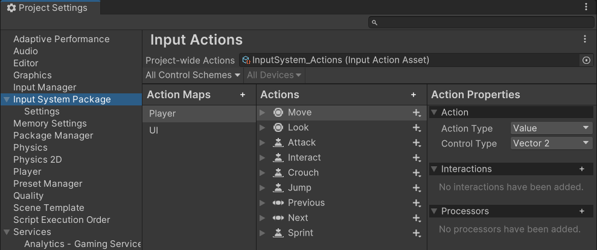
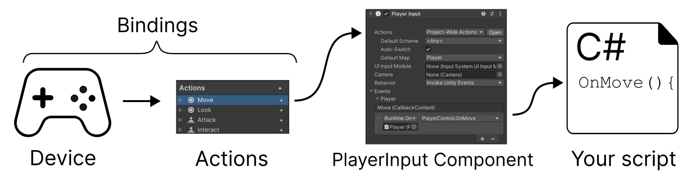
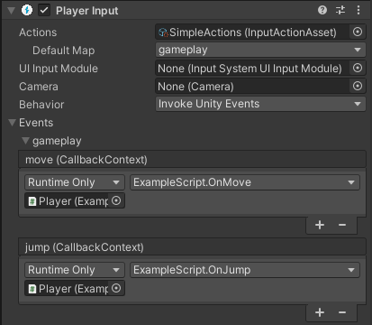
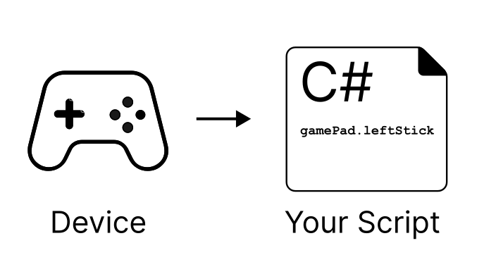

有很多方法使用 Input System，但是主要和建议的 workflow 是使用 Project Settings Window 中的 Input Actions 面板来配置 project-wide Actions 和 Bindings，在你的 Start 方法中获取那些 actions 的引用，然后在 Update 方法中读取那些 actions 的 values。

其他的 workflows 适用于很多不寻常的场景，例如可以联合使用 Actions 和 Bindings 与 PlayInput 组件，PlayInput 添加了更高一层的抽象，允许你连接 actions 和 event handlers，而不需要任何中间代码，很容易处理 multiplayer 情景。

你可以选择在 Editor UI 中配置 Actions 和 Bindings，也可以在 script 中手动设置所有东西。或者你可以使用更直接的方式，完全忽略 Actions 和 Bindings，而是直接用 script 读取 devices 的 state。

下面描述这些主要的 workflow。

- Using Actions

  这是对大多数场景的建议 workflow。在这个 workflow 中，你使用 Actions Editor window 来配置一组 actions 和 bindings，然后在 code 中设置对 actions 的引用，并读取它的值。

- Using Actions and the PlayerInput 组件

  这个 workflow 提供额外的功能，它允许你直接连接 Actions 和你自己 event handler 方法的 callback，不需要在 code 中手动处理 Action references。

  它还提供了 local multiplayer 场景的支持，例如 split-screen 功能，每个 screen 对应一个 player，每个 player 有自己的 PlayerInput。

- Directly read device states

  这个 workflow 是一个简化的，script-only 的方法，完全忽略了 Actions 和 Bindings。相反，script 直接引用具体的 device controls（例如 left gamepad stick），然后直接读取 value。它适合 fast prototyping，或固定单一设备的情景。这非常类似就的 Input。它也是最不灵活的 workflow，因为它放弃了 input system 的主要功能。

不同的 workflows 使用的 code 也是不同的。一些 code 可能使用 action references，而另一些 code 可能直接从 devices 读取 input。

# Workflow-Actions



尽管 InputSystem 有很多 workflow 可以选择，但是这是最建议的 workflow，它适合大多数 game 和 app 的场景。

这个 workflow 中，你在 Input Actions editor 中配置 Actions 和 Bindings，然后设置对那些 actions 的引用，最后在 code 读取它们的 value。

## Configure Actions in Actions Editor

通过 Edit > Project Settings > Input System Package > Input Actions 打开 Input System。

如果你还没有 create 和 assign 默认的 project-wide actions，Input System 设置窗口会显式一个按钮来进行这个任务。

一旦 create 和 assign 默认的 project-wide actions，Project Settings 将会显式 Actions Editor 面板：



Input Actions Editors 提供了一种方式来定义和管理你想要 users 在 game 或 app 中做什么的 Actions。它还允许你在 Actions 和一个或多个 device control 之间创建 Bindings。

Actions 和 Bindings 允许将 game/app 中可以做的事情的概念和 player/user 进行输入的设备进行分离，让你的 code 更简单更灵活。这与直接读取 device states 形成对比，后者适合简单的项目，或快速原型，但是对复杂的项目将变得怪异和不灵活。

### default actions

Input System 带有预制的默认 Actions，例如 Move，Jump，以及更多。这适用于很多常见 app 和 game 场景。它们被配置来读取大多数 input controller 类型，例如 Keyboard，Mosue，Gamepad，Touchscreen，和 XR。

这意味着，大部分情况下，可以直接使用 InputSystem 进行编码，而不需要任何配置，通过引用 default actions 的名字，它们已经被配置好了。

## Accessing your Actions from code

有各种方式在 code 中访问 actions。最简单的方式是使用 FindAction 方法。

FindAction 允许通过名字搜索一个 action，并且返回 reference，有了 reference 后，既可以直接读取值（轮询 polling），也可以添加一个 callback methods，当 action 执行时调用它们。

查找或存储 action reference 和查找存储 Component reference 类似。

- 在 script 顶部添加 using InputSystem 语句，这允许在脚本中使用 Input System API

  ```C#
  using UnityEngine.InputSystem
  ```

- 为每个要使用的 Action 在 class body 中创建 InputAction 类型的变量。它们将用来存储每个 Action 的引用

- 在 Start() 方法中，使用 FindAction 查找每个 action 的 reference，存储到相应的变量中

  ```C#
  InputAction moveAction = InputSystem.actions.FindAction("Move");
  InputAction jumpAction = InputSystem.actions.FindAction("Jump");
  ```

- 在 Update() 方法中，从 action 变量读取 value。这允许编写 code 每帧读取 Actions 的最新的值，并进行响应。

  这种方法读取 value 依赖于 Action value type。

  一些 actions 可能返回一个 1D(float) 或 2D(Vector2) axis value，而其他 actions 可能返回一个 boolean true/false value。

  例如 Move action 返回一个 2D axis，Jump action 返回一个 bool。

  ```C#
  Vector2 moveValue = moveAction.ReadValue<Vector2>();
  bool jumpValue = jumpAction.IsPressed();
  ```
  
  下面的例子展示完整过程：

  ```C#
  using UnityEngine;
  using UnityEngine.InputSystem;
  
  public class Example : MonoBehaviour
  {
      // These variables are to hold the Action references
      InputAction moveAction;
      InputAction jumpAction;
  
      private void Start()
      {
          // Find the references to the "Move" and "Jump" actions
          moveAction = InputSystem.actions.FindAction("Move");
          jumpAction = InputSystem.actions.FindAction("Jump");
      }
  
      void Update()
      {
          // Read the "Move" action value, which is a 2D vector
          // and the "Jump" action state, which is a boolean value
  
          Vector2 moveValue = moveAction.ReadValue<Vector2>();
          // your movement code here
  
          if (jumpAction.IsPressed())
          {
              // your jump code here
          }
      }
  }
  ```

  避免在 Update() 中使用 FindAction，因为它执行一个 string-based lookup，这会影响性能。应该在 Start 查找并存储。

  InputSystem.actions API 专门引用赋值给 project-wide actions 的 Action Asset。大部分项目只需要一个 Action Asset。但是如果你想要多个 Action Asset，你必须使用 InputActionAsset 为你想访问的 asset 创建一个 reference。

## Pros and Cons

这是 Input System Package 建议的 workflow，提供一个灵活但是简单的解决方案，适用于大部分 projects。

你可以从 Action-based features 收益，例如 Action Maps，Bindings，以及在 Actions Editor 中配置它们的功能。你还可以在运行时进行 rebindins。

这个 workflow 自己对使用多个 device 的 local multiplayer 场景没有提供内置支持，因此如果你想要创建一个 local multiplayer game，应该使用 Actions & PlayerInput workflow。

# Workflow-Actions & PlayerInput



Input System 提供的最高层抽象是同时使用 Actions 和 Player Input 组件。

PlayerInput 提供一种方式在配置的 Actions 和 MonoBehaviour 脚本 C# methods 创建连接，这样当 user 执行一个 input action 时，会调用这些 C# methods。

这允许你在 inspector 中使用 UI 设置这些连接，以使用 event-driven 模型，而不是编写 code 轮询 Actions 的 values。

PlayerInput 组件还支持 local multi-player 场景。你可以将 PlayerInput 组件和 PlayerInputManager 组件一起使用，当新设备有输入发生时，来处理新 players 的自动初始化。例如，如果你在制作 4-player local 合作游戏，当新 players 在它们各自的 controller 按下 start 时，PlayerInput 和 PlayerInputManager 可以允许新 players 加入。



上面的示例中，PlayerInput 组件设置为将 Move，Jump actions 映射到脚本中的 OnMove，OnJump，使用 Unity Events。

```C#
using UnityEngine;
using UnityEngine.InputSystem;

// This script is designed to have the OnMove and
// OnJump methods called by a PlayerInput component

public class ExampleScript : MonoBehaviour
{
    Vector2 moveAmount;

    public void OnMove(InputAction.CallbackContext context)
    {
        // read the value for the "move" action each event call
        moveAmount = context.ReadValue<Vector2>();
    }

    public void OnJump(InputAction.CallbackContext context)
    {
        // your jump code goes here.
    }

    public void Update()
    {
        // to use the Vector2 value from the "move" action each
        // frame, use the "moveAmount" variable here.
    }
}
```

作为一个通用的规则，如果你使用 PlayerInput workflow，你应该像上面一样通过 callbacks 读取输入，但是如果你需要在使用 PlayerInput 组件时直接访问 input actions asset，应该访问 PlayerInput 组件的 action 副本，而不是 InputSystem.actions。

这是因为 PlayerInput 组件执行 device 过滤来自动将 devices 分配给 multiple players，这样每个实例都有它自己的 actions 副本。如果你绕过它，直接读取 InputSystem.actions，自动 device 分配不会工作。

## Pros and Cons

这个 workflow 相比 Actions without a PlayerInput component 有自己的优缺点。

因为它基于 Actions 构建，因此具有 Actions 提供的所有优势，例如 Action Maps，Bindings，以及在 Action Editor 中配置它们的能力。还可以在运行时实现 user rebinding。

这个 workflow 还允许在 Editor 设置 callbacks，这有时可以减少代码复杂度，但是也会使 debuging 更复杂，因为 actions 和 code 之间的连接不是在 code 中定义的。

它还对 local multiplayer 场景的 devices 分配和 screen-splitting 提供了 ready-made handling。尽管这些东西你可以自己实现，但是有要给简单的解决方案直接可用，可以让工作更容易。但是如果选择了这个选项，实现某种程度上使一个 black box，意味着不太能自定义它的行为。

就像其他 workflows，这个 workflow 存在灵活性、简易性、实现速度的取舍。

# Workflow-Direct - Directly Reading Device States



这是最简单最直接的 input workflow，但是最少灵活性。它绕开了 Input Actions editor，因此无法收益于 Actions 的所有功能。

如果你想要一个特定类型 device 的快速实现，这很有用。如果你想要向 user 提供多种类型的 input 或者目标使多种平台，这通常不是最好的选择。

你可以从连接的 device 直接读取 values，通过引用 device 的 controls，并读取它们当前帧产生的 values：

```C#
using UnityEngine;
using UnityEngine.InputSystem;

public class MyPlayerScript : MonoBehaviour
{
    void Update()
    {
        var gamepad = Gamepad.current;
        if (gamepad == null)
        {
            return; // No gamepad connected.
        }

        if (gamepad.rightTrigger.wasPressedThisFrame)
        {
            // 'Use' code here
        }

        Vector2 move = gamepad.leftStick.ReadValue();
        {
            // 'Move' code here
        }
    }
}
```

上面的示例，直接从当前连接的 gamepad 的 right trigger 和 left stick 读取 values。它没有使用 input system 的 Action 类。还可以对其他类型的 Device 使用相同的方式，例如 keyboard 或 mouse。

## Pros and Cons

这是最快的方式来设置 code 以响应输入，但是它最不灵活，因为在 code 和具体设备产生的 value 之间没有抽象层。

如果选择这种技术：

- 不能从 Unity 的 actions 和 interactions 管理受益
- 很难让 game 或 app 同时跟多种类型的 input device 一起工作
- 你的 input bindings 是硬编码在脚本中的，因此任何 bindings 的改变都需要改变 code
- 很难实现允许 user 在运行时 remap controls 到 actions

