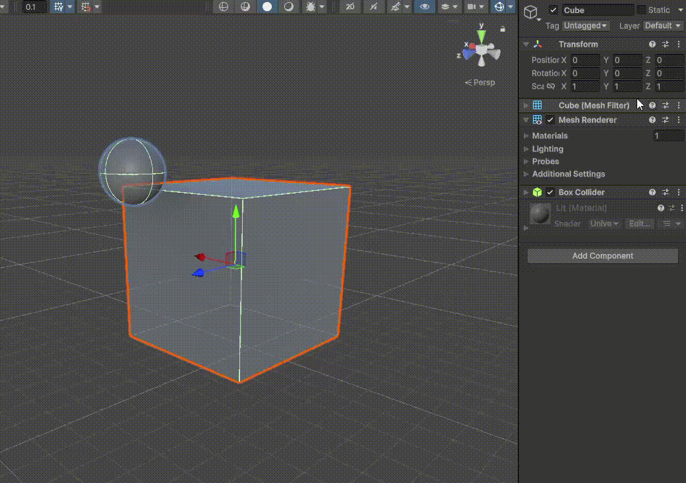
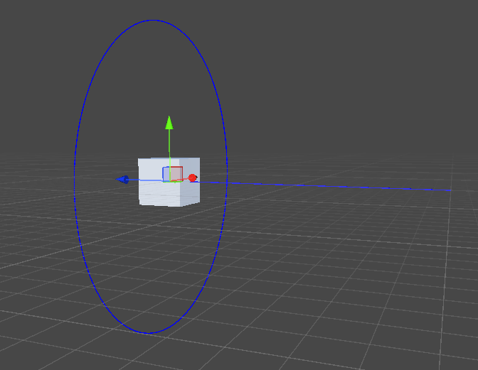
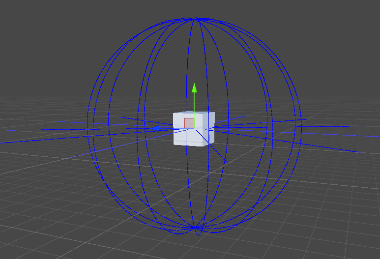
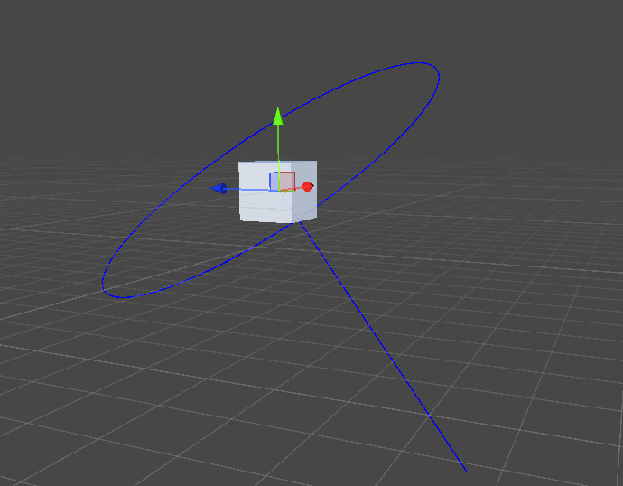
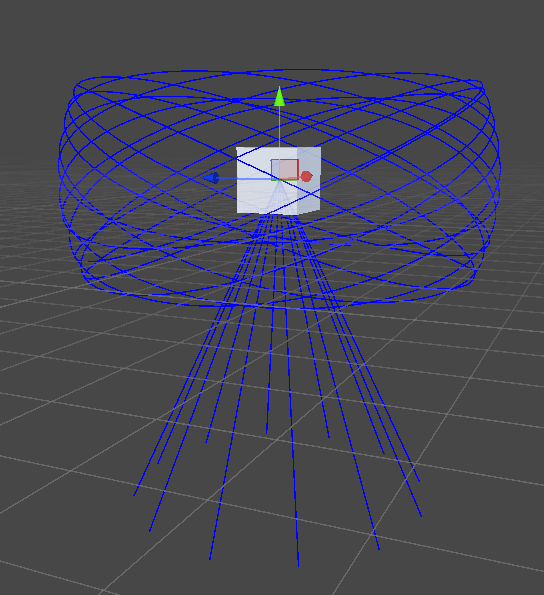
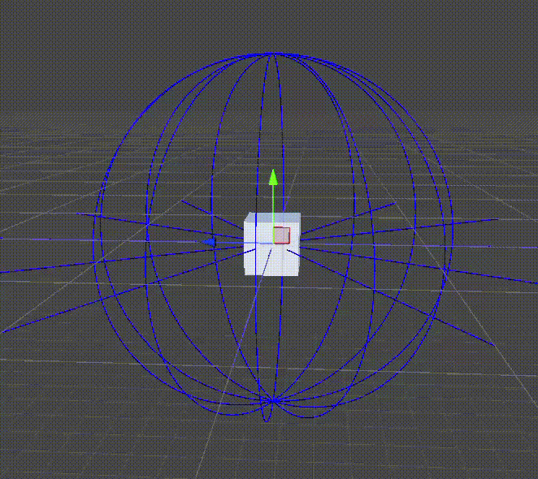

默认情况下，Unity 会按照 Z、X、Y 的顺序应用变换检查器（Transform Inspector）中显示的欧拉角。XYZ 右移一位，先应用的是 child，后应用的是 parent，总是在当前 identity 坐标系对前面已经旋转了的 object 旋转。

先 roll（左右翻滚），然后 tilt（上下俯仰），最后 yaw（水平偏航），每一个都是在 Identity 坐标系进行，而不是在前面旋转后的 local 坐标系进行。

Y 是 X 的 parent，X 是 Z 的 parent。可以想象为这样的一个 rig：```Y->X->Z```，其中 Y 只绕着自身（Y 这个 GameObject）的 Y 轴旋转，X 只绕着自身（X 这个 GameObject）的 X 轴旋转，Z 只绕着自身（Z 这个 GameObject）的 Z 轴旋转。

如下图所示，以 Global Frame 坐标系（即上面说的 Identity 坐标系）展示 Unity 如何处理欧拉角。先绕 Z 轴旋转，Cube 的本地坐标系已经改变，然后再绕 X 轴旋转，此时绕的 X 轴不是 Cube 已经变化的 local X 轴，而仍然是 Global 坐标系的 X 轴。最后绕 Y 轴旋转时，仍然时绕着 Global 坐标系的 Y 轴，而不是 Cube 中已经改变了 local 的 Y 轴。这就是所说的按 ZXY 的顺序处理欧拉角的过程。


注意，虽然这里按照一定的顺序修改 X Y Z 的欧拉角，但是实际上，欧拉角是一下子赋给 GameObject 的，Unity 统一收到一个 Vector3，不管你按照什么顺序给它的分量赋值。Unity 总是按照 ZXY 的顺序旋转 GameObject。

如果以被选


可见，使用仅包含两个轴的欧拉角还算好理解，一旦使用全部三个分量的欧拉角，就很难理解最终的旋转效果了。

```AI
Unity 只指定两个分量（例如只改 XY 或 YZ）并不会“避免”万向锁。万向锁是否出现取决于 Unity 使用的欧拉角顺规（ZXY）中“中间角”是否接近或等于 ±90°。当中间角接近 ±90° 时，欧拉角表示会出现“轴对齐/退化”，两个自由度被“挤”成只剩一个有效旋转轴，这时即便你不去动第三个分量，也会出现“转不动/跳变/两个轴同向”的现象。该现象在动态欧拉角（绕自身轴连续旋转）下更直观，但本质是欧拉角表示的奇异性，而非是否“用了几个分量”。

Unity 的欧拉角细节
- Unity 内部以四元数存储旋转，Inspector 显示的 eulerAngles 是从四元数反解出的欧拉角，存在区间与多表示等价（如 90° 与 −270° 等效）以及轴的“跳变”。默认顺规为 ZXY（静态）/Z→X→Y（动态）。当中间角（X）接近 ±90° 时，Z 轴与 Y 轴在旋转过程中会趋于对齐，导致“丢失一个旋转维度”的典型万向锁表现；此时即便只调整另外两个分量，也会感觉只能绕同一轴旋转。

常见误解与验证
- “只用两个分量就安全”是误解。万向锁是欧拉角顺规与角度取值导致的表示奇异性；当中间角≈±90° 时，即便你只显式设置两个分量，第三个分量也会被四元数反解“改写”，出现数值跳变或轴对齐。例如把 X 设为 90° 后，再改变 Y 或 Z，常会看到 Z 与 Y 的效果“对调/合并”，这正是万向锁的直观表现。

实践建议
- 需要平滑插值或避免奇异：用 Quaternion（四元数）进行旋转与插值（如 Slerp/Nlerp），只在需要时再转欧拉角显示或编辑；这是业界通用做法，可显著降低万向锁与插值不连续带来的问题。

- 必须用欧拉角交互/编辑：尽量避免让中间角（在 ZXY 顺规下即 X）接近 ±90°；给欧拉角设置“死区/回绕/约束”，并在运行时用四元数作为“真值”存储与插值，欧拉角仅作人机交互或烘焙结果的临时表示。
```

万向锁的问题在于中间角，对于 Unity 的欧拉角顺序，就是绕 X 轴旋转的角。以 Unity 欧拉角为例，如果中间角 X 接近 90 度，则它的 child Z 轴的方向就和它的 parent Y 轴的方向重合了。此时无论给 Y 或 Z 什么值，GameObject 都只能绕着 Y 轴方向（此时也是 Z 轴的方向）旋转了。

如下图所示，将 X 轴设为 90 度，此时它的 "child" Z 轴变成垂直向下，它的 "parent" Y 轴垂直向上，绕 Y 轴旋转和绕 Z 轴旋转，都变成绕垂直方向旋转了，Y 和 Z 共轴，这就是万向锁问题。



实际上，万向锁问题不仅出现在 X 轴成 90 度的情况下。它的本质是在 X 轴固定的情况下，只操作 YZ 两轴不能表示空间中的所有旋转，因为 Y Z 不成 90 度。

可以想象坐标系原点一个射线 ray，外面有一个包围球，ray 与包围球在某个点相交。这个 ray 就代表空间的旋转。是否能表示空间的所有旋转，就看 ray 是否能“照射”到球面上的所有点。

正常情况下，当两个轴保持互成 90 度，如下图所示，绕 X 轴可以垂直方向划个圆，然后绕 Y 轴旋转就可以把这个圆在空间中横扫为一个球面。

绕 X 轴可以划一个圆：



绕 Y 轴可以将圆在空间中横扫为一个球面：



而当欧拉角的中间角度，即使不说 90 度，只要它是大于 0 的任何值，都会导致空间中出现死锁区域，YZ 无法表示这个区域的旋转。根本原因就是 X 不为 0 时，旋转绕的 Y 轴和绕的 Z 轴不再是 90 度。如下图所示，Y 轴仍然垂直向上，但是由于 X 轴的旋转，Z 轴斜向左下方。这样绕 Z 轴就会在空间中划一个倾斜的圆。



然后绕 Y 轴的旋转，只能将这个倾斜的圆在空间中横扫为上下两端截掉的鸟巢形状。这个形状内就是 YZ 轴旋转能表示的全部，其上下两端之外的区间都不能表示。



下面展示了随着 X 轴从 0 到 90 度的旋转，YZ 表示的欧拉角旋转的退化过程：



可见最后，X 轴完全 = 90 度时，YZ 轴已经共轴，欧拉角退化到只能表示水平方向的旋转。

可见欧拉角万向锁的本质就是一旦 X 轴旋转（不为 0），YZ 轴就不再是 90 度。仅靠 YZ 的旋转就不能表示空间中的所有旋转。

理论上只要两个轴永远保持 90 度，就不会出现万向锁问题，因此只要不使用中间角，只使用两个轴， XY、ZX、ZY，同时保持另一个轴总是 = 0，就不会有万向锁的问题。只要其中一个轴保持为 0，另外两个轴就总是互成 90 度。

# Api

Unity 绝大部分用角表示旋转的地方使用的都是角度，但是有两个地方使用了弧度，这是遗留并过时的 API，文档中已经不再提及，但是 Unity API 中仍有保留，很容易跟其他以角度表示欧拉角的 API 混淆，因此非常需要注意：

- Quaternion.EulerAngles（用欧拉角构造四元数），它已经被 Quaternion.Euler 取代，后者用角度表示旋转，前者用弧度。
- Quaternion.AxisAngle（用轴和角构造四元数），它已经被 Quaternion AngleAxis 取代，后者用角度，前者用弧度。从名字也可以看出，Axis-Angle => 轴角，更符合对四元数的定义，属于更早期的命名，但是“错误地”使用了弧度。AngleAxis 明显是对 Axis-Angle 的修正，只是将 Angle 放在前面以给出命名的区别，属于更新更合理的 API。

记不住的话，就看代码自动提示，这两个 API 已经没有文档描述，但是代替的两个有正常的文档描述，明确表示角是 in degrees 的。

其他用角表示旋转的地方，就都是角度（degree）了。transform 的 eulerAngles、localEulerAngles，Quaternion.Euler、Quaternion.eulerAngles，Quaternion.EulerAngles，Quaternion.AngleAxis。
