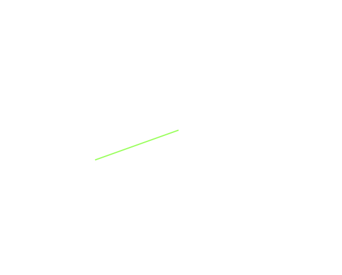

- bool Approximately(float a, float b)
  比较两个浮点数，返回它们是否相近。
  浮点数的不精确度使得通过=比较两个浮点数并不准确。这个函数比较两个浮点数，如果它们的差在 Epsilon 内，则返回 true。

- float Epsilon

  Epsilon 是一个浮点数可以表示的最小非0值。它的操作包括：

  - anyValue + Epsilon = anyValue
  - anyValue - Epsilon = anyValue
  - 0 + Epsilon = Epsilon
  - 0 - Epsilon = -Epsilon

- float InverseLerp(float a, float b, float value)

  正常 Lerp 通过 time factor 返回 a-b 之间插值的 value，InverseLerp 则给定 value，返回其 time factor（0-1 之间）。

- float LerpAngle(float a, float b, float t)

  类似 Lerp，但是会确保当角度超过 360 度 wrap 时，value 被正确地解释。

  这个方法返回指定 angles 之间的最小 path(不超过 180 度的路径)。这个方法对那些超过 [-180, 180] 的 value，进行正确 wrap。例如 LerpAngle(1.0f, 190.0f, 1.0f) 会返回 -170.0f。

  所有角度都被 wrap 在 [-180, 180] 之间，而且在坐标系中都指向同一个角度。

  

- float LerpUnclamped(float a, float b, float t)

  正常 Lerp，t 会被 clamp 到 [0, 1] 之间，返回的值也会 clamp 在 [a, b] 之间。

  LerpUnclamped 中，t 不会被 clamp [0, 1] 之间，返回的值也会返回 [a, b] 之外的正确值。

- float PingPong(float t, float length)

  与 Lerp 不同，t 不是比例值，而是与 length 一样的单位。函数遵循三角波函数曲线，随着 t 的增长，函数值先正比增长到 length，然后再反比降到 0，在正比增长到 length，再反比降到 0。例如 t 从 0 到 length，函数值也从 0 到 length，t 从 length 到 2*length，函数值则从 length 到 0.

- float Repeat(float t, float length)

  和 PingPong 一样，t 与 length 单位相同。但 Repeat 是锯形波，而 PingPong 是三角波。Repeat 类似求余，但是是对浮点数的。例如 t 从 0 到 length，函数值也从 0 到 length，t 从 length 到 2 * length，函数值重新从 0 到 length。

- float SmoothStep(float from, float to, float t)

  这其实是个 InSine-OutSine 的 Easy 函数。应该是早期的 Mathf 函数，现在都以及被 AnimationCurve 或 Tween 取代。

- float SmoothDamp(float current, float target, ref float currentVelocity, float smoothTime, float maxSpeed = Mathf.Infinity, float deltaTime = Time.deltaTime)

  在指定的时间、以指定的速度，平滑地将 current value 移动到 target value。它使用类似 spring-damper 算法平滑地将 current value 移动到 target value。这个算法基于《Game Programming Gems 4》第1章第10节。 

  这个方法尝试避免超出 overshooting target value。当 deltaTime 是 0.0f，这个方法为 currentVelocity 产生 NaN。如果使用 NaN 的 currentVelocity 再次调用，方法返回 NaN。因此避免为 smoothTime 传递 0.0f。

  Mathf.SmoothDamp 是 Unity 中用于平滑缓冲标量值（如位置、角度、透明度等）的静态方法，通过模拟“弹簧阻尼”效果，让当前值逐渐趋近于目标值，避免突兀的变化。它广泛应用于相机跟随、物体移动、UI 动画等需要自然过渡的场景。

  ```C#
  public static float SmoothDamp(
    float current,          // 当前值（如物体的当前位置x/y/z）
    float target,           // 目标值（如目标物体的位置x/y/z）
    ref float currentVelocity, // 当前速度（引用参数，用于存储状态，需初始化为0）
    float smoothTime,       // 平滑时间（达到目标所需的大致时间，值越小越快）
    float maxSpeed = Mathf.Infinity, // 最大速度（可选，限制变化速度，默认无限大）
    float deltaTime = Time.deltaTime // 时间增量（可选，默认用Time.deltaTime适配帧率）
  );
  ```

  currentVelocity：必须用 ref传递（如 ref float yVelocity），函数内部会更新该值以维持平滑状态，无需手动修改，初始值建议设为 0。多次调用传递这个值，作为状态保持。

  smoothTime：直观影响平滑速度，例如 0.3秒表示约 0.3 秒内完成过渡，值越大过渡越平缓。

  maxSpeed：可选限制，防止物体移动过快（如避免相机突然冲向目标），默认 Mathf.Infinity表示不限制。

  调整 smoothTime：

  - 若过渡太慢（如相机迟迟不到目标），减小 smoothTime（如从 0.3 改为 0.1）
  - 若过渡太生硬（如物体突然跳动），增大 smoothTime（如从 0.3 改为 0.5）

  使用 maxSpeed：

  - 当需要限制物体移动速度时（如避免相机追得太快），设置 maxSpeed（如 maxSpeed = 5f表示最大速度为 5 单位/秒）。
  - 保持 deltaTime默认：在 Update中无需手动传入 deltaTime（默认 Time.deltaTime），确保不同帧率下平滑效果一致 。

  常见应用场景：
  - 相机跟随：让相机平滑跟踪玩家或目标物体（如横版游戏、3D 第一人称游戏）；
  - 物体移动：实现物体缓慢移动到目标位置（如宝箱开启后移动到指定位置）；
  - UI 动画：平滑调整 UI 元素的位置、透明度（如弹窗淡入淡出）；
  - Boss 行为：让 Boss 平滑转向玩家（如直升机跟踪士兵的视角调整）

  另一种过渡方法是使用 Lerp，总是以一个固定的 t 调用 Lerp，类如 Lerp(current, target, 0.5f）。这会以 0.5f 的指数曲线平滑值，current value 无需平滑接近 target value。

- float SmoothDampAngle(float current, float target, ref float currentVelocity, float smoothTime, float maxSpeed = Mathf.Infinity, float deltaTime = Time.deltaTime)

  SmoothDampAngle 是专门针对角度值设计的平滑缓冲函数，用于处理旋转相关的数值（如物体旋转角度、摄像机朝向、UI元素旋转等），解决角度环绕（如360°→0°）时的突变问题，确保旋转过渡更自然。

  SmoothDamp 直接对输入的角度值进行线性或指数衰减，不处理角度环绕问题。若目标角度与当前角度差值超过180°，会优先朝“反方向”移动（如从350°到10°，会先转到340°再到10°），导致过渡不自然。

  SmoothDampAngle 内部集成了角度差值归一化处理（类似Mathf.DeltaAngle函数），会自动计算当前角度与目标角度的最短差值（始终取0°~180°之间的值）。例如，从350°到10°时，会直接朝10°方向移动（差值为20°），避免绕远路，更适合旋转场景。

  主要差别在 current 和 target 参数，SmoothDampAngle 的 current/target 为角度值（度数），需以度为单位输入（如0°~360°），函数内部会自动处理角度归一化。

  总之，如果是平滑角度，就使用 SmoothDampAngle，其他值就使用 SmoothDamp。

- float DeltaAngle(float current, float target)

  返回 [-179, 180] 之间的角度值。它计算 current 和 target 之间的最短的角度路径。

- float PerlinNoise(float x, float y)

  返回值 0-1 之间的值，可能略微小于 0 或大于 1.

  产生一个 2D 柏林噪声。

  柏林噪声是在 2D 平面上生成的伪随机模式。这个噪声并不是在每个点包含一个完整的随机数，而是由 waves 组成（定义），这些 waves 在整个 pattern 上平滑地增长或下降。噪声可以被用于基于纹理的特效的基础，也可以用于 animation，生成地形高度映射 heightmaps，以及很多其他方面的应用。

  平面上的任何一点都可以通过传递相应的 x y 坐标采样。相同的坐标总是返回相同的值，但是平面本质上是无穷的，采样坐标不需要限制在 0-1 之间，因此可以通过在 plane 上选择随机区域来避免重复。

  柏林噪声在 2D 平面上连续且无穷，可以选择任意区域，x y 坐标不限制在 0-1 范围。例如 (0, 0) - (1, 1) 这个矩形的噪声与 (1, 3) - (2, 4) 这个矩形的噪声就是不同的。但是只要 x 或 y 是连续，采样的值也是连续的。

- float PerlinNoise1D(float x)

  等价于 PerlinNoise(x, 0)。柏林噪声平面是由 waves 定义的，任何一点都是连续可导的，因此沿一条直线（不仅是水平还是垂直），求值 PerlinNoise 都是连续的。

  一维柏林噪声就是专取 y = 0 这条直线在柏林噪声平面上穿过的曲线进行求值的，这个曲线也是无穷的，x 可以取任意值，通过选择不同的区域避免 pattern 重复。

- float MoveTowards(float current, float target, float maxDelta)

  将 current 移动向 target，每次不超过 maxDelta。本质就是每次给 current 累加 maxDelta，如果超过了 target 就限制到 target。

- float MoveTowardsAngle(float current, float target, float maxDelta)

  类似 MoveTowards，但是专门用于角度，确保角度在 360° wrap 时能正确解释。current 和 target 假设为角度。

  即用于角度的 MoveTowards 就使用 MoveTowardsAngle，其他的值就使用 MoveTowards。

  出于优化的原因，不支持负数 maxDelta，可能导致震荡。要将 current 推向远离 target angle 的方向，添加 180° 到原本的 target 角度上。

