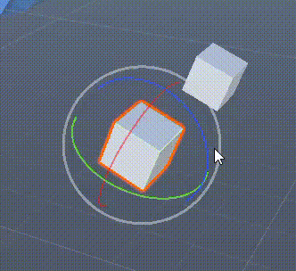

​
# ​Quaternion 没有 SmoothDamp 方法​​

在 Unity 的 Quaternion类中，​​没有内置的 SmoothDamp方法​​。SmoothDamp是 Vector3类的静态方法，主要用于实现向量值的平滑阻尼过渡（如位置、缩放等），其作用是通过逐渐调整当前值向目标值靠近，避免突变，常用于相机跟随、物体移动等场景。
若需要对四元数（Quaternion）进行平滑旋转，Unity 提供了专门的 Quaternion.Slerp（球面线性插值）和 Quaternion.Lerp（线性插值）方法：
​​Quaternion.Slerp​​：通过球面插值在两个四元数之间实现平滑过渡，保持旋转的自然性（如角色转身、摄像机视角调整），是 Unity 中最常用的四元数插值方法。
​​Quaternion.Lerp​​：通过线性插值在两个四元数之间过渡，计算更简单，但旋转速度会随插值进度变化（初始快、后期慢），适合对性能要求高但对旋转自然度要求较低的场景。
若需实现类似 SmoothDamp的“阻尼”效果（如旋转速度逐渐衰减），可通过 Quaternion.Slerp结合 Time.deltaTime调整插值比例，或使用 Quaternion.RotateTowards方法（限制每帧最大旋转角度），但这些均需手动实现，而非 Quaternion类的内置功能。
综上，Quaternion类没有 SmoothDamp方法，其平滑旋转需通过 Slerp、Lerp或 RotateTowards等方法实现。


# ​​Unity 中 Vector3.SmoothDamp 对欧拉角平滑过渡会有万向锁问题
​​
​​结论​​：使用Vector3.SmoothDamp对物体的欧拉角进行平滑过渡时，​​会产生万向锁问题​​。其根源在于Vector3.SmoothDamp直接操作欧拉角的数值，而欧拉角的本质缺陷（动态旋转轴依赖）未被规避。

万向锁的产生条件与Vector3.SmoothDamp的关联​​：万向锁（Gimbal Lock）是​​动态欧拉角​​（绕物体自身坐标系依次旋转）的固有问题，当绕中间轴（如Unity默认的“Heading→Pitch→Bank”顺序中的Pitch轴）旋转±90°时，首尾旋转轴（如Heading轴与Bank轴）会重合，导致旋转自由度丢失（从三维降为二维）。

Vector3.SmoothDamp的作用是对​​向量值（如欧拉角的x、y、z分量）​​进行平滑插值，其计算逻辑是基于数值的线性/阻尼变化，而非旋转的几何意义。当欧拉角的某个分量（如Pitch）接近±90°时，SmoothDamp仍会继续插值其他分量（如Heading、Bank），但由于动态旋转轴的重合，这些分量的变化会导致旋转方向突变，表现为“卡顿”“抖动”或“意外翻转”——这正是万向锁的典型症状。

若需对物体旋转进行平滑过渡，​​优先使用四元数（Quaternion）代替欧拉角​​。四元数通过“轴角表示法”（绕单位轴旋转一定角度）避免了动态旋转轴的重合问题，天然免疫万向锁。Unity提供了Quaternion.Slerp（球面线性插值）和Quaternion.SmoothDamp（四元数阻尼插值）等方法，可实现安全、平滑的旋转过渡。

Vector3.SmoothDamp直接操作欧拉角的数值，无法规避动态旋转轴重合的问题，因此会对欧拉角平滑过渡产生万向锁。若需安全实现旋转平滑，应优先使用四元数方法（如Quaternion.Slerp），或通过限制角度、调整旋转顺序等方式减少万向锁的影响。


# Unity Quaternion的Lerp与Slerp核心区别  

1. 插值路径差异

Lerp（线性插值）是直线插值，沿着起始四元数（startQuat）与目标四元数（endQuat）之间的直线路径过渡；Slerp（球面线性插值）是球面弧线插值，沿着起始与目标四元数所在球面的最短弧线（大圆弧）过渡。这种路径差异直接影响旋转的自然度——Slerp的路径更符合人类对旋转的直觉认知（如角色转头时不会“穿模”或“抖动”）。  

2. 旋转速度特性

Slerp能保持恒定角速度（Angular Velocity），即旋转过程中每单位时间的旋转角度一致，不会出现“开始快、后面慢”或“突然加速”的不自然现象；而Lerp的旋转速度会随插值进度变化——初始阶段速度较快，接近目标时速度减慢（类似“缓入缓出”），但这种速度变化会导致旋转过程不够平滑。  

3. 计算复杂度对比

Lerp的计算更简单高效，仅需一次线性计算（公式：Lerp(A, B, t) = A + t*(B - A)），适合对性能要求高的场景（如大量物体的简单位置插值）；Slerp的计算更复杂，涉及三角函数（sin）和除法运算（公式：Slerp(A, B, t) = (sin((1-t)θ)/sinθ)*A + (sin(tθ)/sinθ)*B，其中θ为两四元数的夹角），性能开销略高，但更适合旋转插值。  

4. 适用场景明确

Lerp适合非旋转属性的线性过渡，如位置（Vector3.Lerp）、颜色（Color.Lerp）、数值（Mathf.Lerp）等，这些属性的变化不需要考虑“路径”的自然性；Slerp专为四元数旋转插值设计，适合角色转身、摄像机跟随、骨骼动画等需要平滑、自然旋转的场景，能有效避免欧拉角带来的万向节死锁问题。  

5. 插值精度区别

Slerp的插值精度更高，尤其在起始与目标四元数夹角较大时，能保持旋转的一致性和准确性；而Lerp在大角度插值时，会出现“路径偏离”（直线路径与球面路径差异大），导致旋转结果不自然（如物体旋转时“歪向一边”）。


# Unity Math 中各种数值类型的平滑过渡方法

平滑过渡（MoveTowards，Lerp，Slerp，SmoothDamp）

- float：SmoothDamp，SmoothDampAngle，Lerp，MoveTowards
- Vector3：SmoothDamp，Lerp，MoveTowards，Slerp，RotateTowards
- Quaternion：Lerp，Slerp，RotateTowards

SmoothDamp 只为 float 和 vector3 提供（vector3 的版本只是 float 的版本的当个分量复合）。Quaternion 没有 SmoothDamp 方法。

使用固定插值因子 t 每一帧对 current value 和 target value 进行插值，也能得到平滑过渡效果，从视觉上与 SmoothDamp 看起来差不多。二者的差异如下：

- 核心机制差异

  固定插值系数（如Mathf.Lerp）：通过线性或自定义系数（t）直接控制每帧的插值比例，公式为result = current + (target - current) * t。若t固定（如0.5），则每帧移动固定比例的距离（如从10到0，每帧移动5），呈现先快后慢的非匀速运动；若t随时间递增（如t = time/duration），则可实现匀速运动，但需手动维护时间变量。  

  Mathf.SmoothDamp：采用弹簧-阻尼物理模型，通过内部计算调整速度，实现非匀减速运动（类似物体受到阻力逐渐减速）。其核心逻辑是根据当前速度、目标距离和smoothTime动态调整每一步的移动量，无需手动维护速度变量（需通过ref传递currentVelocity）。

- 速度控制方式

  固定插值系数：速度由外部参数直接决定。若使用固定t（如0.1），则速度随目标距离缩小而指数递减（如distance * t）；若要匀速，需将t与时间增量关联（如t = speed * Time.deltaTime），但需额外处理到达目标时的精度问题（如浮点数误差导致无法完全到达）。  

  Mathf.SmoothDamp：速度由内部算法自动调节，受smoothTime（近似到达时间，值越小速度越快）、maxSpeed（限制最大速度）和currentVelocity（上一次的速度）影响。其速度变化更符合物理直觉（如接近目标时速度逐渐减小至0），无需手动调整速度参数。

- 到达目标的行为

  固定插值系数：若t固定且不为1（如0.5），永远不会完全到达目标（因每帧移动剩余距离的一部分，数学上极限趋近于目标但无法抵达）；若t随时间递增至1（如t = Mathf.Clamp01(time/duration)），则会在指定时间准确到达目标，但需手动重置起始点和t值。  

  Mathf.SmoothDamp：会自动接近并停在目标值（通过Mathf.Clamp限制目标距离，避免过度移动），且可通过maxSpeed限制最大速度（如快速移动时不会超过设定阈值），适合需要稳定停止的场景。

- 使用复杂度与维护成本

  固定插值系数：实现简单，仅需控制t值（如固定t或随时间递增）。但需手动维护起始点（若每帧更新current为result，则需保留初始值）和时间变量（若要匀速），容易因变量管理不当导致运动异常（如起始点未固定导致非匀速）。  

  Mathf.SmoothDamp：需传递ref currentVelocity（维护上一次的速度状态），增加了变量管理的复杂度，但内部处理了速度调节、时间增量和边界条件（如maxSpeed限制），使用更便捷，尤其适合需要平滑跟随的场景（如相机跟随、物体缓动）。

- 适用场景差异

  固定插值系数：适合简单、可控的过渡需求，如UI元素的淡入淡出（固定t实现线性渐变）、数值的匀速变化（手动计算t）或需要精确控制速度的场景（如子弹飞行速度固定）。  

  Mathf.SmoothDamp：适合需要自然、物理感的平滑过渡，如相机跟随角色（避免突兀的移动）、物体缓动到目标位置（如弹簧门关闭）、UI元素的弹性动画（如按钮点击后的回弹）等，能提供更真实的运动效果。

Mathf 提供了 SmoothStep 函数，但它只是 Ease Curve 的 Sine-in-Sine-out 特例而已，现在早已被 Ease Curve 曲线采样代替了。

不知道 SmoothDamp 是否也是这样的一个过时函数，因为用固定因子每帧插值也能得到类似的平滑过渡效果，还不用维护一个 velocity 状态变量。不知道是否应该用插值方法代替 SmoothDamp。插值方法可以适用于 float，Vector3，Quaternion 所有类型，SmoothDamp 只能用于 float 和 Vector3，并且对 Vector3 还不能用于欧拉角。

所有的旋转都使用 轴+角度（四元数）方式来表达，避免各种问题。欧拉角只应用于单轴旋转，即四元数（轴+角度）的特例，只为 X Y Z 中的一个轴提供一个角度。

针对角度的 SmoothDampAngle 只为 float 提供，没有对 Vector3 提供。

Vector3 也包含 RotateTowards 和 Slerp 方法，是将 vector3 作为方向来处理了。

据说 SmoothDamp 更符合自然、物理效果，但实际并不能和插值的效果明显区分。因此可以先用插值方法平滑过渡，如果发现效果不好，在用 SmoothDamp。但是 SmoothDamp 只能用于 float 和 Vector3，因此对于 Quaternion 只有插值一个选项。

固定因子插值几个注意点：

- 因子应乘以 Time.deltaTime，以在帧率变化时保持一致速度
- 可添加一个末端 clamp：如果当前值过渡到目标值附近，与目标值相差非常小的时候，可以直接跳跃到目标值，并且不进行插值。因为固定因子插值理论上永远到达不了 target，只能无限接近

# SmoothDampAngle



如图所示，右边的 cube 跟随左边 cube 的 z 轴旋转，欧拉角（0， 0， z）。前一半阶段使用 SmoothDamp，每当角度超过 360 度的边界，跟随的 cube 就会出现突变的旋转。后一半阶段使用 SmoothDampAngle，角度进行 360 wrap，旋转状态正常。

SmoothDampAngle 只有 Float 版本，只能应用于当个角度。也不要想对欧拉角每个分量分别使用 SmoothDampAngle，因为这本质上还是用欧拉角表示旋转，还是会出现万向锁问题。

SmoothDamp 只对 float Vector3 提供，Quaternion 没有 SmoothDamp 方法，对 Quaternion 平滑过渡使用 Slerp。

下面是使用 AI 生成的脚本，让相机平滑跟踪和观察 target，可见对位置的平滑使用 SmoothDamp，对旋转使用 Slerp.

以下是一个完整的 Unity C# 脚本，实现​​相机以固定偏移量平滑跟随目标物体​​，同时​​平滑朝向目标物体​​的功能。脚本采用 LateUpdate确保相机移动在目标物体移动之后，避免穿模；使用 Vector3.SmoothDamp实现位置平滑过渡，用 Quaternion.Slerp实现旋转平滑，兼顾性能与视觉效果。

```C#
using UnityEngine;

[RequireComponent(typeof(Camera))] // 确保脚本挂载的物体有Camera组件
public class SmoothCameraFollow : MonoBehaviour
{
    [Header("Target Settings")]
    [Tooltip("需要跟随的目标物体")]
    public Transform target; // 目标物体的Transform组件

    [Header("Follow Offset Settings")]
    [Tooltip("相机与目标的偏移量（初始值，可运行时调整）")]
    public Vector3 followOffset = new Vector3(0, 5, -10); // 相机相对于目标的偏移（x:左右, y:上下, z:前后）

    [Header("Movement Smoothing Settings")]
    [Tooltip("位置平滑速度（值越大，跟随越快；0.1-0.3适合多数场景）")]
    public float positionSmoothSpeed = 0.15f; // 位置插值的平滑系数
    [Tooltip("位置变化的阈值（小于该值时停止移动，避免微小抖动）")]
    public float positionThreshold = 0.01f; // 位置变化的阈值

    [Header("Rotation Smoothing Settings")]
    [Tooltip("旋转平滑速度（值越大，转向越快；0.1-0.3适合多数场景）")]
    public float rotationSmoothSpeed = 0.2f; // 旋转插值的平滑系数

    private Vector3 velocity = Vector3.zero; // 用于SmoothDamp的速度变量
    private Vector3 targetPosition; // 相机的目标位置

    private void Start()
    {
        if (target == null)
        {
            Debug.LogError("Target is not assigned to the camera follow script!", this);
            enabled = false; // 如果没有目标，禁用脚本
            return;
        }

        // 初始化目标位置（计算初始偏移后的位置）
        targetPosition = target.position + followOffset;
    }

    private void LateUpdate()
    {
        if (target == null) return;

        // 计算相机的新目标位置（目标位置 + 偏移量）
        targetPosition = target.position + followOffset;

        // 使用SmoothDamp平滑移动相机到目标位置
        transform.position = Vector3.SmoothDamp(
            transform.position, 
            targetPosition, 
            ref velocity, 
            positionSmoothSpeed, 
            Mathf.Infinity, 
            Time.deltaTime
        );

        // 让相机始终看向目标物体
        SmoothLookAt(target);
    }

    /// <summary>
    /// 平滑让相机看向目标物体
    /// </summary>
    /// <param name="lookTarget">需要看向的目标物体</param>
    private void SmoothLookAt(Transform lookTarget)
    {
        if (lookTarget == null) return;

        // 计算相机到目标的方向向量
        Vector3 directionToTarget = lookTarget.position - transform.position;
        
        // 处理目标在相机正下方或正上方的情况（避免旋转异常）
        if (directionToTarget.sqrMagnitude < 0.001f)
            return;

        // 计算目标旋转（方向向量转四元数，保持Y轴不变）
        Quaternion targetRotation = Quaternion.LookRotation(directionToTarget);

        // 使用Slerp平滑旋转相机到目标旋转
        transform.rotation = Quaternion.Slerp(
            transform.rotation, 
            targetRotation, 
            rotationSmoothSpeed * Time.deltaTime
        );
    }

    #region Runtime Adjustment Methods (Optional)
    // 以下方法用于运行时动态调整参数（可通过Inspector或代码调用）
    public void SetFollowOffset(Vector3 newOffset)
    {
        followOffset = newOffset;
        targetPosition = target.position + followOffset; // 更新目标位置
    }

    public void SetPositionSmoothSpeed(float newSpeed)
    {
        positionSmoothSpeed = Mathf.Clamp(newSpeed, 0.01f, 1f); // 限制速度范围
    }

    public void SetRotationSmoothSpeed(float newSpeed)
    {
        rotationSmoothSpeed = Mathf.Clamp(newSpeed, 0.01f, 1f); // 限制速度范围
    }
    #endregion
}
```

​
- 核心逻辑​​
​
  - ​位置跟随​​：通过 Vector3.SmoothDamp实现相机位置的平滑过渡，避免生硬的“跳跃”感。velocity变量记录上一次的速度状态，确保运动连贯。
​
  - ​旋转跟随​​：通过 Quaternion.Slerp实现相机旋转的平滑过渡，Quaternion.LookRotation计算目标方向的旋转，确保相机始终朝向目标。

  - ​​LateUpdate​​：在 Update之后执行，确保相机移动在目标物体移动之后，避免穿模问题。

- ​参数配置​​

  - ​​Target Settings​​：绑定需要跟随的目标物体（必填）。
​
  - ​Follow Offset Settings​​：设置相机相对于目标的偏移量（初始值为 (0, 5, -10)，即相机在目标后方10米、上方5米处）。

  - ​​Movement Smoothing Settings​​：调整位置平滑速度（positionSmoothSpeed）和阈值（positionThreshold），控制跟随的快慢与稳定性。

  - ​​Rotation Smoothing Settings​​：调整旋转平滑速度（rotationSmoothSpeed），控制转向的快慢。
​​
- 扩展功能​​

  ​运行时调整​​：提供了 SetFollowOffset、SetPositionSmoothSpeed、SetRotationSmoothSpeed方法，可通过代码动态调整参数（如根据游戏进度改变跟随距离）。

# unity 中相机跟随目标物体移动，目标物体在 fixedupdate 中更新，相机在 update 中更新，为什么会有抖动？

1. Update与FixedUpdate的调用频率差异

   Unity的Update函数每帧调用一次，其调用间隔受帧率影响（如帧率60FPS时，每帧约0.0167秒；帧率30FPS时，每帧约0.0333秒），时间间隔不固定。而FixedUpdate函数按固定时间步长（默认0.02秒，可通过Project Settings→Time→Fixed Timestep调整）调用，不受帧率波动影响。当目标物体在FixedUpdate中更新（如通过Rigidbody移动），而相机在Update中跟随时，两者的更新频率不一致，导致相机无法准确匹配目标的位置，从而产生抖动。  

2. 执行顺序导致的位置信息不同步

   Unity的生命周期中，FixedUpdate的执行优先级高于Update（每帧先执行所有FixedUpdate，再执行Update）。若目标物体在FixedUpdate中更新位置，而相机在Update中读取目标位置并跟随，会出现“目标已移动但相机未及时更新”的问题：  

   例如，某一帧FixedUpdate中目标向前移动了0.1米，但Update中相机仍读取的是上一帧的目标位置（未移动），导致相机与目标之间出现瞬时位移差；  

   下一帧FixedUpdate中目标可能停止移动，但相机仍在向旧位置移动，导致位置来回波动，表现为抖动。  

3. LateUpdate的缺失导致跟随时机错误

   即使Update和FixedUpdate的执行顺序正确，若相机跟随代码写在Update中而非LateUpdate中，仍会出现问题。LateUpdate的作用是在所有Update函数执行完毕后再执行，确保读取的是目标物体的最终位置。若相机在Update中跟随，可能会读取到目标物体尚未完成的中间位置（如目标在Update中正在移动），导致相机跟随滞后或超前，进而引发抖动。  

4. 物理模拟与渲染帧的不匹配

   目标物体使用FixedUpdate（物理更新）时，其移动是基于物理引擎的计算（如Rigidbody的力、碰撞等），而相机的Update是基于渲染帧的。物理引擎的更新频率（Fixed Timestep）与渲染帧率（Frame Rate）不同步，导致相机的跟随节奏与目标的物理运动节奏不一致。例如，当帧率下降时，Update的调用间隔变长，相机可能错过目标的多个物理更新步骤，导致位置偏差累积，表现为明显的抖动。

