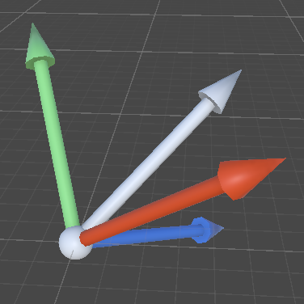

Transform 表示一个 object 的 Position，Rotation，Scale。

场景中每个 object 都有一个 Transform，它用于存储和操作 object 的 position，rotation，scale。

以 Transform 自身为基准：

- Transform Point/Vector/Direction：将 Transform 坐标系中的 Point/Vector/Direction 转换到 world 空间
- InverseTransform Point/Vector/Direction：向 Transform 坐标系中转换 Point/Vector/Direction

为什么有 3 个对 Vector3 的转换？因为 transform 表示这个 object 到 world 空间的位移、旋转、缩放三种变化，但是 Point/Vector/Direction 虽然都用 Vector3 表示，但是它们具有不同的意义，为了保持其原有意义，需要的变换不同：

- Point 表示空间中的一个点或位置，因此变换时，应用全部 3 个变换（位移、旋转、缩放）
- Vector 表示空间中的一个向量，可以认为它的起点总在原点，锚定在原点进行旋转、缩放，但是没有位移。因此对 Vector 的变换，只应用旋转和缩放（不应用位移）
- Direction 表示空间中的一个方向，类似 Vector，起点总在原点，锚定在原点进行旋转，但是不进行位移也不进行缩放（这才是方向的意义）。因此对 Vector 的变换，只应用旋转（不应用位移和缩放）

总结：

- Point：位移+旋转+缩放
- Vector：旋转+缩放
- Direction：仅旋转

# 属性

- bool hasChanged

  自上一次这个 flag 被设置为 false，transform 被改变过。

  object 初始化时，这个 flag 被标记为 true。Unity 从不会将其标记为 false，你必须手动将其标记为 false。但是任何对 transform 的改变，都会将它标记为 true。

- Matrix4x4 localToWorldMatrix

  将 point 从 local space 变换到 world space 的矩阵。也可以使用 Transform.TransformPoint 来执行这个变换，都是一样的。

- Matrix4x4 worldToLocalMatrix

  localToWorldMatrix 的逆。

- localPosition/localRotation/localScale/localEulerAngles

  transform 相对 parent 的变换，此时 parent 坐标系相对于 object 就是 identity 坐标系。

- position/rotation/lossyScale

  transform 相对 world 的变换，应用了任何中间层次的 transform 变换。

  注意，没有 scale，只有 lossyScale，它表示 object 相对 world 空间的缩放，且为只读。

- root

  transform 在 hierarchy 中的 topmost parent。

# 方法

- void GetLocalPositionAndRotation(out Vector3 localPosition, out Quaternion localRotation)

  类似读取 localPosition 和 localRotation，但是当要同时读取二者时，用这个方法稍微高效一点。

- void GetPositionAndRotation(out Vector3 position, out Quaternion rotation)

- void SetLocalPositionAndRotation(Vector3 localPosition, Quaternion localRotation)

- void SetPositionAndRotation(Vector3 position, Quaternion rotation)

有很多地方会同时设置 position 和 rotation，例如实例化 Prefab 的时候。

- void LookAt(Transform target) / void LookAt(Transform target, Vector3 worldUp = Vector3.up)

  旋转 transform 使它的 forward 指向 target 的 position。

  然后它旋转 transform 使它的 up 在 forward-worldUp 所在的平面。如果不使用 worldUp 参数，默认使用 world Y 轴。

- Rotate

  Transform.Rotate 以各种方式旋转 GameObjects。rotation 经常以 Euler angle 的形式提供，而不是 Quaternion。因为很多时候，旋转需求仅是绕着某个坐标轴的旋转，即使是复合旋转，也可以通过复合 Transform 层次，使一个 Transform 负责一个 axis 的旋转。

  Unity 的旋转内部总是用 axis+angle 表示。即使使用 eulerAngles 表示旋转，内部仍然转换为 axis+angle。在 Update 中以一个固定 EulerAngles 旋转，无论使用什么 EulerAngles 数值，在运行时都可以发现 Object 总是在围绕着一个固定轴在旋转，这就是 EulerAngle 和 Axis+Angle 的等价性。

  当使用超过一个分量的 EulerAngles 旋转时，尤其是 x y z 轴都有旋转时，很难理解旋转的过程。但是如果使用其等价（Unity 底层）的 Axis+Angle 理解，就会发现很好理解。这也是为什么应该总是使用 Axis+Angle 来理解旋转。只对单个轴的旋转使用 EulerAngle 的方式。单个轴的旋转可以认为是 Axis+Angle 的简单特例。因此总而言之，始终使用 Axis+Angle 理解旋转就对了，这是最简单最有效的方式。

  Rotate 旋转总是绕着 object 的自身 pivot 的，不会绕着其外面的点进行 around 旋转。后者有专门的 RotateAround 函数。因此无论是 Space.Self，还是 Space.World，Object 总是绕着自身中心旋转的。

  也就是以 object pivot 为原点建立一个坐标系，绕着这个坐标系原点进行旋转。Space 用于决定如何确定这个坐标系的3个轴的方向：

  - Space.World 这个坐标系的三个轴与 world 的坐标轴平行
  - Space.Self 这个坐标系的三个轴与 object 自身当前的坐标轴平行

  知道了原点和三个坐标轴的方向，就可以确定如何旋转了。无论使用 EulerAngle 还是 Axis+Angle 都是基于这个坐标系的。即使是使用 EulerAngle，最终也会被转换为一个 Axis 和 Angle。

  当使用固定 EulerAngle 或 AxisAngle 速度旋转 object 时，会发现无论是 World 还是 Self 都是绕着一个固定的轴在旋转。Space.World 的旋转好理解，因为 world 坐标系是固定的，始终不变，旋转轴也是固定的。但是 Space.Self 是基于自身坐标系参考的，而 object 自身又在旋转，为什么也能绕着固定的轴旋转呢？如下图所示，当基于 Self 坐标系的一个轴旋转时，尽管 Self 坐标系的轴旋转了，但是这个旋转轴在旋转后的 Self 坐标系仍然相同的值，因此也会总是绕着一个固定轴来旋转。将三个坐标轴和旋转轴想象为一个刚体，然后绕着白色的旋转轴旋转，就可以看出，尽管坐标系被旋转，但是旋转轴与坐标轴的相对关系是保持不变的。

  

  

  位移时，也是如此，Space.Self 总是基于 object 的自身坐标系位移。

  注意：Space.Self 是 object 自身坐标系，不是 object 的 parent 坐标系。

  - void Rotate(Vector3 eulers, Space.relativeTo=Space.self)
  
    按照 ZXY （Z 右移一位）顺序绕着相应的轴旋转。

    使用欧拉角定义旋转，不仅难以理解，而且还有万向锁的问题。而且开发者应该总使用同一种方法解决问题，因此应该总是以 AxisAngle 来理解和定义旋转。只将欧拉角用作 AxisAngle 的简化特例，只沿着一个坐标轴旋转。因此应该每次只指定一个轴的旋转角度，免于指定坐标轴的 axis（例如 Vector3.right，Vector3.up，Vector3.forward）。
    
  - void Rotate(Vector3 axis, float angle, Space.relativeTo=Space.Self)

    绕着给定轴，以指定角度旋转，角度方向通过左手定则定义。

- void RotateAround(Vector3 point, Vector3 axis, float angle)

  只在世界坐标系空间中使用，point、axis 都是在世界坐标系中定义。

  将 object 绕着通过 point 的 axis 旋转 angle 角度。  

- void Translate(Vector3 translation, Space relativeTo=Space.Self)

# Space

变换 Object 时，指定在哪个坐标空间应用变换。

- Space.World 表示世界坐标空间
- Space.Self 表示 object 自己的坐标空间（不是它 parent 的坐标空间）

