# Deformer

本质上在deform mesh的顶点，进而deform mesh

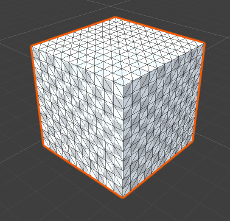

## Normal

### Bend

- 沿着Axis弯曲mesh，通过为Axis赋予一个GameObject（可以就是deform本身），可以自定义deform坐标空间（使用Transform定义的坐标系）
- Factor：是乘在Angle上的系数，最终角度=Factor*Angle
- Top-Bottom的长度确定弯曲程度的半径，半径越小，弯曲程度越大
- 在Limited模式下，弯曲只限制在Axis确定的空间中的Top-Bottom（沿着Y轴）之间的部分，Bottom之下的部分不变，Bottom-Top之间的部分成扇形弯曲，Top之上的部分会随之旋转但不变形，Unlimited模式下整个空间都会变形，Top-Bottom只用来确定弯曲程度（这应该由曲线Clamp导致的，小于0的范围使用0处的值，大于1的范围使用1处的值）
- 所有deform都是基于曲线的，有的是自定义，有的是通过指定参数生成，然后基于曲线按照不同的deform公式（Lerp），沿着Axis特定方向变换vertics
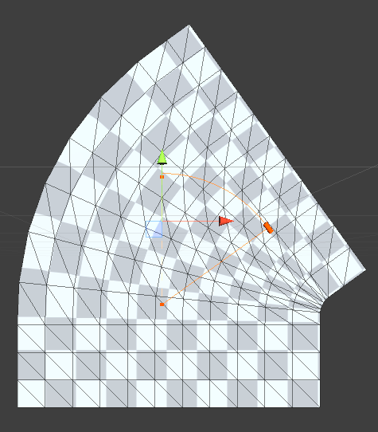
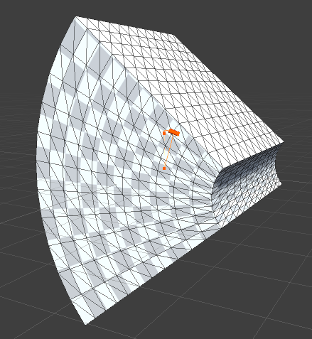

### Blend

- 传递给deformer一个VertexCache ScriptableObject资源，它具有和mesh vertices相同维度的顶点数组
- 使用Factor在当前顶点与VertexCache顶点相同索引顶点直接进行Lerp插值

### Bulge（膨胀，充气）

- 在Axis坐标系Y轴Bottom-Top中间的顶点以Y轴为中心沿着XZ平面，成圆形膨胀，顶点的Y坐标不变，只改变XZ坐标
- Factor缩放膨胀程度
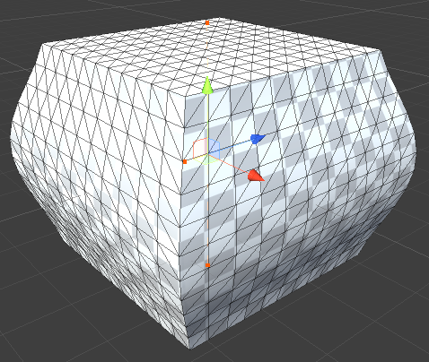

### Curve Displace

- 沿着曲线偏移mesh的顶点
- 曲线从Axis原点出发，沿着Z轴正方向
- 通过调整Axis的ScaleZ调整曲线长度，调整ScaleY和Factor调整曲线高度
- Offset沿着Z轴调整曲线原点
- 同一个Deformable下面可以挂载多个deformer，来得到综合的deform效果，甚至可以包含多个同一类型的deform，为它们设置不同的参数尤其是Axis。例如可以挂载两个Curve Displace，一个沿着deformable的Z轴，一个沿着deformable的X来变形mesh
- 曲线使用外插值（Clamp），小于0的使用0处的曲线值，大于1的使用1处的曲线值

### Curve Scale

- 类似Curve Displace
- Displace只是沿着曲线（Z轴）向一个方向（Y轴）偏移所有mesh顶点，Scale是沿着曲线方向（Z轴）上下两个半空间对称地向+Z/-Z方向偏移每个半空间的顶点，得到沿着Y轴的缩放效果
- Bias调整曲线应用的基础高度，边界曲线的形状仍然保持不变，而Factor就是简单地整体沿着Y轴缩放所有顶点，因此边界曲线的形状也被缩放

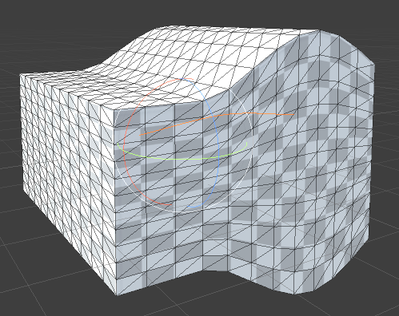
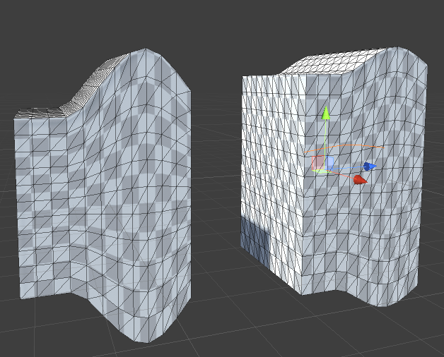

### Cylindrify

- 将mesh圆柱化
- Factor调整圆柱化的程度，0表示完全没有效果，1表示完全圆柱化
- 圆柱化只在XZ平面进行，Y坐标保持不变。Radius确定一个半径，然后所有顶点在当前位置到对应的圆柱边界位置使用Factor进行插值Lerp，因此0的时候就是当前位置，1的时候所有顶点都落在圆柱体的边界上。但是Lerp还可以继续在小于0和大于1的区间执行，因此最终的效果完全取决于Lerp的计算结果
- 可以通过调整Axis的ScaleX/ScaleY将圆柱体横截面变成椭圆

- Factor=0, 0.5, 1

    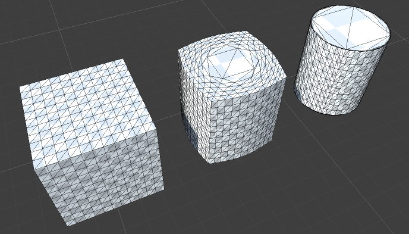

- Factor= -0.5, 1.5

    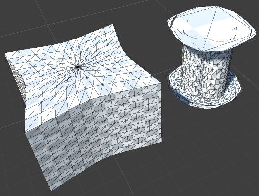

- Axis非一致缩放

    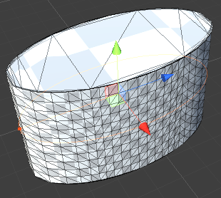

### Inflate

- 简单地沿着每个vertices的法向量方向移动它们
- Factor调整移动的程度

### LatheDisplace

- 类似CurveScale，但是CurveScale只是沿着一个方向（或对立方向）按照曲线缩放，LatheDisplace则是沿着Y轴按照曲线在XZ平面向所有方向缩放
- 沿着Y轴定义一个曲线，曲线绕着Y轴旋转定一个缩放空间，沿着Y轴在XZ平面上向所有方向缩放顶点
- Lathe：车床，机床，旋转加工
- Factor：缩放系数
- Bias：定义曲线的基础值，这个基础值之下的vertics不缩放
- Offset：沿着Y轴移动曲线的起始点
- 所有曲线都是Clamp的，小于0的部分使用0处的value，大于1的部分使用1处的value

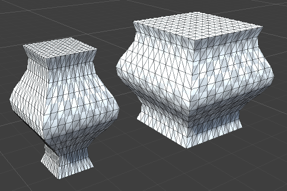

### Magnet

- 在Axis原点处吸引或排斥所有vertics，就像磁铁一样
- Falloff定义引力曲线下降的指数
- Factor定义引力的吸引程度，正数表示引力，负数表示斥力
- deformer都是在Axis的坐标系中计算的，如果Axis GameObject被缩放，deformer空间以及deform的结果也相应地被缩放。因此通过给Axis物体赋予不一致缩放，可以得到很多有趣的效果

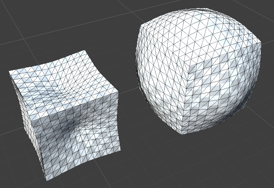

### Radial Curve

- 类似CurveDisplace，但是CurveDisplace是沿着一个方向偏移vertices，Radial Curve是从Axis中心在XZ平面上向所有方向在Y轴上偏移vertices
- 类似CurveScale与LatheScale的关系
- Offset：调整曲线自Axis中心的起始点距离
- Falloff：下降曲线指数

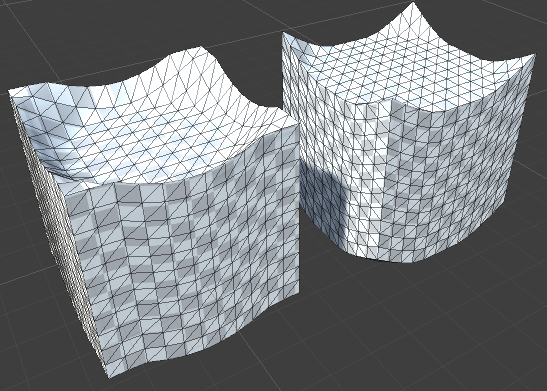

### Ripple（涟漪）

- 类似Radial Curve，但是曲线不是自定义的，而是通过指定参数生成的震荡曲线
- Frequency：涟漪震荡频率
- Amplitue：振幅
- Speed：无效果，代码中亦未见使用
- Offset：相位

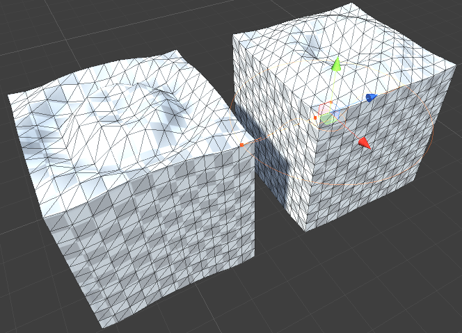
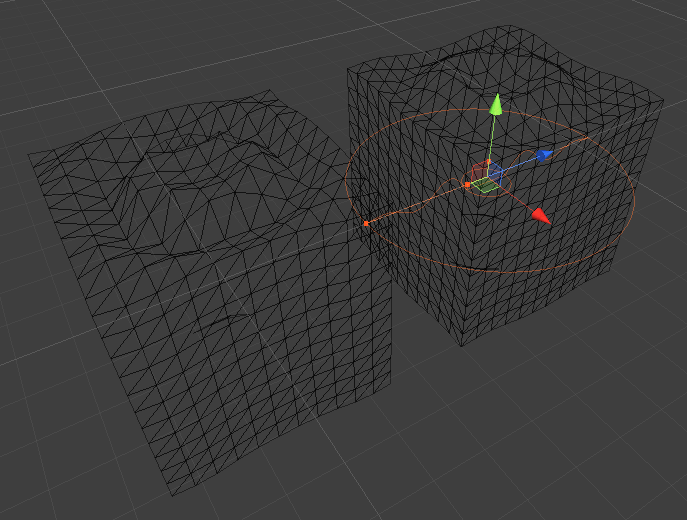

### Scale

- 使用Axis空间的Scale缩放vertices
- GameObject的Scale缩放的是整个GameObject，而Scale Deformer缩放的是Deformable的mesh

### Sine

- 类似CurveDisplace
- 沿着Z轴方向上的正弦曲线偏移vertices
- Frequency：频率
- Amplitude：振幅
- Falloff：为正弦曲线乘以一个下降曲线，Falloff为下降曲线指数
- Offset：相位

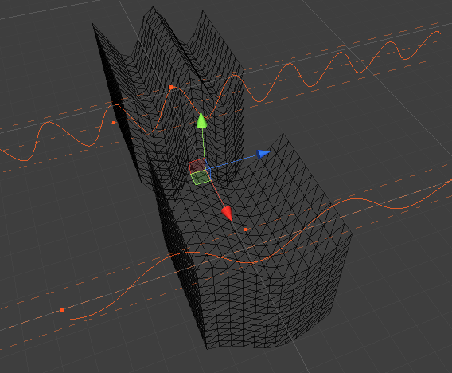

### Skew

- 错切
- 沿着Axis的Z轴方向错切vertices
- Factor定义错切的程度
- Limited模式可以限制指定Y轴区间上的vertices执行错切，Unlimited模式对所有vertices执行错切

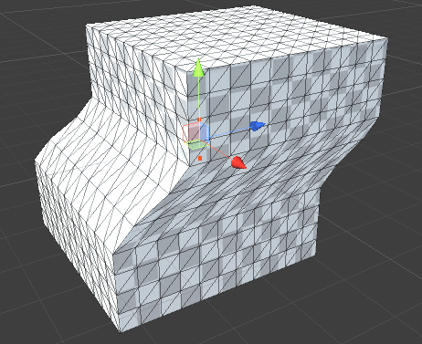

### Spherify

- 将vertices变形为一个球形
- Radius确定一个球形，使用factor在vertices当前位置和球体表面投影做lerp。当factor=0时，保持在当前位置；当factor=1时，完全落在球面上
- 很多deformer都是通过参数确定一个完全变形的位置，然后使用factor在当前位置与它之间进行线性插值变换
- Factor：插值变量
- Radius：半径
- Mode=Unlimited时，简单地在vertices和目标球体之间进行插值
- Mode=Limited时，只有在目标球体之内的vertices才被变形，目标之外的保持不变
  - Smooth=false：向目标球体做简单插值
  - Smooth=true：vertex变形程度与它到球体的距离成正相关，距离球体越远，变形程度越大，否则变形程度越小

### Squash and Stretch

- 挤压和拉伸
- Top-Bottom确定挤压拉伸导致曲线变形的vertices
- Curvature：确定中间变形的曲线曲率
- Factor：小于0-挤压，大于0-拉伸
- 就是Lathe Displace，只是曲线只是一个两端（小于0，大于1）为1，中间根据factor和curvature确定的凹凸弯曲的曲线而已

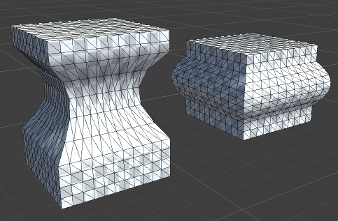

### Star

- Speed不是没有作用，而是动画控制参数，需要进入playmode才生效

    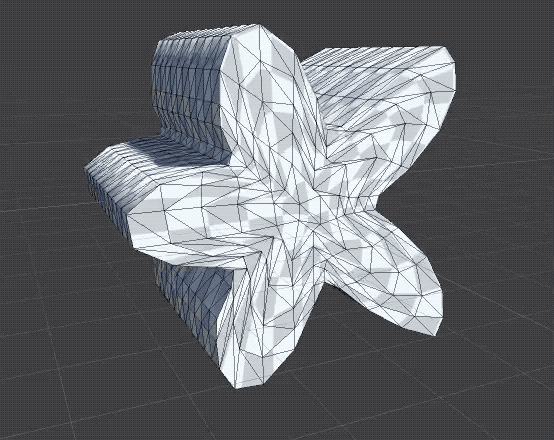

- Star是Mesh以Z轴为中心，在XY平面上呈星形
- Frequency：确定星形角数量
- Magnitude：确定星角长度
- Offset：星星旋转角度位移
- Speed：随时间动画Offset
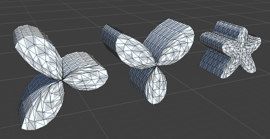

### Taper

- 又一种Lathe特例，在SquashAndStretch基础上添加Top Factor X/Y，Bottom Factor X/Y进一步定制沿着X/Y方向的deform程度

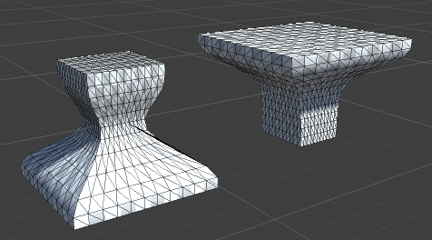

### Texture Displace

- 使用一个texture在Y轴方向偏移vertices
- Factor：偏移程度
- Space：World/UV
- Channel：指定使用texture的哪个channel作为偏移值
- Repeat：超出纹理size的vertices重复循环采样（就像重复纹理一样，对0-1区间求余）
- Bilinear：双向采样（沿着X/Y分别采样求平均值，trilinear3向采用用于mipmap，第3个方向在相邻的多级纹理之间进行采样求平均值
- Offset/Tiling
- Texture：必须readable
- Axis：在Axis的XZ平面采样纹理，在Axis的Y轴上偏移vertices

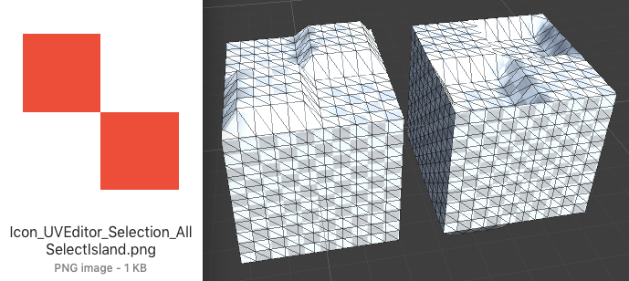

### Transform

- 使用Axis定义一个新的transform（translate/rotation/scale）
- 使用factor在当前transform和新的transform之间进行插值
- Factor=0, 0.5, 1，Transform=[position(0, 5, 0), rotation(45, 0, 0), scale(2, 2, 2)]

    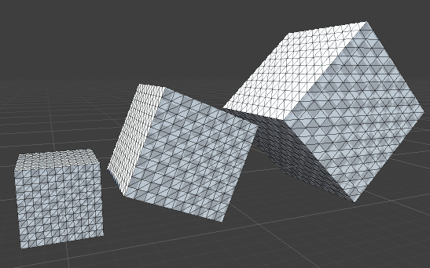

### TransformOffset

- 使用Axis的世界空间的position，rotation，scale偏移mesh的position，rotation，scale
- 没有Factor插值

### Twirl

- 使vertices绕着AxisY轴根据到Y轴到距离螺旋式旋转
- Unlimited模式所有vertices都旋转，Limited模式只有Inner和Outter半径之间的vertices被旋转
- Factor调整旋转程度

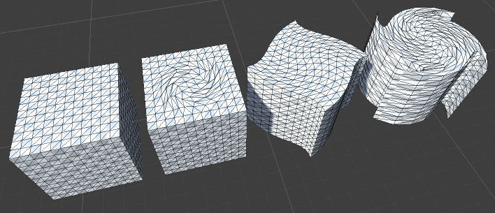

### Twist

- 类似Twirl，但是不考虑vertics到旋转轴（Y轴）的距离，所有vertices均匀旋转，Twirl则会导致距离旋转轴越远的vertices旋转越快
- vertices沿着Y轴螺旋变形
- Unlimited模式所有vertices都被螺旋变形，Limited模式只有Top-Bottom之间的vertices被旋转。Bottom之下的vertices跟随Bottom旋转，Top之上的vertices跟随Top旋转，二者都不再沿着Y轴螺旋
- StartAngle/EndAngle/Offset：调整旋转角度范围和偏移
- Factor：螺旋程度系数，乘到每个vertices本来应该旋转的角度上
- Smooth：考虑了一些其他因子，是螺旋变形更平滑

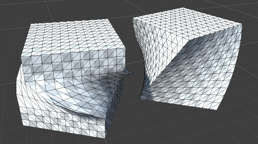

### UV Offset/UV Scale

- 这两个模块展示了Deform可以修改任何顶点数据，而不仅仅是坐标（尽管通常都是修改坐标）

## Noise

- 将噪声应用到mesh到data上
- Celluar Noise/Perlin Noise/Simplex Noise，具有相同的噪声参数
- Speed/Velocity控制运行时噪声动画
- Mode
  - 3D：将噪声应用到每个vertex到坐标上
  - Directional：将噪声只应用到顶点到z坐标上
  - Normal/Spherial/Color模式代码似乎不正确，代码是雷同的，看起来是更新normals、colors等非vertices数据的

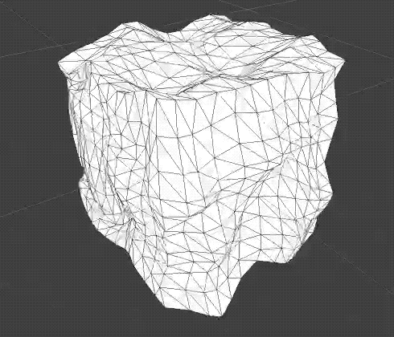

## WIP(Work In Process)

### BoundedBend

- 指定一个包围盒，只有包围盒里面的vertices才进行bend

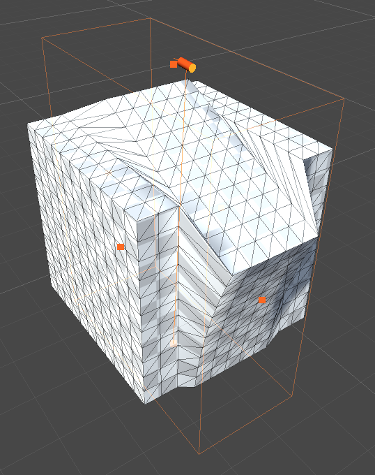

### Cubify

- 指定一个目标矩形，在当前矩形和目标矩形直接进行插值，类似Cylindrify
- 当目标矩形与初始矩形不平行时可以创建一种圆角效果

Factor=0, 0.5, 1

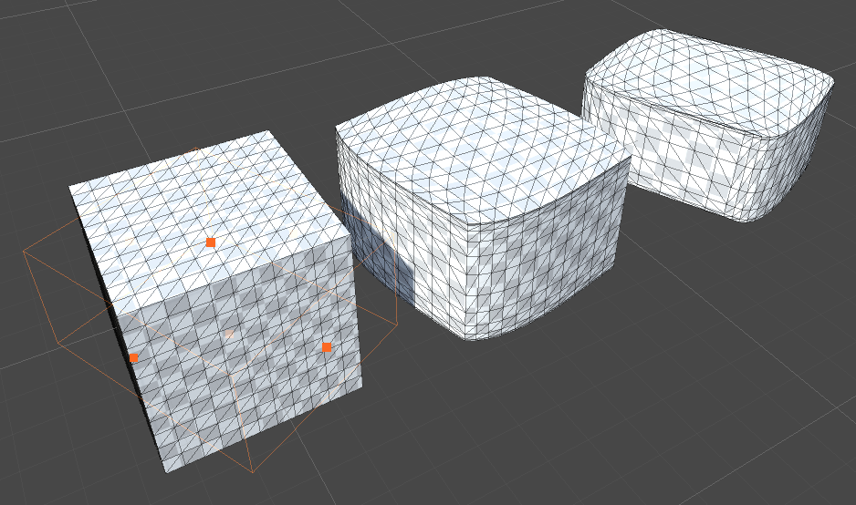

### Melt

- 融化效果
- 自Top到Bottom沿着Y轴融化
- 顶点只在XZ平面上移动，不再Y轴上变化
- Factor-融化效果系数，0-完全不融化
- Falloff：融化效果下降曲线指数
- Radius：融化半径，融化部分延伸的大小
- UseNormals：沿着顶点的法向量移动顶点
- ClampAtBottom：舍弃Bottom以下的部分，否则Bottom以下的部分就像从Bottom开始向下extrude一样
- Noise：融化效果噪声系数

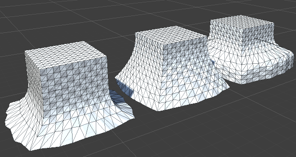

### RadialSkew

- 从中心到四周呈菱形放大或缩小

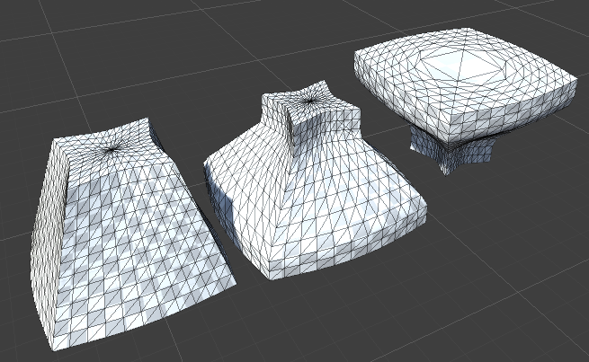

### Wave

- 波浪动画效果
- WaveLength：浪高（波长）
- Steepness：陡度，下降曲线指数
- Speed：波浪速度
- 沿着Z轴起伏

