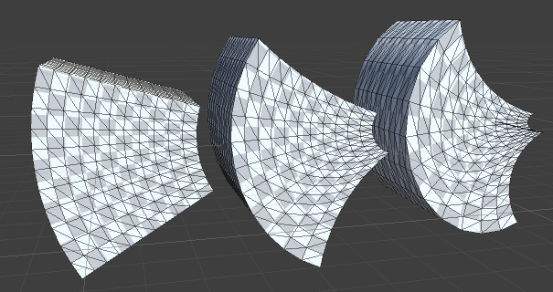

# Utility

## AutoGroup

- AutoGroup GameObject下面的Deformer被作为一个Group
- Deformer Group是组织Deformer的方法。Group在Deformable作为一个slot，使得其中所有的deformer可以一起开启和关闭

## Group

- 类似AutoGroup，但是需要在Inspector中手动添加指定的deformer

## Recalculate Bounds/Normals

- 在mesh变形之后重新计算包围框和法向量

## Repeater

- 引用一个Deformer，将其重复执行多次，每次执行都基于上次的deform结果。第一次执行时是基于之前deform的结果，因此如果Repeater引用的是之前的一个有效的deformer，则这个defomer会执行n+1次

Bend迭代执行1，2，3次

