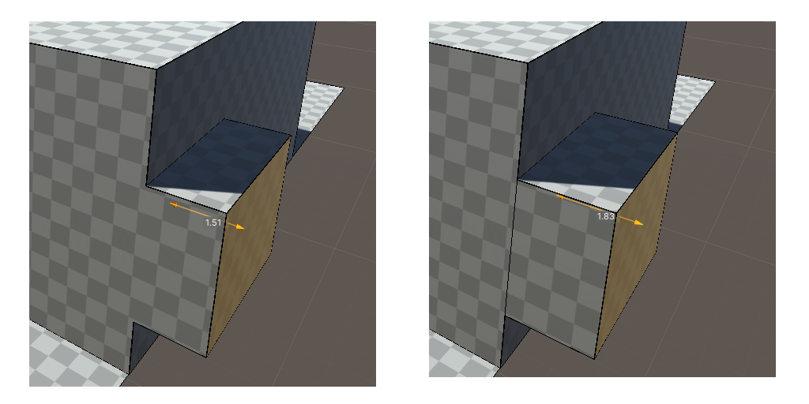
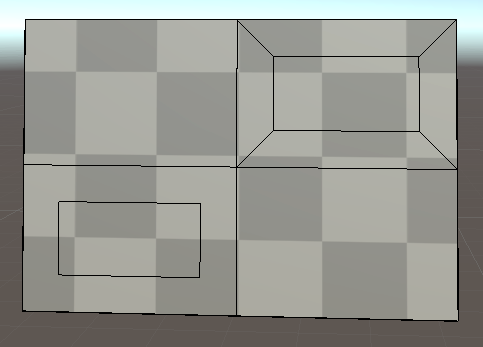
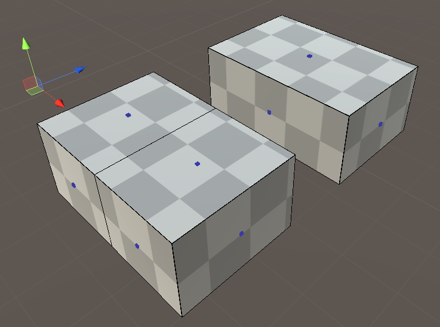

# UModeler

## Toolbar, Setting and Preference

### 3D cursor

- 打开3D cursor时，3D cursor将是rotation和scale的pivot
- 当3D cursor经过一个vertex附近时，它将对齐到那个vertex
- CTRL+SHIFT+LMB实时设置3D cursor位置
  - 如果鼠标在一个UModeler之上，3D cursor将移动到这个mesh上
  - LMB edge，3D cursor将设置为edge到中心；LMB face，3D cursor将设置为face到中心

### Refresh all

- 刷新场景中全部到UModeler，重建所有资源。可以解决broken到mesh和lightmap问题等

### Seamless Edit

每当鼠标移动经过UModeler对象时，自动进入编辑状态

- Single：只有选中到物体被编辑
- All：场景中所有UModeler对象都可以编辑
- Group：同一个root下面到object可以被编辑

在移动鼠标时按住SHIFT关闭无缝编辑

### Snap

- Snap Type
  - None
  - World Grid Snap：每次移动对齐到world grid position
  - Increment Snap：使用gizmos移动position时，它们将增加/减少Move Snap Size
- Move Snap Size：自定义移动snap size
- X，Y，Z：沿着哪些轴在world grip snap对齐
- Rotation Snap Size：选择snap size

UModeler对象也被Snap setting影响

### 显示

辅助modeling到显示信息

- Triangulation：显示三角化到polygons。它们是被输入给渲染器的数据
- Status：在inspector显示全部选择的元素数量，全部polygon数量，全部三角形数量
- Commentary：在scene view左下角显示UModeler注释。哪个key被按下，哪个工具被选中
- Global Overlay：显示选中UModeler mesh的bound box的长宽高
- Local Overlay：显示当前工具的特定值。例如对PushPull工具显示polygon被push或pull多少距离

### Preferences

设置UModeler的快捷键和通用设置

Tools/UModeler/Preferences Menu

- Detailed Tooltip：开启最详尽的tooltip
- Lightmap by Default
- Display Polygon Preselection：鼠标下的polygon被高亮
- Keep System Toolbar on always：scene view中的toolbar总是可见

## Menu

- UModelerize：将选中的物体转换为UModeler对象，使得它可以被UModeler编辑
- UModelerize Hierarchically：将选中的物体和所有的子物体都转换为UModler objects
- Triangulate：将所有polygons划分为triangles

## Elements Group

- 可编辑元素：Vertex/Edge/Polygon/Object
- Rotate和Scale元素默认使用它们的中心，但如果3D cursor开启时，将使用3D cursor
- Ctrl添加选中的元素
- SHIFT并拖拽任何gizmo，选中的元素将被推挤extruded
- CTRL并拖拽move gizmo的一个handle，鼠标移动到另一个vertex附近，选择的元素的选择axis（拖拽的move gizmo的轴）对齐到**鼠标下方的vertex**相应的axis，1D对齐
- SHIFT+CTRL并拖拽任何gizmo，组成这个elements的vertices将被分离，即不在共享一个vertex而一起移动，而是原始vertex保留，并创建新的vertex移动，类似将mesh剥开分离的效果
- LMB双击一个polygon将其unwrap（uv），Auto Layout
- 按住V并移动选择的vertices/edges/polygons允许它们的pivot对齐到**鼠标下面的vertex**
- Select Only Visible：MeshCollider
- Distance：被选中元素移动多少距离，translation gizmos
- Snap To Polyton：移动vertex/edge到polygon附近时对齐到polygon平面上，edge平行于polygon
- MoveTo Cursor：button，移动当前选中的元素到3D cursor的位置，Center/Pivot
- Insert Vertex：插入vertex到邻边避免T-jution

## Selection Group

- All/None：选中全部元素/取消全部选择
- Isolated：选中所有连接在一起的元素
- Loop Edges：选择端到端连接在一起的edges，loop/Hole
- Loop Quad：先选中两个确定方向
- Edge Ring：不相互连接，组成Loop Quad的edge
- Quad Ring：先选中两个，然后选择交叉方向上横跨mesh的quad
- Invert：反转选择
- Increase：从当前选择的元素想所有外方向扩展选择的元素

## Drawing Group

- Space确认当前动作，ESC取消
- 确认之前可以通过调整属性调整shape
- 当mouse cursor接近一个vertex，一个edge center，一个polygon center等元素时，cursor将会对齐到它们，以便从它们开始绘制
- 在被绘制的polygon上创建vertex
- Floor Height：当使用LMB凭空绘制shape时，floor的高度。**凭空绘制只能在XZ平面**
- Line
  - 在surface或floor绘制edge，绘制extrude草图，或者切分出一个polygon
    - 凭空绘制，闭合折线段自动创建polygon
    - 在既有polygon上绘制，将切分出一个hole polygon
    - cursor接近第一个vertex时，将显示为sky blue指示闭合
  - 从一个polygon的一个edge上开始绘制line，并且在相同的edge或者这个polygon另一个edge（总之是同一个polygon上的edge）结束，将把polygon分割为两部分
  - 类似Blender cut tool，但是更方便
- Arc
  - LMB并拖拽确定arc的两端，移动鼠标确定半径
  - 想Line一样，既可以创建曲线，也可以创建或切分polygon；对齐与Line一样
  - Segment：细分程度
  - Force Close：强制start和end被直线连接，构成封闭shape，并因此创建polygon，否则只绘制开放arc曲线
- Rectangle
  - Width/Depth
  - Corner Length：圆角的半径
  - Corner Segment：圆角的细分程度
- Disk
  - Angle Snap：disk圆心与cursor的方向每当接近90度的时候，将disk对齐到90度方向
- Side Stair：楼梯侧面（横截面），在一个plane上（侧墙上）绘制楼梯的草图，类似绘制rectangle，通过绘制的矩形确定楼梯的size
  - Rise：台阶的size
  - Flip：楼梯只绘制在rectangle对角线的一侧，Flip切换到另一侧
- Parallel：创建平行edge
  - 不能凭空绘制
  - 距离Mouse cursor最近的edge被复制，并且随着cursor相对原始edge平行移动
  - Distance：调整平行边移动的距离

## Primitive Shapes Group

- Glue和Border Check属性对绝大多数shape tools是通用的
- 所有shape都可以在一个既有平面创建，或者凭空创建（XZ平面）
- Box Tool
  - 在一个平面（凭空创建在XZ平面）上创建一个box
  - Floor Height：凭空创建时floor（XZ平面）的高度
  - Border Check：对新创建的box运行Raycast，检查它是否超出对面的polygon，保证它不穿越其他polygon，是一种对齐机制
  - Glue：关闭时，创建的box是独立的box，只是它的起始平面与绘制平面重合，结束平面与Border Check重合。开启时，box就像是从绘制平面和Border Check到的平面上长出来的一样，box和它们重合的平面被移除，在它们上面创建新的vertics和edges，将box焊接在其上
- Room Tool：几乎与Box相同，但是还创建一个反转normal的内部box，用于创建室内场景
  - Thinkness：确定“墙”的厚度（即outter box和inner box的间隙）
- Stair：就像创建box一样创建楼梯，box确定stair的size
  - Rise：step的size
  - Wide Step-选择stair90度，Reverse-前后反转，总之两者确定以哪个方向在box中创建stair
- Cylinder
- Cone
- Spiral Stair Tool：创建旋转楼梯
  - Radius：内半径，外半径=内半径+width
  - Curvature：楼梯旋转的角度，0-360
  - Mirror：镜像旋转方向
- Sphere
- Capsule

## Add Group

- PushPull
  - 沿着法向量方向推挤extrude一个polygon。可以Push/Pull任何类型的polygon，包括circular、rectangular以及抽象的polygon
  - Push从polygon上长出shape，Pull切除shape就像执行了boolean操作
  - Border Check
    - Push时像Primitive Shape Tools一样
    - Pull时可以切除一个3D shape到对面的polygon
  - Continuous
    - Push（Extrude）本质上是沿着法向量创建一个与polygon平行的新polygon，然后将侧边连接起来创建侧面的face
    - 关闭时，原始polygon和新polygon之间的边缘edge将被保留
  - Border Check Ray Cast遇到第一个碰撞点就停止。对于Primitive Shape Tools以及Push可以有效防止穿越其他polygon，或对齐到其他polygon。对于Pull只有extruded polygon恰好落在另一侧的平面上，才会执行cut out，否则也只是将其停止在第一个碰撞点处。另外Pull & Border Check只在单个polygon的Push/Pull Tools中存在，因此执行Pull & Cut的前提是
    - 两侧平行
    - 执行pull的一侧polygon是单个polygon

### Multi PushPull Tool

- 同时PushPull多个polygons，它们不一定是在一个平面上的或者连接的，这就是它们没有Border Check的原因
- 操作上等价于对每一个polygon进行PushPull，但是没有border check，区别是可以通过PushPull Type可以使所有polygons以一致对方向进行push & pull
- PushPull Type
  - Individual Polygon：选择的每个polygons沿着各自的polygon法向量进行extrude
  - Vertex Normal：选择的每个polygons的每个vertex沿着各自的vertex的法向量进行extrude
  - Average Normal：选择的polygons沿着它们的平均法向量进行extrude
  - X/Y/Z：选择的polygons沿着指定的坐标轴进行extrude
- Continuous参加PushPull工具
- One Step Size/One Step Push/One Step Pull：通过按钮单次按照指定size进行push/pull

### Inset Tool

- 创建一个比选中polygon更小或更大的相似polygon
- 可以对多个独立或相互连接的polygons同时执行inset
- Thickness：调整相似polygon的大小
- Type（针对Multiple Inset）
  - Individual：对每个选中的face独自进行Inset
  - Group：对选中的faces每一个连接的区域（island）进行Inset。将island作为一个整体进行inset，包括同一个平面上的faces以及不再同一个平面上的faces
- Bridge Edges：在新的polygon与原始polygon的edges之间创建连接edge，而不是创建一个孤立的新polygon

### Boolean Tool

- 在两个UModeler之间创建新的UModeler
- Union/Subtract/Intersection

### Mirror Tool

- 沿着local坐标系镜像一个mesh，另一侧的mesh完全是有原始mesh复制而来。这样原始侧每一个修改都被同步到另一侧
- Axis：X/Y/Z选择沿着哪个坐标轴执行镜像
- Invert：选择Mirror Plane的哪个侧面的mesh被镜像
- Distance：在local坐标系中调整Mirror plane的偏移
- Angle：在local坐标系中调整Mirror plane的角度
- Distance & Angle就可以沿着任意方向对mesh进行mirror，尽管绝大部分时间都是沿着X/Y/Z坐标轴的
- Boundary：如何处理编辑部分和镜像部分的边界edges
  - Remove：移除boundary edges
  - Remain：保留boundary edges
  - Ignore：当mirroring完成时忽略跨越boundary edges的polygons。对那些没有跨越boundary（镜像边界，plane）的mesh按照通常那样镜像，对于跨越边界的polygons，将其忽略即不镜像
- Mirror时，会把Mesh沿着plane完全切开成两半，留下准备镜像的那一半，舍弃另一半（除非有另一半里面有across boundary的polygon，并且Boundary设置为ignore，对于这些polygon不舍弃也不镜像，但是非镜像那一半里面的没有across boundary在所有mode下都是被舍弃的）
- 镜像的一半mesh被完全复制到另一侧，对于两半的交界处edges
  - 如果edge两边的polygon是共平面的，而且Boundary设置为Remove，则edge被移除，留下一个跨越boundary的polygon，沿着mirror plane对称
  - 否则edge保留，并存在于mirror plane上
- Start：开始mirror模式
- End：结束mirror模式

### Loop Slice Tool

- 环形切分一个faces loop，插入新的edges，与选择的edge交叉

### Follow Tool

- 沿着一个path（polygon，或者开放的折线）推挤extrude一个polygon

### Bevel Tool

- 创建切角或圆角的geometry。Bevel的效果是平滑edge和corner
- Vertices、Edges或Polygons必须在选择Bevel Tool之前选择好，然后通过修改inspector中的属性调整bevel，而不是通过鼠标
- Width：bevel的宽度（size）
- Segments：细分segment的数量，细分越多，bevel越平滑
- Profile：bevel edge侧面视图（曲线），0～1，0.5=完全平面，小于0.5创建凹下去的bevel，大于0.5创建吐出来的bevel
- Clamp Overlap：bevel amount不会超过导致与其他geometry发生碰撞的一个amount，类似border check

### Bridge Tool

- 填充选中元素包围的空间
- 可以应用Bridge的条件
  - 超过3个vertices被选中
  - 两个不相连的edges被选中
  - 超过两个相连的edge被选中
  - 超过两个polygons被选中

### Clone Tool

- 拖拽鼠标绘制一条直线，沿着直线复制选中的polygons（可以是多个polygons）
- Space-confirm，Esc-cancel
- Number：复制的数量
- Distance：沿着line排放复制的polygons的距离
- Arrangement
  - Divide：Distance是所有clone的总长度
  - Multiply：Distance是每两个clone的间隔长度，所有clone都会被沿着line创建，line只是确定创建的方向和两个clone的间隔，Number确定创建多少个
- 复制的单元可以是任意多个polygons，设置是一个完整的mesh
- 与基本的shape绘制一样，复制的polygon如果落在共平面的plygon中（无论是clone开始的那个polygon还是其他的任何polygon），都会在共面的polygon上创建shape，就像在它上面绘制一样。如果没有共面的polygon，就凭空创建。这个工具的底层本质上应该就是相当于手动按照相同的距离和方向依次执行基本绘制，只不过它将这个过程自动化而已，底层执行的应该是相同的函数，这就是为什么它们的特性是一样的
- 很多工具都是重复执行手动单次执行的操作。例如Multiply Push/Pull就是重复执行单次Push/Pull

### Duplicate Tool

- 复制选中的polygons。被复制的polygons的每个polygon中心cube显示为粉红色，表示它们可以通过gizmos独立的移动

## Remove Group

### Eraser Tool

- 删除元素（Vertex，Edge，Polygon）
- 删除的模式
  - Immediate Mode：先选中元素，然后点击Eraser按钮删除它们
  - Edit Mode：先选中Eraser Tool，然后依次选择要删除的元素
- 删除的元素
  - 当删除edge而edge是两个共面的polygon时，只有edge被删除，两个polygon合并成一个，否则两个polygon也被删除
  - 当删除的是vertex时，所有共享这个vertex的polygon都被删除
  - 当删除的是polygon时，只有polygon被删除，vertex和edge都保留

### Detach Tool

- 选择的polygon从当前UModeler分离出来作为一个单独的UModeler

### Combine Tool

#### Combine Vertices Tool

- 合并所有选择的vertices为一个vertex。留下了的vertex的位置可以在执行tool之前选择好
- 如果先选择Combine Tool，而没有选择任何vertices，则进入Combine Vertex模式。在这个模式中，可以选择vertices，设置一些选项，然后合并它们。但是如果选择Combine Tool之前已经选择了一些vertices，则combine操作立即执行
- Combine Type：
  - First：合并到第一个vertex
  - Last：合并到最后一个vertex
  - Center：合并到选择的vertices中心
- Collapse：选择的vertices中连接在一起的vertices（island）单独合并到各自island的中心，因此结果会留下多个vertices

#### Combine Polygon Tool

- 将相邻且共面的polygons合并为一个polygon

#### Combine Object Tool

- 将选择的UModelers合并为一个UModeler

### Remove Double Tool

- 自动merge选择的vertices中在指定距离内的那些
- Distance：合并的范围

### Collpase Tool

- 类似Combine Vertices Tool

### Cut Tool

- 拖拽鼠标绘制一条line，将mesh切分成两部分
- 当dragging时按下space将改变cut的方向
- Type
  - Single：移除cut plane下面的polygons
  - Both：只是将mesh切开，留下所有polygons
- Fill Facet：用polygon封住切口
- Select Above
  - 切分一个mesh之后，选择cut plane之上的polygons
  - 用于Type=Both时，切分之后立即选中其中一半，以便将其和另一半分开，否则手工选中其中一半非常困难

### Clip Tool

- 类似cut tool，区别在于
  - 通过scene中的一个polygon而不是鼠标拖拽绘制的平面作为cut plane
  - 只cut选中的polyogns，而不是整个mesh
  - cut之后cut plane下面的polygon只是简单的被删除就像cut之后执行了Eraser Tool一样
- 先选中要cut的polygons，点击Clip Tool，最后点击作为cut plane的polygon

## Tweak Group

- 反转polygons的normals
- 在object mode下反转全部polygons的normal
- 在polygon mode下反转选中的polygons的normal

### Flatten Tool

- 将选中的polygons对齐到最后一个选中的polygon，使所有的polygons平整共面
- 通常和Combine Tools联合使用来合并几乎共面的polygons
- Projection Dir：Flatten的方向
  - Up：在Y轴上平整
  - Right：在X轴上平整
  - Forward：在Z轴上平整
  - Last Polygon：在最后一个选中的polygon的法向量轴上平整
- 带选项的工具可以先选中工具而不选择元素来调整选项

### Align Tool

- 选中一组vertices，在它们的包围盒BoundBox将它们对齐到某个平面
- Axis：X/Y/Z，沿着BoundBox的哪个轴对齐
- Location
  - Min：对齐到包围盒指定Axis的底部
  - Middle：中部
  - Max：顶部

### Axis Flip Tool

- 将选中的polygons沿着它的local X/Y/Z穿过mirror plane中心进行反转。这个工具某种程度上类似Mirror
- 与Mirror不同，不创建任何新的mesh/polygon，只是将polygons反转
- 反转之后的polygons可能与原来连接在一起的其他polygon分离
- 如果flip之后polygon还能与原来的polygon相连，则它们就会相连在一起
- UModeler在工具操作元素之后，如果能合并的就会尽可能合并在一起（例如共面，共线等等），而不会出现共面共线的元素overlap的情况，除非工具提供选项明确这么做
- 选中polygons，点击工具，调整mirror选项，点击Flip按钮

### Pivot Tool

- 将当前object的pivot设置为3D cursor

### Pivot To Center Tool

- 将object的pivot设置为top center/center/bottom center

### Snap Move Tool

- 移动polygon到指定位置。通常与Follow Tool联合使用
- 选择polygon，点击显示的第一个锚点作为pivot，点击第二个锚点确定向上向量，将polygon定位在任何一个vertex上
- Space水平反转选择的polygon，Esc回到前一步或退出工具
- Flip：水平反转polygon

## Surface Group

### Material Tool

- 添加材质，将polygons赋予指定材质
- SHIFT+LMB将指定材质赋予当前材质
- Add Slot：添加新的材质槽
- Texture Button：选择一个材质槽
- Alt + n或A（Assign）：将当前Mat ID赋予指定polygons
- S（Select polygons）：选择当前Mat ID对应的polygons
- Minus -（Remove a slot）：移除一个材质槽
- Material Box：为当前材质槽选择一个material

### UV Tool

- 为每个polygon设置uv参数：Shift/Scale/Rotation
- unwrapped polygons不能通过UV tools调整，UV tools只能调整自动生成的uv
- Hide Overlay：因此选择的polygon overlays，以便更清楚地查看选中的polygon的纹理
- Tiling/X/Y：通过X/Y设置的tiling的值，点击Tiling按钮自动计算Scale，使之满足指定的tiling
- Fit UVs：使得每个选择的polygon的uv坐标落在0-1之间
- Reset UVs：将选择的polygons的uv坐标重置到初始状态

### Vertex Color Tool

- 为vertices设置顶点颜色
- 按下或拖拽LMB，同时按下SHIFT将以选择的颜色绘制鼠标下方的vertices
- 需要使用Material Tool设置一个支持Vertex Color shader的mateial以设置颜色
- UModelerPro_OnlyVC/UModelerBasic_OnlyVC
- 先选择顶点再从调色板直接赋予颜色/先选择颜色再按住SHIFT并拖拽鼠标绘制颜色
- SHIFT：显示球形画刷
- SHIFT+LMB：点击或拖拽，使用画刷绘制顶点颜色
- SHIFT+ScrollWheel/Brush Radius：调整画刷size
- Color Number/Remove the color/Choose a color/Add a new color
- Select Vertices：选择被赋予当前颜色的vertices
- Paint Vertices：将当前颜色赋予被选择的vertices

### Polygon Color Tool

- 为polygons设置颜色。SHIFT+LMB绘制polygon颜色
- 设置支持VertexColor的shader材质
- 与Vertex Color Tool相似

### Smoothing Group Tool

- 管理smooth shading的polygon分组
- 选择属于同一个smooth group的polygons，将它们Add到一个group
- 选择想要Auto Smooth包含的polygons，设置angle，小于这个angle的polygons被认为使一个smooth group，点击Auto Smooth按钮
- 创建新的group slot，将polygons添加到group，将polygons从group移除，将group移除，选择一个group中的polygons，为group赋予一个名字

## Misc Group

### New UModeler Tool

- 创建一个新的UModeler GameObject，带有一个UModeler和Mesh Collider组件

### Bake Transform Tool

- Bake rotate, scale, 或者两者

### Polygon Group Tool

- 将选择的polygons组织为一个group
- 新创建的polygons属于当前active group
- 管理逻辑上属于不同的部分的polygons，使它们可以一起被选中
- 类似Polygon Color工具，每个颜色都是一个单独的polygons group
- 添加group/删除group/命名group/选中group polygons/添加polygons/移除polygons

### Export Tool

- 将UModeler mesh导出为.obj or .prefab
- Create Folder：创建一个folder，将.obj各种资源导出在里面
- Export Material：创建一个材质文件.MTL
- Export Vertex Colors：为每个vertex添加RGB channel
- Optmize UV：优化UV避免duplication

### Collider Tool

- 添加一个Mesh Collider组件

### Local Setting Tool

- 模型局部设置
- Backface：显示背面
- Lightmap Static：改变lightmap的光照方式（静态/动态）。与Lighting窗口Lightmap Static变量同步
- Recalculate Tangents：每次UModeler mesh修改时计算切向量
- Don't Save In Build：Build时不包含UModeler组件。如果想在运行时编辑mesh，需要关闭此选项
- Generate UV2 channel for Lightmap：lightmap不自动创建。点击此按钮手动创建lightmap。点击Tools/UModeler/Refresh All为场景中所有UModeler创建lightmap UVs
