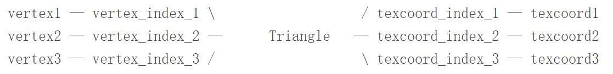

# 纹理坐标

纹理坐标与顶点坐标不是一一对应的，但我们经常听见“顶点的纹理坐标”这个说法，严格来说是不准确的。
顶点坐标与纹理坐标其实没有直接联系，它们是用过三角面片间接联系起来的。它们之间没有一一对应的关系（顶点颜色也是一样，这就是为什么多面体每个面可以有不同的单一颜色）

最终输入给渲染管线的是一个一个三角形，每个三角形由3个顶点组成，每个顶点有一组顶点数据，但是对于所有的顶点数据，三角形都是通过下标来引用每一种顶点数据。两个共享相同顶点的三角形在应用顶点位置时使用到顶点位置数组的相同的索引，但是使用顶点的uv坐标（或顶点颜色）时就可能引用uv坐标数组（顶点颜色数组）的不同的索引，因此同一个位置的顶点在两个三角形具有不同的uv坐标（顶点颜色）。渲染管线是并行独立没有状态的，每个三角形的顶点数据都是独立读取输入的，因此顶点之间本质上是没有任何联系的，它们的联系都是通过三角形对各种不同数据的索引确定的

顶点数据指的是输入给渲染管线的顶点具有相同的数据结构，但是存储上不同的顶点数据之间是没有管线的，它们最终通过三角形联系在一起

uv（以及各种顶点数据）最终是为三角形而不是顶点设置的

严格来讲，顶点并没有纹理坐标的概念，只有三角形有纹理坐标的概念

网格UV展开到平面的时候，如果没有割缝产生，那么每个顶点在其相邻三角形内的纹理坐标都是一样的，故可简称为顶点的纹理坐标。如果有割缝产生，割缝处的顶点在不同三角形内的纹理坐标是不一样的。这时，顶点和纹理坐标是一对多的关系

这是两个不同的概念。把网格顶点映射到纹理坐标域所得到的2D网格，和原始网格的拓扑结构可以是不同的。你可以把这两个网格看成是两个独立的网格。纹理坐标的缝隙是2D网格的边界。网格割缝是把网格的拓扑结构改变了，割缝处会产生新的网格顶点。纹理坐标缝隙，是在展开的UV空间中，顶点纹理坐标的缝隙。缝隙处网格顶点和纹理坐标是一对多的关系。

如果在纹理坐标缝隙处把网格割开，那么割开后的网格顶点和纹理坐标就是一一对应的关系了。

可以这样认为，完整模型mesh是有一组完全独立的三角形一起渲染而成的，每个三角形都独立的渲染，每个三角形都有独立的3个顶点数据，每次渲染一个三角形时，顶点数据都独立获取，顶点之间是没有关系的。只不过很多三角形的某种顶点数据是相同的（顶点坐标，uv坐标，顶点颜色），它们在存储时可以无视数据的相同性而每个顶点数据都独立存储，或者相同的顶点数据只存储一份，每个三角形通过索引引用相同的数据。但是这只是优化手动，从本质上说，每个三角形都是独立的，每个顶点数据都是独立的，渲染管线不知道它们的关系，只知道需要渲染一个三角形时能够读到它的每个顶点数据，不关心这些数据是怎么来的，是不是相同的，两个三角形是独立渲染的。

理论上以及最终渲染管线上，mesh是由一组triangle构成的，每个triangle有独立的顶点数据（坐标、法向量、uv、颜色等等），无论有多少顶点的数据是一样的，在数据上它们只是恰好相同而已，每个顶点都是独立的instance。因此为每个三角形的每个顶点创建一个单独的存储才是真正理想的情况，因此理想情况下每个三角形的各个顶点数据都是可独立编辑的。任何共享顶点数据的方式都只是优化方法。
