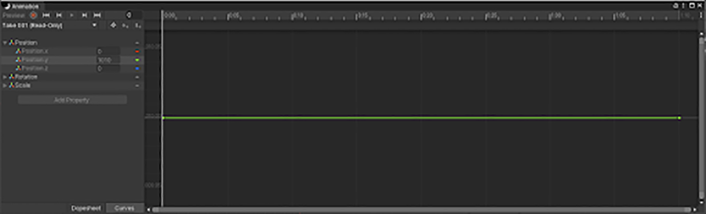

Animation Clips（动画剪辑）是 Unity 中动画的最小构建单元。它们表示一段独立的运动，例如 RunLeft、Jump 或 Crawl，并且可以通过多种方式进行处理与组合，从而产生生动的最终效果（参见 Animation State Machines、Animator Controller 或 Blend Trees）。你可以从导入的 FBX 数据中选择 Animation Clips。

动画片段很多时候不是单独运行，而是和其他动画片段叠加混合运行的。

当点击包含 Animation Clips 的模型时，会出现以下属性：


Animation Tab 有 5 个区域：

- Asset-specific 属性：定义整个资源 asset 的导入选项
- Clip selection list：可以从这个动画列表中选择任何一项，展示它的属性、预览它的动画，还可以定义新的 clips
- Clip 专有属性：为选择 Animation Clip 定义的导入选项
- Clip 属性：为所有 clips 定义的导入选项
- Animation Preview：playback 动画

# Asset-specific properties


- Import Constraints：从 asset 中导入约束 constraints（Aim，Look At，Parent，Position，Rotation，Scale，Unity 的 constraints 可能是为 Animation Constraints 开发的）
- Import Animation：从 asset 中导入 animation。如果禁止，这个 tab 中其他所有选项都会消失，并且不会导入任何动画
- Bake Animations：Bake 使用 IK 或 Simulation（物理模拟）的动画到 FK（forward kinematic 正向动力学）关键帧
- Resample Curves

  将动画曲线重新采样为四元数（Quaternion）值，并为动画中的每一帧生成一个新的四元数关键帧。

  此选项仅在导入的文件包含欧拉曲线（Euler curves）时出现。此选项默认启用。

  禁用此选项可保留动画曲线的原始创作状态。只有当重新采样后的动画与原始动画相比在插值上出现问题时，才应禁用此选项。

- Compression

  导入动画时使用的压缩类型。

  - Off：禁用动画压缩。这意味着 Unity 在导入时不会减少关键帧数量。禁用动画压缩会产生最高精度的动画，但会带来更慢的性能以及更大的文件与运行时内存占用。通常不建议使用此选项。如果需要更高精度的动画，应当启用关键帧减少（Keyframe Reduction）并降低允许的 Animation Compression Error 值。
  - Keyframe Reduction：在导入时减少冗余关键帧。启用后，Inspector 会显示 Animation Compression Errors 选项。这会影响文件大小（运行时内存）以及曲线的评估方式。适用于 Legacy、Generic 以及 Humanoid 动画类型。
  - Keyframe Reduction and Compression：在导入时减少关键帧，并在将动画存入文件时对关键帧进行压缩。这只影响文件大小；运行时内存占用与 Keyframe Reduction 相同。启用后，Inspector 会显示 Animation Compression Errors 选项。仅适用于 Legacy 动画类型。
  - Optimal：让 Unity 决定如何压缩，可通过关键帧减少或使用密集格式（dense format）。启用后，Inspector 会显示 Animation Compression Errors 选项。仅适用于 Generic 与 Humanoid 动画类型。

- Compression Errors：

  仅在启用 Keyframe Reduction 或 Optimal 压缩时可用。

  - Rotation Error：为旋转曲线压缩设置误差容差（以度为单位的角度）。Unity 使用此值来判断是否可以从旋转曲线上移除某个关键帧。它表示原始旋转值与消减后值之间的最小角度：Angle(value, reduced) < RotationError。

  - Position Error：为位置曲线压缩设置误差容差（以百分比表示）。Unity 使用此值来判断是否可以从位置曲线上移除某个关键帧。

    将​​错误容忍百分比​​设置为一个阈值，用于决定 ​​Unity​​ 是否可以在​​位置曲线​​或​​缩放曲线​​上移除某个关键帧，作为​​动画压缩​​的一种策略。

    当你将 ​​Anim. Compression​​ 属性设置为 ​​Keyframe Reduction​​ 或 ​​Optimal​​ 时，Unity 会将​​原始曲线​​与移除某个特定关键帧后的曲线外观进行比较，并应用以下测试：
​​
    ```OriginalValue - ReducedValue > OriginalValue * percentageOfError​```

    Unity 会在原始值与消减值之间的差值小于原始值乘以误差容忍百分比时，移除该关键帧。

    请注意，Unity 会比较三个曲线分量之间的距离（即比较 distance(x,y,z)），同时也会逐个分量进行比较（即分别比较 distance(x)、distance(y) 和 distance(z)）。

    本示例展示了 Unity 如何在误差容忍度为 10% 的情况下，评估 y 轴上的关键帧消减：

    

    在一个简单的 y 轴位移动画上定义 position error 为 10%。

    如下所示，动画从左到右有 7 个关键帧，第 1、2、4、5、7 关键帧的 y = 10，第 3 个关键帧的 y = 11.2，第 6 个关键帧的 y = 11.1

    

    

    第 3 个关节不会被削减是因为：

    - 前一个关键帧（如果削减本关键帧，就会使用前一个关键帧的数据）的 y = 10
    - 如果削减本关键帧，这一刻将使用前一个关键帧的 y = 10，则原始 y 与削减后的 y 的 D = 11.2 - 10 = 1.2
    - 误差为 E = 11.2 * 10% = 1.12
    - D > E，即削减后，y 变化的范围超过了 1.12，因此本帧不会削减

    第 6 个关键帧会被削减是因为：

    - 前一个关键帧（如果削减本关键帧，就会使用前一个关键帧的数据）的 y = 10
    - 如果削减本关键帧，这一刻将使用前一个关键帧的 y = 10，则原始 y 与削减后的 y 的 D = 11.1 - 10 = 1.1
    - 误差为 E = 11.1 * 10% = 1.11
    - D < E，即削减后，y 变化的范围小于 1.1，因此本帧可以被削减

    关键帧削减后的结果就是第 1、2、4、5、6、7 关键帧的 y = 10，只有第 3 个关键帧的 y = 11.2，因此形成下面的动画曲线：

    

    请注意，当使用数值较大但变化幅度较小的值时，此方法存在局限性。例如，将场景移动到距离原点 1000 个单位的位置，虽然动画本质上相同，但其位置却远离了 0 点。

    例如将上面的动画沿 y 轴偏移 1000 个单位，1、2、4、5、7 的 y = 1010，3 的 y = 1011.2，6 的 y = 1011.1.

    

    这种情况下，第 3、6 个关键帧都会被削减。

    第 3 个被削减的原因（第 6 个关键帧一样）。

    - 原始 y 与削减后的 y 的距离 D = 1011.2 - 1010 = 1.2
    - 误差为 E = 1011.2 * 10% = 101.12
    - D < E，削减

    动画只是简单地将物体移动到了 1000 个单位之外进行，两个关键帧就都被削减了。

    较高的误差容忍百分比 要求 原始值与消减值之间必须存在更大的差异，才能将关键帧保留在消减后的曲线中。例如，关键帧 A 的值为 1100，会被丢弃；而关键帧 B 的值为 1112，则会被保留下来。

    

  - Scale Error：为缩放曲线压缩设置误差容差（以百分比表示）。Unity 使用此值来判断是否可以从缩放曲线上移除某个关键帧。

# Clip selection list


- 选择一个 clip，显示这个 clip 的专有属性
- 在 clip preview pane 中播放选择 clip（带着这个 clip 所在的 model 中 mesh，如果有的话）
- 使用 + 按钮创建一个新的 clip
- 使用 - 按钮移除一个 clip

如果手动修改了导入的动画剪辑属性，当源资源发生变化时，Unity 不会重新导入新的动画剪辑。例如，如果在动画选项卡中创建了一个新剪辑或更改了剪辑时间，即使从 Unity 外部向 FBX 文件中添加了剪辑，剪辑列表也不会更新。要查看新增或修改的动画剪辑，你必须在剪辑列表中添加一个新的 source take.

## Clip-specific 属性


- A. 可编辑的 selected source take 的名字
- B. clip timeline
- C. 控制 looping，root motion（包括 transform rotation，transform position Y，transform position XZ）的 clip 属性

### Source Take name（原剪辑，take = clip，剪辑）

Source file 中的 source take 的名字。Source file 中包含一组 source takes，它们被外部的 3D 应用程序创建。

你可以导入 source takes 为独立的 animation clips。还可以将 frames 的子集创建为 animation clips。

### Clip timing

- timeline editor

  拖动动画时间轴上的起始和结束指示器，为每个 clip 定义帧范围。

  创建 clip 本质上是定义动画片段的起始点和结束点。
  
  要定义循环剪辑，请调整起始和结束点，使第一帧和最后一帧尽可能匹配。还可以缩放和滚动时间轴以获得更高的精度。

- Start：可以手动输入 clip 的 start 帧
- End：可以手动输入 clip 的 end 帧
- Loop Time：动画播放时，是否循环
- Loop Pose：是否启用无缝 Loop motion
- Cycle Offset：偏移一个 loop animaiton 的 cycle，如果它的起始位置在另一个时间点（帧）

### Root Transform Rotation

- Bake into Pose：将 root rotation bake 到 bones 的运动中。禁止这个选项，可以将其存储为 root motion。

  如果 root bones 存在运动（rotation、translate），在编辑动画时，root 下面的 child bones 只会记录相对于 root bone 的运动数据，然后在播放动画时，root bone 进行运动。而 Bake 行为，将 root bone 的运动（rotation、translate）都添加到 child bones 中，root bone 变成原地（in place）的，这样动画看起来是一样的，但是一个的 root bone 在世界空间中运动，一个原地不动（例如可以被脚本控制运动）。

- Based Upon：root rotation 的基准 Basis

  - Original：保留来自 source file 的原始 rotation
  - Root Node Rotation：使用 root node 的 rotation。只对 Generic Animation Type 可用
  - Body Orientation：保持上半身指向 forward。只对 Humanoid Animation Type 可用

- Offset：以角度偏移 root rotation

### Root Transform Position（Y）

- Bake into Pose：将垂直方向的 root motion bake 到 bones 的运动中。禁止这个选项，可以将其存储为 root motion。
- Based Upon(at Start)：root position 的垂直基准（Basis）

  - Original：保留来自 source file 的垂直位置
  - Root Node Position：使用 root 的垂直位置。只对 Generic Animation Type 可用
  - Center of Mass：保持 center of mass 和 root transform position 对齐。只对 Humanoid Animation Type 可用
  - Feet：保持 feet 和 root transform position 对齐。只对 Humanoid Animation Type 可用

- Offset：对 root position 的垂直偏移

### Root Transform Position（XZ）

- Bake into Pose：将 root 的水平运动 bake 到 bones 的移动中。禁止这个选项，可以将其存储为 root motion。
- Bake Upon：Original/Root Node Position/Center of Mass
- Offset：root 水平位置的偏移

### Additional clip properties

- Mirror：在 clip 中左右镜像。只在 Humanoid Type Animation 时可见
- Additive Reference Pose：开启这个选项，为 reference pose 设置 frame，用作 additive animation layer 的 base
- Pose Frame：输入一个帧序号，那一帧的 Pose 将作为 reference pose。可以拖拽 timeline 中的蓝色 marker 来更新这个值。只在 Additive Reference Pose 中可用
- Curves：管理 clip 中的 animation curves
- Events：管理 clip 中的 animation events
- Mask：管理 clip 中的 Avatar

# 用于所有 Clips 的属性

- Motion：为所有导入的 clips 管理 root motion node
- Import Messages：查看关于 animation 如何导入的详细信息，包括可选的 Retargeting Quality 报告

# Animation import warnings

如果在动画导入过程中发生问题，在 Animaitons Import inspector 顶部会出现一个警告。

警告不一定意味着你的 animation 没有导入或不能工作。它可能只意味着导入的 animaitons 看起来和 source animation 略微不同。

要查看详细信息，展开 Import Message 区域：


这种情况下，Unity 提供一个 Generate Retargeting Quality Report 选项，可以让你查看关于 retargeting 问题更详细的信息。

其他你可能看到的警告包括：

- 文件中发现的默认骨骼长度（head -> tail）与 source avatar 中发现的不同
- 文件中发现的中间帧（inbetween）骨骼默认旋转与源 Avatar 中的不一致
- Source avatar hierarchy 和模型中的不匹配
- Animation 有会被丢弃的位移动画
- Humanoid animation 有会被丢弃的中间帧 transforms 和 rotation
- 动画有会被丢弃的 scale 动画

这些消息表明，Unity 在导入并将你的动画转换为其内部格式时，省略了原始文件中的某些数据。这些警告本质上是在告诉你，经过重定向的动画可能与源动画不完全匹配。

注意：Unity 不支持除 Constant 之外的 pre-extrapolate 和 post-extrapolate 模式（也称为预无穷和后无穷模式），并在导入时将这些模式转换为 Constant。

# 骨骼

骨骼是一个 head->tail 定义。head 位于这个骨骼对应真实部分的根部，tail 是连接的子级骨骼的根部。tail 可以为空。即一个骨骼的 head 是它的 pivot，应该位于这个骨骼真实结构中坐在的地方。例如 Hip 的 head 就应该位于臀部，并且 tail 指向 spline；upper arm 的 head 就应该位于肩膀处，tail 指向肘部。