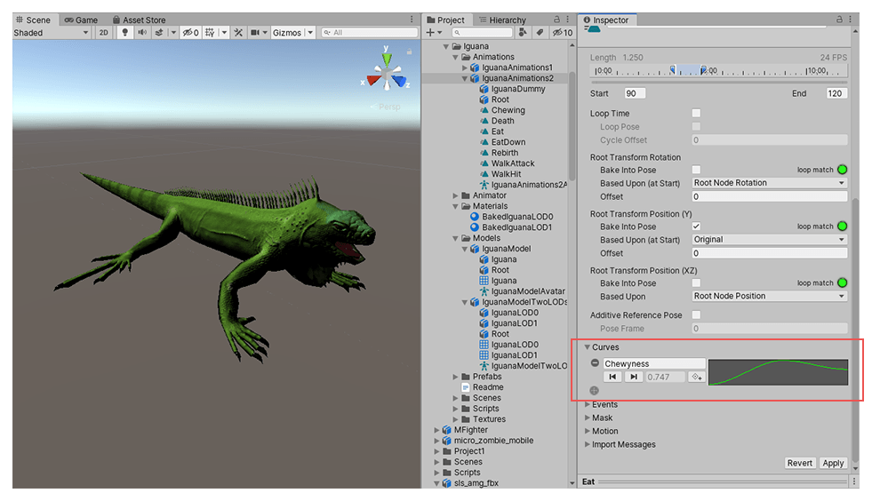
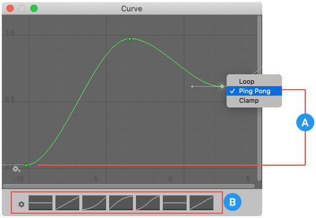

你可以在动画选项卡中为导入的动画剪辑 **附加动画曲线**。

这些曲线可用于向导入的剪辑添加额外的动画数据。你可以利用这些数据，根据动画控制器的状态来控制其他元素的动画时机。

例如，在一个冰雪环境设定的游戏中，额外的动画曲线可以用来控制粒子系统的发射速率，从而展现玩家在寒冷空气中呼出的白气。

要为导入的动画添加曲线，请展开动画选项卡底部的 "curve" 部分，然后点击加号图标为当前动画剪辑添加新曲线。

如果导入的动画片段分为多个 clips，每个 clip 都可以有自己的 curve。

**这是一个标准的 AnimationCurve。**

Curve 的 X 轴代表 normalized time，范围总是 0-1，分别对应 clip 的开头和结尾，无关它的 duration。

双击动画曲线会打开标准的 Unity 曲线编辑器，可以使用它向曲线添加关键帧。

关键帧是曲线时间轴上的点，这些点的值是由动画师明确设置的，而不是仅仅使用插值计算得出的。关键帧对于标记动画时间轴上的重要节点非常有用。例如，在行走动画中，您可以使用关键帧来标记左脚着地、双脚同时着地、右脚着地等时刻。一旦设置了关键帧，就可以通过按下“上一关键帧”和“下一关键帧”按钮方便地在关键帧之间移动。这会移动垂直的红色线条，并显示该关键帧处的标准化时间。你在文本框中输入的值将决定该时刻曲线的取值。

自定义动画曲线只能添加到 Model 文件中导入的 clip。对于 Unity Animation Editor 创建的 clip，没有自定义曲线功能，因为你本身就可以在其中动画任何 GameObject 的属性，不需要单独的 Animation Curve 曲线，

# Animation Curves 和 Animator Controller parameters

如果你有一个曲线，其名称与 Animator Controller 中的某个参数名称相同，那么该参数的值将在时间轴的每个时间点上取自该曲线在该时刻的值。例如，如果你在脚本中调用 GetFloat 方法，返回的值将等于调用时该曲线所对应的值。

需要注意的是，在任意给定的时间点，可能会有多个动画剪辑尝试从同一个控制器中设置同一个参数。在这种情况下，Unity 会对来自多个动画剪辑的曲线值进行混合。如果某个动画没有为特定参数设置曲线，那么 Unity 会将该参数的默认值用于混合。
