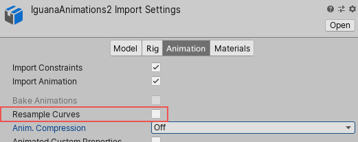
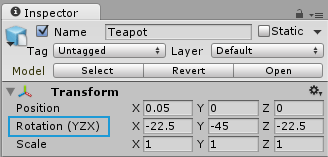

在 3D 应用中，旋转通常以四元数（Quaternion）或欧拉角（Euler angles）表示。大多数情况下，Unity在内部以四元数表示旋转；不过，了解 Unity 中的旋转与朝向的基本概念仍然很重要。

从外部来源导入包含动画的文件时，这些文件通常包含欧拉格式的关键帧动画。Unity的默认行为是将这些动画重新采样为四元数值，并为动画中的每一帧生成一个新的四元数关键帧。这可以尽量减少源动画与在 Unity 中呈现效果之间的差异。

即便进行了重新采样，在某些情况下，导入动画的四元数表示仍可能与原始动画不够接近。因此，Unity提供了关闭动画重新采样的选项。这意味着你可以在运行时使用原始的欧拉动画关键帧。

注意：只有在默认的四元数帧间插值导致不良结果并引发问题时，才应保留欧拉曲线作为最后手段。

# 在导入的动画上保留原始的 Euler curves

取消 Animation tab 中的 Resample Curves 选项

当禁用此选项时，Unity 会根据曲线类型（适当情况下为欧拉或四元数模式）保留具有原始关键帧的旋转曲线。

注意：FBX SDK 会自动对具有前置或后置旋转的关节上的任何旋转曲线进行重新采样。这意味着 Unity 会自动将它们作为四元数曲线导入。

Unity 支持如此广泛的导入文件类型，并尝试使导入的曲线尽可能接近原始状态。为了实现这一点，Unity 支持所有常规（非重复）欧拉旋转顺序，并以原始旋转顺序导入曲线。

## Unity 中的欧拉角

在使用原始欧拉（未重新采样）旋转时，你在动画播放中几乎看不到视觉差异。在底层，Unity 即使在运行时也以欧拉表示形式存储这些曲线。然而，由于引擎只使用四元数，Unity 最终还是必须将旋转值转换为四元数。

当禁用“重新采样曲线”选项时，Unity 会将旋转值保持为欧拉值，直到它们被应用到 GameObject 上。这意味着最终结果应该看起来与原始效果一样好，但由于未在制作软件中烘焙的旋转曲线占用的内存更少，从而改善了内存使用情况。

## Transform Inspector 中的非默认欧拉角顺序

默认情况下，Unity 会按照 Z、X、Y 的顺序应用变换检查器（Transform Inspector）中显示的欧拉角。XYZ 右移一位，先应用的是 child，后应用的是 parent，总是在当前 identity 坐标系对前面已经旋转了的 object 旋转。

先 roll（左右翻滚），然后 tilt（上下俯仰），最后 yaw（水平偏航）。

当播放或编辑具有与 Unity 默认旋转顺序不同的旋转顺序的欧拉曲线的导入动画时，Unity 会在旋转字段旁边显示一个表示差异的指示符。

当编辑具有不同旋转顺序的多个变换时，Unity 会显示一条警告消息，提示相同的欧拉旋转应用于具有不同旋转顺序的曲线时会产生不同的结果。

