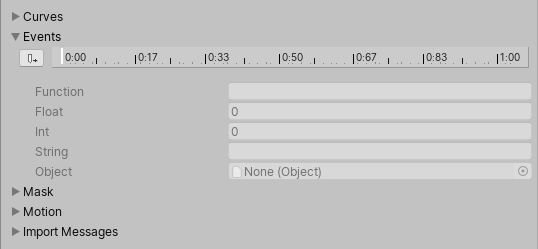
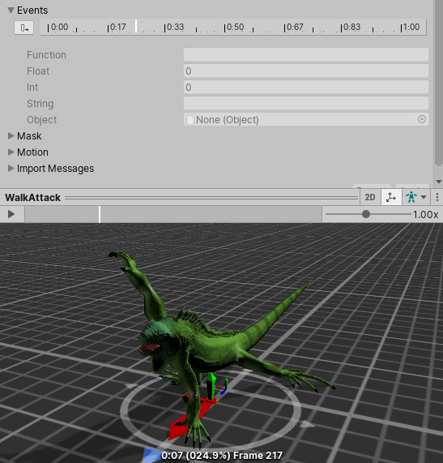
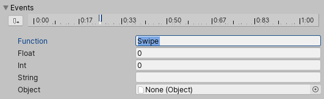

你可以在动画选项卡中为导入的动画剪辑附加动画事件。

动画事件允许你向导入的剪辑添加额外的数据，用于确定在动画播放过程中某些动作应在何时发生。例如，对于一个动画角色，您可能想要为行走和跑步循环添加事件，以指示何时应该播放脚步声。

要为导入的动画添加事件，请展开“event”部分，以显示该导入动画剪辑的事件时间轴：

要移动 playback head 到 timeline 上不同的位置，使用 preview pane 窗口的 timeline。

将播放头定位到您想要添加事件的时间点，然后点击“添加事件”。此时会出现一个新的事件，以时间轴上的一个小白色标记表示。在 Function 属性中，填写当到达该事件时要调用的函数名称。

请确保任何使用此动画的 GameObject，在其 Animator 中都附加了一个包含与该事件名称相匹配的函数的相应脚本。

下面的示例演示了一个事件的设置，该事件用于调用附加到 Player GameObject 上的脚本中的 Swipe 函数。这可以与 AudioSource 结合使用，以同步于动画播放斩击音效。

还可以选择指定一个参数，将其传递给事件调用的函数。共有四种不同的参数类型：Float（浮点数）、Int（整数）、String（字符串） 或 Object（对象）。

通过在这些字段中的一个填写一个值，并将函数实现为接受该类型的参数，就可以让事件中指定的值传递到脚本中的函数。

例如，可能想要传递一个浮点数值，以指定在不同动作期间音效的音量大小，比如在行走循环中脚步声较轻的事件，以及在奔跑循环中脚步声较响的事件。也可以传递一个对特效预制体（Prefab）的引用，让脚本能够在动画的某些特定时间点实例化不同的特效。
