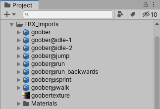

一个动画角色通常会在游戏中因不同情况而播放若干不同的动作，这些动作被称为Animation Clips。

例如，我们可能会为行走、奔跑、跳跃、投掷和死亡分别准备独立的动画剪辑。 

根据美术师在 3D 建模应用中的设置方式，这些独立的动作可能会作为不同的动画剪辑导入，也可能会作为一个单一剪辑导入，其中每个动作只是紧接着前一个动作依次播放。 

如果只有一个长剪辑，你可以在 Unity 中将其中的组件动画剪辑提取出来，但这会给你的工作流程增加一些额外步骤。

导入的模型可以有很多个定义好的 clips。每个 clip 如果包含一组 actions（它们只是连续地在同一个 clip 中放在一起），还可以从中再定义新的动画片段（选择新片段的 source take，指定它的范围）。

# 使用多模型文件导入动画

导入动画的另一种方式是遵循 Unity 支持的动画文件命名方案。你可以创建多个单独的模型文件，并使用约定命名：​​modelName@animationName.fbx​​。

例如，对于名为 ​​goober​​ 的模型，可以使用名为 ​​goober@idle.fbx​​、​​goober@walk.fbx​​、​​goober@jump.fbx​​ 和 ​​goober@walljump.fbx​​ 的文件来导入独立的 ​​idle​​、​​walk​​、​​jump​​ 和 ​​walljump​​ 动画。

以这种方式导出动画时，无需在这些文件中包含​​网格（Mesh）​​，但在这种情况下，应启用 ​​Preserve Hierarchy​​ ​​模型导入选项​​。

Unity 会自动导入上述四个文件，并将所有动画汇集到不带 ​​@​​ 符号的文件中。在上面的示例中，Unity 会自动导入 ​​goober.mb​​，并引用 ​​idle​​、​​jump​​、​​walk​​ 和 ​​wallJump​​ 动画。

对于 ​​FBX​​ 文件，你可以将网格导出到不含动画的模型文件中。然后，在 FBX 对话框中启用动画，将四个剪辑分别导出为 ​​goober@animname.fbx​​。

Unity 会自动导入所有四个文件，并将所有动画汇总到不含 @ 符号的文件中。在上面的示例中，Unity 会自动导入 goober.mb 文件，并自动引用 idle、jump、walk 和 wallJump 动画。

对于 FBX 文件，你可以将网格导出到一个不含动画的模型文件中。然后，通过导出每个动画所需的帧（在 FBX 对话框中启用动画），将四个剪辑分别导出为 goober@_animname_.fbx。
