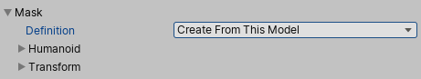
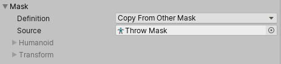
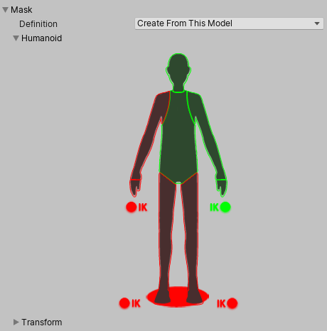
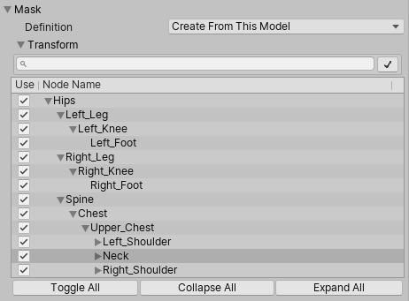

Masking 允许你丢弃片段中的部分动画数据，使该片段只动画化对象的部分部位而非整个对象。

例如，如果你有一个带有投掷动画的角色。如果你希望能够在跑步、下蹲和跳跃等各种其他身体动作中结合使用该投掷动画，可以为该投掷动画创建一个 Masking，将其限制为仅右臂、上半身和头部。然后，这部分动画可以作为层叠加在基础的跑步或跳跃动画之上。

Masking 可以应用到你的构建中，从而使文件大小和内存更小。它还能提高处理速度，因为在运行时需要混合的动画数据更少。在某些情况下，导入遮罩可能不适合你的目的。在这种情况下，你可以使用 Animator Controller 的层设置在运行时应用 Masking。本页内容涉及导入设置中的 Masking。

要为导入的动画片段应用 Masking，展开 Mask 标题以显示 Masking 选项。打开菜单后，你会看到三个选项：Definition、Humanoid 和 Transform。

# Definition

允许你指定 是要在 Inspector 中专门为当前剪辑创建一个一次性（独享）Masking，还是使用项目中已经存在的 Masking 资源（Masking Asset）。

如果你想要仅为当前剪辑创建一个专用的一次性 Masking，请选择 / 从此模型创建 /（Create From This Model）。

如果你打算为多个剪辑设置相同的 Masking，则应该选择 Copy From Other Mask，并使用一个 Masking 资源。这样你就可以为多个剪辑复用同一个 Masking 定义。

当选择了 Copy From Other Mask 时，Humanoid（人形） 和 Transform（变换）选项将不可用，因为这些选项与在 Inspector 中为当前剪辑创建一次性 Masking 有关。

# Humanoid

Humanoid 选项 可让你通过在人体示意图中选择或取消选择身体部位，快速定义 Masking。当动画已被标记为 Humanoid（人形）并且具有有效的 Avatar 时，可以使用这些选项。

# Transform

此选项允许你基于动画中的单个骨骼或可动部件来指定 Masking。这为你提供了更精细的 Masking 定义控制，同时也允许你将 Masking 应用于非人形动画剪辑。

**可以为 Generic 动画定义 Masking。**

