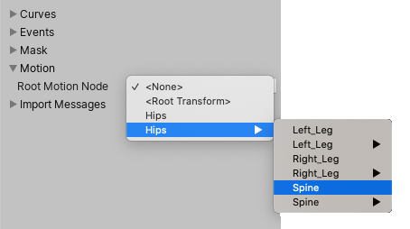

Unity 使用 Root Motion 来移动并旋转 Animator 层级 root 的 GameObject，适用于所有 Animation Clips。

有时，你需要选择一个不同的节点作为 Root Motion Node，而不是指定的节点。

为所有动画剪辑选择不同的根运动节点

- 展开 Motion 部分。
- 在 Root Motion Node 菜单中选择新的 Root Motion Node。该菜单会列出导入文件层级根部以下的所有对象与节点，包括：None（无）、Root Transform、角色的网格对象、根骨骼名称，以及每个条目的子对象子菜单。每个子菜单同样包含其子对象本身，若这些对象还有子对象，则会进一步包含更深层的子菜单。
- 选择 Apply。

当你为所有导入的动画剪辑选择了一个不同的 Root Motion Node 时，新选定的 Root Motion Node 将覆盖每个剪辑的手动 Root Motion Node 设置。

这会隐藏并覆盖以下设置：Root Transform Rotation、Root Transform Position (Y) 和 Root Transform Position (XZ)。
