# 创建人形动画

Mecanim 动画系统 (Mecanim Animation System) 特别适合使用类人骨架动画。由于类人骨架非常普遍并在游戏中广泛应用，因此Unity 针对类人动画专门提供了专业的工作流程和扩展工具集。

本篇主要介绍为模型创建 Avatar 的基本步骤。包括：

- 创建Avatar
- 配置Avatar
- 肌肉设定
- 动画重定位
- 反向动力学

什么是Avatar

Mecanim 系统简化了搭骨架和动画控制的过程。创建动画的基本步骤就是在 Mecanim 理解的简化类人骨骼结构和骨架中的实际骨骼之间建立映射。在Mecanim术语中，将该映射称为 Avatar。

Avatar 就是一个映射 map，一个字典，字典的 key 是预定义好的，每个模型有自己的 avatar，即自己的骨骼字典，记录每个预定义的逻辑骨骼对应这个模型的那个骨骼。当每个模型都建立自己的 avatar 之后，不同的模型之间就可以通过这个协议约定接口进行通信了，因为他们彼此知道自己某个骨骼对应对方的那个骨骼，而这样一个模型的人形动画就可以通过 avatar 直接应用到另一个模型上。似乎不再需要 Unity Docs 中介绍的 retargeting，每个模型建立好 avatar 之后，模型导入设定为 humanoid animation，就直接可以重用动画了。IK 系统也使用 avatar，Unity 提供了一个通用的运行时 IK 算法，IK 算法只操作骨骼界面 avatar，然后将对每个骨骼的操纵 transform 通过 avatar 传递给真实的骨骼。

动画重定位和反向动力学

由于类人动画的骨骼结构大部分都相似（个别情况例外），比如展示身体、头部和四肢的主要清晰部位等，因此通过实现 retargeting 和 IK，还可以将一个类人骨架动画映射到另一个类人动画。

## 创建Avatar

导入模型文件（例如FBX文件）之后，首先需要在【Model Importer】选项的【装置(Rig)】选项卡中指定装置（Rig）的类型为 humanoid，指定后单击【Apply】，就为其创建了一个Avatar。

Model：蒙皮网格模型

Rig：装配，操纵，骨骼

### 人形动画

对于人形动画，导入动画模型后，创建Avatar的具体步骤如下：在检视器视图中，单击【Model】选项卡“Animation Type”右侧的下拉框，选择【Humanoid】，点击【Apply】。

此时Mecanim 就会自动尝试将现有骨骼结构匹配到 Avatar 的骨骼结构。大多数情况下，Unity都会通过分析装置中骨骼之间的连接来自动完成这一过程。

如果匹配成功，就会在【Configure】按钮的前面看到一个“√”标记，如下图所示。另外，在成功匹配的情况下，Unity还会自动将 Avatar 的子资源添加到模型资源文件中（可以在工程视图层次视图中看到该资源）。

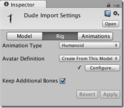

如果自动 Avatar 创建失败，此时会看到【Configure…】按钮旁边出现一个“X”标记，如下图所示：

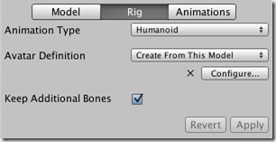

在这种情况下，系统不会自动添加 Avatar 子资源。此时需要手动配置 Avatar。

### 非人形动画

Unity提供了两种非类人动画：通用 (Generic) 和旧版 (Legacy)。
通用动画使用 Mecanim 系统导入，但不能使用人形动画可用的额外功能。

旧版动画使用 Unity 在 Mecanim 之前提供的动画系统。在某些情况下，比如你不希望更新旧 Unity 工程的版本，在这种情况下，你可以继续使用旧版动画。但是要记住：在新版本的工程中很少使用旧版动画 (Legacy)。

## 配置 avatar

在 Mecanim 系统中，不论自动创建的 Avatar 匹配是否成功，都需要进入配置 Avatar (Configure Avatar) 模式，这样做的目的是为了确保 Avatar 有效且正确设置。

“有效且正确设置”的含义是：角色的骨骼结构必须匹配 Mecanim 预定义的骨骼结构且将模型摆成 T 字姿势 (T-pose)，这一点非常重要。

### 匹配

前面我们说过，如果Avatar创建成功，就会在【Configure】按钮的前面看到一个“√”标记。但是，此时的“成功”仅仅意味着成功匹配了所有需要的骨骼，为了获得更好的结果，你可能还想匹配可选的骨骼，并让模型摆成合适的 T 姿势 (T-pose)。

当单击【Configure……】按钮转到对应的菜单时，编辑器会先弹出一个窗口询问是否要保存当前场景，这是因为在配置 (Configure) 模式下，场景视图 (Scene View) 仅显示所选模型的骨骼、肌肉和动画信息，而不会显示场景的其他部分。

保存当前场景之后，就会在检视器视图看到一个带有骨骼映射的新 Avatar 配置 (Avatar Configuration)。如下图所示：

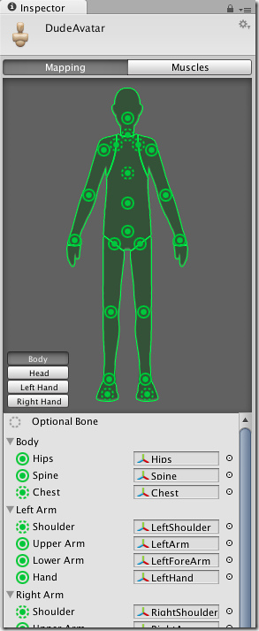

检视器还会显示哪些骨骼必需的，哪些骨骼是可选的（可选骨骼的运动可以自动用插值计算出来）。

为了让 Mecanim 产生有效的匹配，需要将所需骨骼放在骨架上的恰当位置，否则就可能匹配不成功。另外，为了提高找到匹配 Avatar 的骨骼的成功率，一般都使用反映身体部位的名称为骨骼命名（比如 "LeftArm“、”RightForeArm" 等）。

如果模型不能自动产生有效的匹配，此时需要遵循 Mecanim 在内部使用的类似流程来手动匹配它，步骤如下：

- 采样绑定姿势 (Sample Bind-pose)（尝试让模型更接近其建模时的姿势，一个合理的初始姿势）
- 自动映射 (Automap)（从初始姿势创建一个骨骼映射）
- 强制 T 字姿势 (Enforce T-pose)（强制模型更接近 T 字姿势，这是 Mecanim 动画使用的默认姿势）

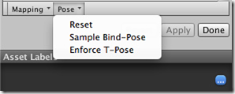

如果自动映射完全失败或者部分失败，则可以通过从场景 (Scene) 或层级视图 (Hierarchy) 中拖出骨骼来为其赋值。

如果 Mecanim 认为某块骨骼合适，该骨骼就会在 Avatar 检视器 (Avatar Inspector) 中显示为绿色，否则显示为红色。

最后，如果骨骼赋值正确，但角色的姿势有错误，此时会看到消息“角色未摆成 T 字姿势 (Character not in T-Pose)”。这种情况下，可使用强制 T 字姿势 (Enforce T-Pose) 进行修改，或者将剩余的骨骼旋转成 T 字姿势。

### 人形模板（Human Template）文件

以将骨架中骨骼与 Avatar 的映射在磁盘上保存的扩展名为“.ht”的文件称为类人模板(Human Template)文件，这些文件可以由使用此映射的任何角色重复使用。

扩展名为“.ht”的模板文件十分有用，例如当动画对所有骨架使用一致的布局和命名约定，但 Mecanim 不知道如何解释它时，你就可以对每个模型加载 (Load)扩展名为“.ht”的文件。这样做的好处是，只需要手动重新映射一次就行了。

## 肌肉设定

Mecanim 可让你使用肌肉 (Muscles) 来控制不同骨骼的活动范围。

正确配置 Avatar 后，就意味着Mecanim已经“理解”了骨骼结构，此时就可以在 Avatar 检视器 (Avatar Inspector) 的肌肉 (Muscles) 选项卡中工作。在这里，可以非常轻松地调整角色的活动范围，确保角色以逼真的方式扭曲，避免过度造作或自我重叠。如下图所示：

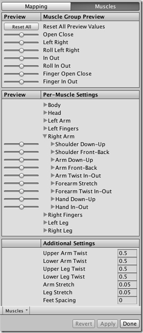

### 逐肌肉设置（Per-Muscle Setting）

通过Per-Muscle Setting选项卡下的视图，可以一个一个地调整身体（视图下部）中的每块骨骼，或使用一次操作若干块骨骼的预定义扭曲（视图上部）来操作角色。

### 肌肉剪辑

在动画 (Animation) 选项卡中，还可以设置肌肉剪辑 (Muscle Clips) - 它们是针对特定肌肉和肌肉组的动画。

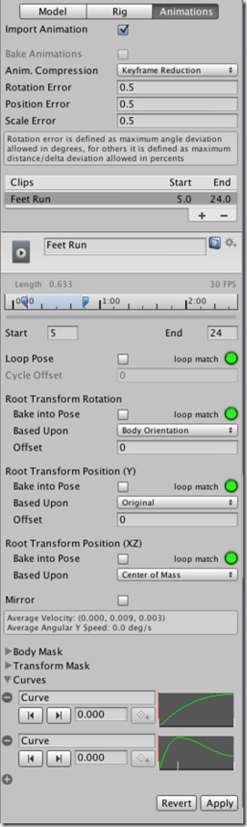

也可以定义这些肌肉剪辑应用于身体的哪个部位：

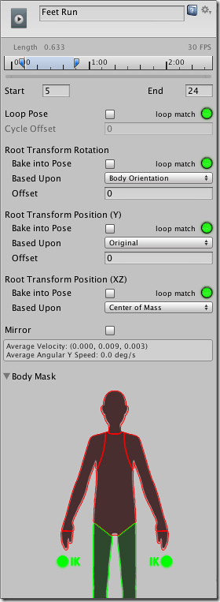

## Avatar Mask

在网格导入检视器的动画 (Animation) 选项卡和动画层 (Animation Layer) 中，可以使用身体掩码 (Body Mask) 在动画中有选择性地启用或禁用特定身体部位。

Avatar Mask 是动画片段的属性，因为动画掩码通常用于动画层次加法中。一个动画可以创建多个副本，每个副本拥有不同的 mask，形成了不同的部分动画，然后被应用在各种动画加法的场景中。

Avatar Mask 和 int mask 一样，露出的部分骨骼动画数据正常输出，被屏蔽的骨骼不输出动画数据。可以将 avatar mask 也理解为和 avater 一样的映射/字典，只是它的 value 不是真实的骨骼，而是 true/false，true 表示骨骼露出，false 表示骨骼被屏蔽。

因为 Avatar Mask 是应用在动画片段上的，因此可以直接用在 Animancer 中。

使用Avatar mask可以调整动画以便更加符合角色的特定要求。例如，你可能具有同时包括手臂和腿运动的标准行走动画，不过如果角色使用双手运送大型物体，不希望其手臂在其行走时在两侧摆动，此时可通过在身体遮蔽中关闭手臂移动来仍旧使用标准行走动画。

使用Avatar mask的好处是：

有助于减少内存开销，因为不活动的身体部位无需关联动画曲线。
不使用的曲线无需在播放过程中进行计算，这有助于减少动画的 CPU 开销。

### IK

身体部位包括：头、左臂、右臂、左手、右手、左腿、右腿和脚（通过脚下的“阴影”表示）。在Avatar Mask，还可以切换手和脚的反向运动（Inverse Kinematics，简称IK） ，这会确定是否在动画混合中包括 IK 曲线。

- 单击 Avatar 部分可切换包括（绿色）或排除（红色）。
- 在 Avatar 周围的空白空间中双击可全部切换。

下图是身体遮蔽检视器中的身体遮蔽（排除了手臂）：

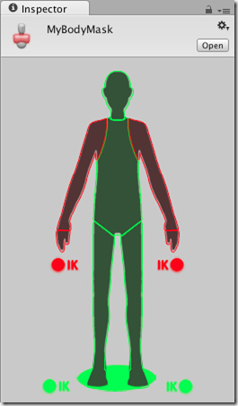

在网格导入检视器动画(Animation) 选项卡中，会看到标题为片段 (Clips) 的列表，其中包含对象的所有动画片段。从该列表中选择一个项目时，会显示该片段的选项，包括身体遮蔽编辑器。

### Avatar Body Mask Asset资源

还可以创建Body Mask资源，步骤是：【资源 (Assets)】->【创建 (Create)】->【Avatar Body Mask】，这些资源会在磁盘上显示为 .mask 文件。

BodyMask 资源可以在动画器控制器 (Animator Controller) 中重复使用，即：在指定动画层 (Animation Layer)时可重复使用。

## 动画重定向

Mecanim 最强大的功能之一是重定位类人动画。这意味着，你可以相对轻松地将相同动画集应用到各种角色模型上。

重定位只可用于已经配置了Avatar的类人模型，因为这样才能在模型的骨骼结构之间建立对应关系。

推荐的层级视图 (Hierarchy) 结构

使用 Mecanim 动画时，场景中应该包含以下元素：

- 导入的 (Imported) 角色模型，其中包含 Avatar。
- 动画器组件 (Animator Component)，通过引用动画控制器 (Animator Controller) 资源得到的。
- 动画片段集，通过引用动画控制器 (Animator Controller)得到的。
- 角色的控制脚本。
- 角色相关的组件，例如动画控制器 (Animator Controller)。

你的工程也应该包含另一个含有有效 Avatar 的角色模型。

推荐的设置

在包含角色相关 (Character-related) 组件的层级视图 (Hierarchy) 中创建一个游戏对象 (GameObject)：

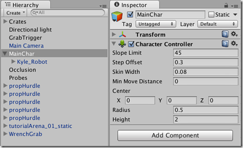

将模型与动画器(Animator)组件一起作为游戏对象(GameObject)的子对象：

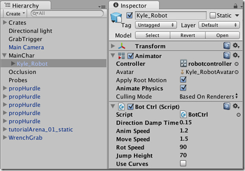

确保引用动画器(Animator)的脚本正在寻找子对象中的动画器，而非根。即使用GetComponentInChildren\<Animator>()来代替GetComponent\<Animator>()。

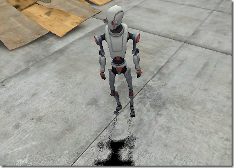

为了在另一个模型上再次使用相同的动画，需要：
禁用原始模型
将所需模型作为游戏对象(GameObject)的另一个子对象加入

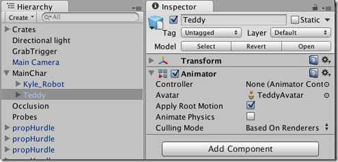

确保新模型的动画器控制器(AnimatorController)属性引用相同的控制器资源：

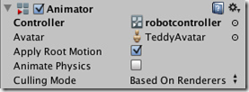

调整角色控制器、变换和顶层游戏对象(GameObject)的其他属性，以确保动画能够顺利地使用新模型。

完成设置！最终得到的效果如下：

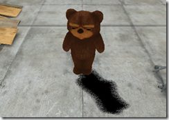

## Mixamo

In place 参数

## 反向动力学

大多数动画通过旋转调整骨架中关节的角度为预定值来制作。子关节的位置根据其父关节的旋转而改变，因此，关节链的端点由其所包含的单个关节的角度和相对位置决定。这种构成骨架的方法称为正向动力学。

因此，从相反的角度查看构成关节的任务通常十分有用 – 在空间中给出一个选择的位置，然后对其逆向操作，找到一种定向关节的有效方式，这样端点就落在该位置。这种方式称为反向动力学 (Inverse Kinematics) (IK)，Mecanim中的IK可用于任何含有正确配置 Avatar 的类人角色。

当想要角色在用户选择的某一点触摸一个物体或者将角色双脚稳稳地固定在不平坦的表面上时，反向动力学这种方式非常有效。

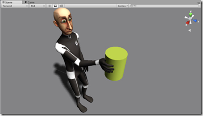

要为角色设置IK，通常需要拥有与角色互动的场景四周的物体，然后通过脚本设置 IK，特别是通过此类提供地方法实现动画器 (Animator) 功能。例如：SetIKPositionWeight、SetIKRotationWeight、 SetIKPosition、 SetIKRotation、 SetLookAtPosition、 bodyPosition、 bodyRotation

上图展示了一个角色正抓住一个圆柱形物体。如何才能做到这一点？答案是：先从一个拥有有效 Avatar 的角色入手，然后向该角色附加一个处理 IK 的脚本（IKCtrl.cs），该文件的C#代码如下：

```C#
using UnityEngine;
using System;
using System.Collections;
[RequireComponent(typeof(Animator))]  
public class IKCtrl :MonoBehaviour
{
    protected Animator animator;
    public bool ikActive = false;
    public Transform rightHandObj = null;
    void Start () {
        animator = GetComponent<Animator>();
    }
    //a callback for calculating IK
    void OnAnimatorIK()
    {
          if (animator) {
            if (ikActive) {
                //if the IK is active, set the position and rotation directly to the goal. 
                //weight = 1.0 for the right hand means position and rotation will be at the IK goal (the place the character wants to grab)
                animator.SetIKPositionWeight(AvatarIKGoal.RightHand,1.0f);
                animator.SetIKRotationWeight(AvatarIKGoal.RightHand,1.0f);
                if (rightHandObj != null) {
                    //设置右手的位置和旋转
                    animator.SetIKPosition(AvatarIKGoal.RightHand,rightHandObj.position);
                    animator.SetIKRotation(AvatarIKGoal.RightHand,rightHandObj.rotation);
                }
            }
            else {
               //如果IK未激活，还原原来的右手位置和旋转
                animator.SetIKPositionWeight(AvatarIKGoal.RightHand,0);
                animator.SetIKRotationWeight(AvatarIKGoal.RightHand,0);
            }
          }
    }
}
```

由于我们不打算让角色用手抓住“整个”物体，所以在圆柱体上放置了一个可以用手抓的球体，并相应转动该球体。

下图是该球体然后被列为 IKCtrl 脚本的“右手对象 (Right Hand Obj)”的属性：

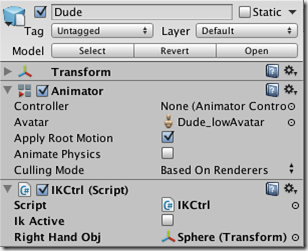

点击IKActive复选框，观察角色抓取、松开物体的过程。
