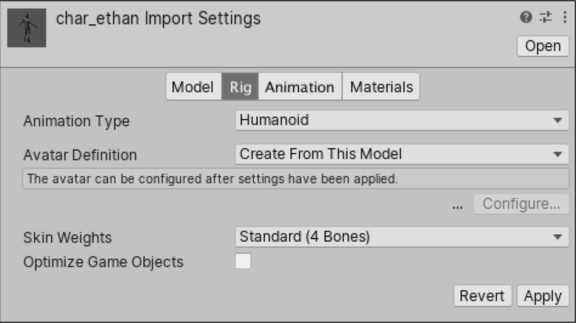
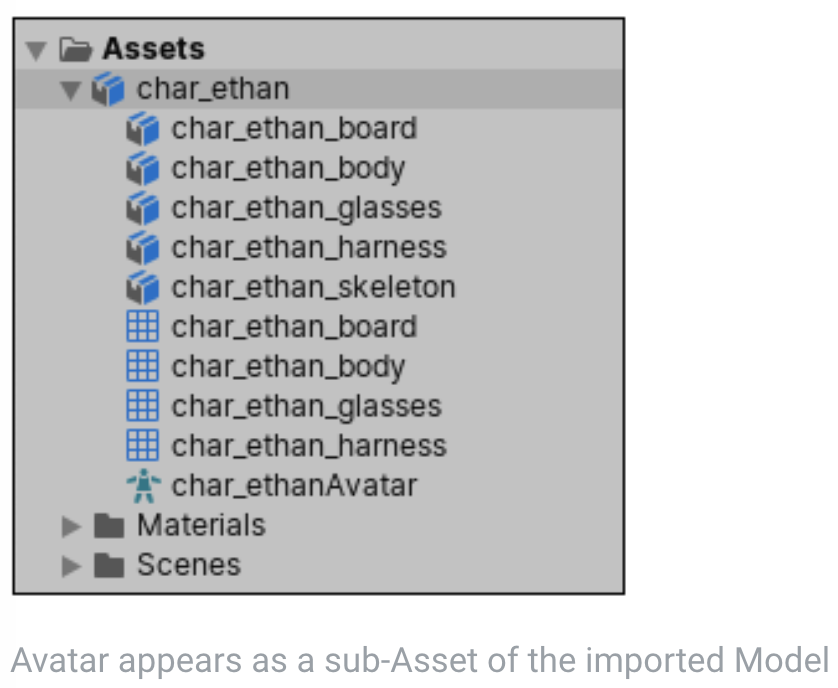
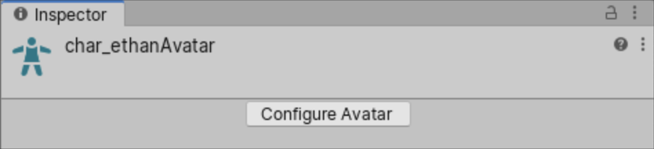
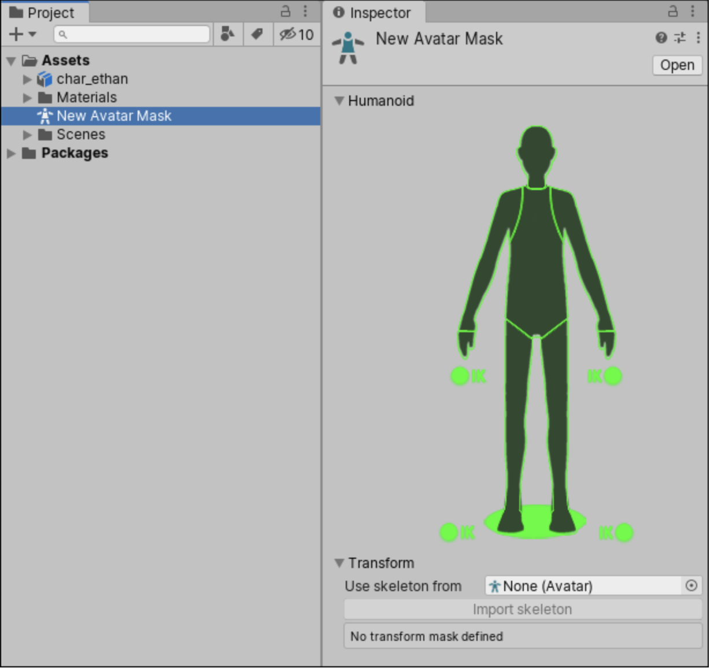

# 导入人形动画

导入指的是**将资源从Project导入到scene中，而不是从外部导入到Unity到Project中**。

当 Unity 导入包含人形骨骼和动画的模型文件，它需要使模型的骨骼结构和动画协调一致。它通过将文件的每个骨骼映射到一个人形 avatar 以使它可以正确播放动画。

由于人形骨骼在骨骼上的相似性，可以将人形动画从一个人形骨架映射到另一个结构不同但相似的人形骨架，从而实现动画重定向和重用。

除了极少数情况之外，人物模型都具有相同都基本结构。Mecanim 动画系统利用这一点来简化骨架绑定和动画控制过程。

Avatar 就是 Unity 在不同都人形骨骼之间建立的标准界面（接口）。Unity 首先定义了一个标准的人形骨骼结构。每个模型导入时创建一个 Avatar，avatar 就是一个映射，记录这个模型骨骼结构中哪个骨骼对应 Unity 标准骨骼结构的哪个骨骼。当两个人形骨骼都创建好 avatar（模型骨骼到标准骨骼结构的映射）之后，两个骨骼结构之间就可以建立起映射了，因为映射到avatar 中相同位置上的骨骼肯定就是相同的骨骼。

Mecanim 动画系统在播放动画时可能不是直接操作模型的骨骼，而是操作的 avatar 的骨骼槽。这样当使用相同的动画片段，不同的模型和 avatar 时，仍然能够播放正确的动画。

Avatar 创建了一个间接层。

因此在将模型文件导入 Unity（Scene）之前，仔细准备模型文件非常重要

1. 定义 Rig type 并创建 avatar（映射）
2. 修改或校验 avatar 映射
3. 一旦完成骨骼到 avatar 到映射，可选地点击 Muscles & Setting tab 来调整 Avatar 到 muscle 配置
4. 可选地将骨骼到 avatar 到映射保存为 Human Template(.ht)文件
5. 可选地通过定义一个 Avatar Mask 来限制导入动画的特定骨骼，即动画将不活动这些骨骼
6. 在 Animation tab，开启 Import Animation 选项，然后设置其他 asset-specific 属性
7. 如果文件包含多个动画或动作，可以指定 action ranges 作为 Animation Clips
8. 对于文件中定义的每个 Animation Clip，可以
  - 改变 pose 和 root transform
  - 优化 looping
  - 在人形骨骼两侧镜像动画
  - 给 Clip 添加 Curve 以 animate 其他 items 的 timings
  - 给 Clip 添加 event 以在 animation 特定时间触发动作
  - 丢弃动画的一些部分，就像在运行时使用 AvatarMask 一样，但是是在 import 时应用的
  - 选择一个不同的 Root Motion Node 来驱动动作
  - 查看 importing clip 时 Unity log 的 message
  - 查看 animation clip 的预览
9. 点击 Apply Button 来保存修改，Revert 来放弃修改

Muscle可以控制不同骨骼的活动范围（旋转角度），确保角色以逼真的方式动画扭曲，避免过度动画造成失真。

## 设置 avatar

在 Rig tab of the Inspector Window，设置 Animation Type 为 Humanoid。默认地，Avatar Definition 属性给设置为 Create From This Model。如果保持这个选项，Unity 尝试映射文件中定义的 bones 集合到 Humanoid Avatar。

或者可以改变这个选项为 Copy From Other Avatar 来使用在另一个模型文件中定义的 Avatar。例如，如果你在 3D 模型程序中创建一个 Mesh(skin) 以及一些不同的动画，你可以导出 Mesh 到一个 FBX 文件。当你将这些文件导入到 Unity 中，你只需要为第一个导入的文件创建一个 Avatar，**只要所有的文件使用相同的骨骼**，你可以为剩下的文件（动画）重用这个 avatar，因此这基本上就是用于同一个模型的不同动画文件。

如果你开启这个选项，必须通过 Source 属性指定想要使用哪个 Avatar。

还可以改变影响一个给定 vertex 的 skin weights 属性的最大骨骼数量。默认地，这个属性限制到 4 个骨骼，但是你可以指定更多或更少。

当点击 Apply 按钮，Unity 尝试匹配现有骨骼结构到 Avatar 骨骼结构。默认地，它可以通过 rig 中相连的 bones 来自动完成。

如果匹配成功，一个对勾出现在 Configure 菜单旁边。Unity 还添加了 Avatar sub-Asset 到 Model Asset 中，可以在 Project view 找到。

## 配置 Avatar

如果你想要检查 Unity 是否正确映射了你的模型骨骼到 Avata。如果 Unity 没能为你的模型创建 Avatar，你可以点击 Rig tab 中的 Configure 按钮，进入 Avatar configuration mode。

如果 Unity 成功创建了 avatar，Avatar 出现为 Model Asset 的 sub-asset。你可以在 Project window 选择 Avatar asset，然后点击 Inspector 中 Configure Avatar 按钮进入 Avatar confuguration mode。这个模式允许检查或调整 Unity 如何映射你的模型骨骼到 Avatar layout。

一旦进入 Avatar configuration mode，Avatar window 出现在 Inspector 显示 bone 映射。

确保 bone 映射是正确的，并且你可以映射任何可选的 Unity 没有赋值的骨骼。

你的骨骼需要拥有必须的骨骼让 Unity 产生一个有效的匹配。为了提高对 Avatar 找到一个匹配的机会，命名你的骨骼以反映它们反映的身体部分。例如 LeftArm 和 RightForearm 使得它们表示那个骨骼更清楚。

### 映射策略

如果模型没有产生一个有效匹配，你可以使用一个类似 Unity 内部处理的过程：

1. 选择 Avatar window 底部的 Mapping 菜单中 Clear，重置 Unity 尝试的任何映射
2. 选择 Avatar window 底部的 Pose 菜单中的 Sample Bind-pose 来接近模型的初始 pose
3. 选择 Mapping > Automap 来从一个 initial pose 创建一个 bone-mapping
4. 选择 Pose > Enforce T-Pose 来设置 Model 回到需要的 T-pose

如果自动映射完全或部分失败，你可以手动赋值骨骼，通过从 Scene View 或者 Hierarchy View 中拖拽骨骼。如果 Unity 认为这个骨骼合适，它在 Avatar Mapping tab 中显式为绿色，否则它显示为红色。

### Resetting the pose

T-pose 是 Unity 动画需要的默认 pose，并且是 3D 模型程序建议的模型 pose。然而，如果你没有使用 T-pose 建模你的角色，并且动画不能如期望地工作，你可以选择 Pose 菜单中的 Reset。

如果骨骼关联是正确地，但是角色没有在正确的 pose，你可能看见消息 “Character not in T-Pose”。你可以尝试通过选择 Pose > Enforce T-Pose 菜单进行修复。如果 pose 仍然不正确，你可以手动选择剩余的骨骼到 T-pose。

## 创建一个 Avatar Mask

Masking 允许你放弃一个动画片段中的一些动画数据，允许片段只动画物体或角色的部分而不是整体。

例如你可能有一个标准 walking 动画，其同时包含 arm 和 leg 运动，但是如果这个角色正在使用双手搬运一个很大的物体，你不会像在他们想 walk 的同时挥舞他们的胳膊。然而，你仍然可以早搬运物体时使用标准 walking 动画，通过使用一个 mask 只播放 carry 动画的 upper body 到 walking animation 的上面。

你可以在 import 时，或者在运行时应用 masking 到动画片段上。在 import 时 mask 是非常适合的，因为它被舍弃的动画数据从 build 中忽略掉，使得文件更小，因此使用更少的内存。它还允许更快的处理，因为在运行时有更少的数据需要 blend。有时，import masking 可能不适合你的目的。此时，你可以在运行时应用一个 mask，通过创建一个 Avatar Mask asset，并在 Animator Controller 中的 layer settings 使用它。

要创建一个空的 avatar mask asset：

- 选择 Assets 菜单中的 Create > Avatar Mask
- 或者在 Project view 中点击你想要定义 mask 的 Model，然后右键点击并选择 Create > Avatar Mask

Avatar 只需要定义哪个骨骼被屏蔽，不需要引用真正的骨骼。

你现在可以添加身体的部分到 mask 中，然后：

- 添加 mask 到 Animation Layer（运行时 masking）
- 或者在 Animation Tab 下面的 Mask section 添加对它的引用（import 时 masking）
