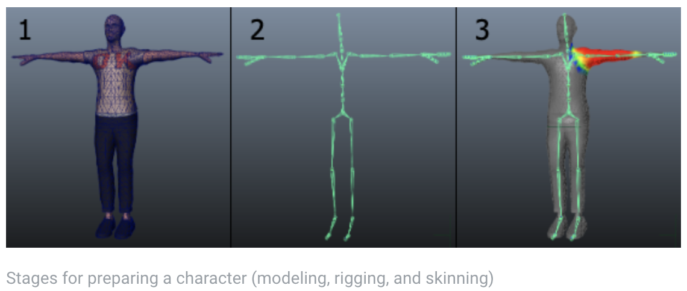
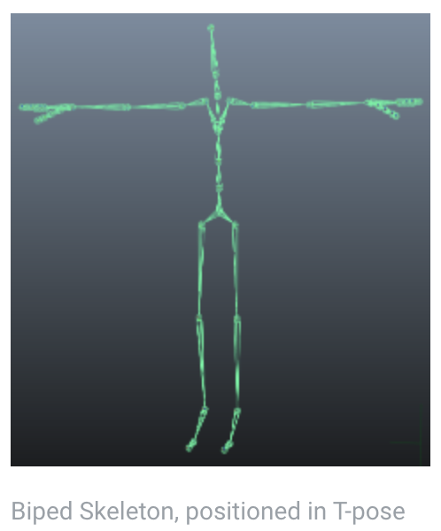
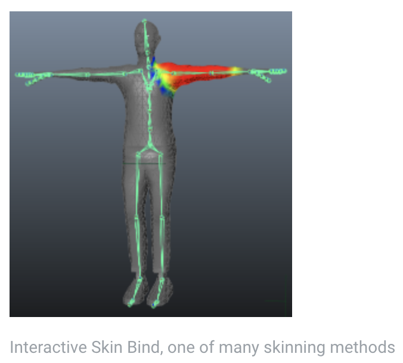

# Preparing Humanoid Assets for export

为了利用 Unity humanoid animation 系统的全部优势和 retargeting，你需要有一个 rigged 和 skinned humanoid 类型的 mesh。

1. 一个角色模型通常由多边形或三角形组成
2. 为了控制一个角色运动，你必须创建一个 joint hierarchy（关节层次）或者骨骼 skeleton，其定义了 Mesh 中的骨骼，以及它们彼此之间的相对运动。创建 joint 层次的过程称为 rigging
3. 你必须连接 mesh(skin) 到这个 joint hierarchy。这定义了角色 mesh 的哪个部分随着哪个 joint 活动和活动。连接 skeleton 到 mesh 的过程称为 skinning

## 如何获得 humanoid 模型

有 3 种方式获得 humanoid 模型，可以在 Unity Animation system 中使用：

- 使用一个过程化角色系统，或者角色生成器，例如 Poser，Makehuman，或者 Mixamo。这些系统中的一些可以 rig 和 skin 你的 mesh（例如 Mixamo），而另外一些不能。更进一步，如果你使用这些方法，你可能需要减少原始 mesh 中的多边形数量以用于 Unity
- 在 Unity Asset Store 中购买角色资源
- 在一个 3D 建模程序中 model，rig，skin 你自己的模型

### Modeling

这个过程在 3D 建模软件中创建你自己的 humanoid Mesh。这里是一些确保模型在 Unity Animation 中工作良好的指南：

- 使用一个 well-formed 结构的拓扑。一个 Mesh 的 well-formed 结构的准确本质非常微妙但是通用，你应该时刻记住 vertices 和 triangles 在动画时是如何变形的。一个失败的拓扑不能够使模型不失真地动画。学习现有的 3D 模型来查看它的拓扑如何安排的以及为什么
- 检查你的 mesh 的 scale。执行一个测试 import，并与一个 meter cube 比较 size。检查你的 3D 建模软件使用的单位，调整 export 设置，使得 Model 的 size 到 cube 的比例正确。非常容易创建模型而没有注意它们的 scale，而导致失调的 size
- 调整 mesh 使得角色的 feet 放置在 local origin 或者模型的 anchor point
- 尽可能建模为 T-pose。这给你改善多边形的空间。这还使得将 rig 放置在 Mesh 中更加容易
- 在 building 时，清理你的 model。在可能的地方，封住空洞，焊接顶点，移除隐藏的 faces。这可以帮助 skining，尤其是自动化 skinning 过程。

### Rigging

这个过程创建一个 joint 的骨架，来控制模型的移动。

3D 建模软件提供大量方式来创建 joints 进行 humanoid rig。它们从 ready-made biped skeletons（你可以缩放它来适配你的 Mesh），到独立的 bone creation 和 parenting 来创建你自己的 bone 结构。

要用在 Unity 动画系统中，确保它们是 bone hierarchy 的 root 元素。Skeleton 中最少需要 15 个 bones，以产生一个有效的 match。为了提高找到有效 Avatar 匹配的机会，将你的骨骼命名为反映它们表示的部分。例如 LeftArm 和 RightForearm。

Joint/bone hierarchy 应该遵循你的角色的天然结构。为左右 arm 和 leg 使用一致的命名。

可能的结构包括：

* HIPS - spine - chest - shoulders - arm - forearm - hand
* HIPS - spine - chest - neck - head
* HIPS - UpLeg - Leg - foot - toe - toe_end

### Skinning

这个过程附加 Mesh 到 skeleton。

Skinning 设计绑定 vertices 到 bones，或者直接地（rigid bind，刚体绑定），或者混合影响权重到一定数量的 bones（soft bind，软绑定）。

初始 setup 通常是自动化的。例如，查找最近的 influence，或者使用 heatmaps。Skinning 通常需要和 animations 一起进行大量的工作和测试，以确保 skin 变形的结果。

这个过程的一些通用指南：

- 使用一个自动化过程初始设置一些 skinning
- 创建一个简单的动画测试 rig 和 skinning。这可以给你提供一个 skinning 是否合适的非常快速直观的印象
- 出于性能原因，限制影响一个 vertex 的骨骼数量不超过 4 个。这是 Unity 默认支持的最大数量

## 导出和检验

Unity 支持大量不同的 generic 和 native 3D 文件格式。建议使用 FBX，因为：

- 它可以导出 Mesh 以及 skeleton hierarchy，normals，textures 和 animations
- 可以 Re-import Mesh 到 3D 建模程序中，检验 animationed Model 是否如预期般地工作
- 导出 animations 而不导出 Mesh
