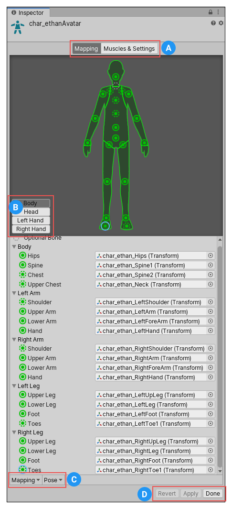

要进入 Avatar Mapping tab：

- 在 Project window 中，选择 Avatar Asset，点击 Inspector 中的 Configure Avatar
- 在 Project window 中，选择 Model Asset，进入 Inspector 中的 Rig tab，点击 Avatar Definition 菜单中的 Configure

# 保存和重用 Avatar data（Human Template files）

你可以将 skeleton 的 bones 到 Avatar 的映射作为 Human Template File（.ht）保存到磁盘上。

你可以重用这个映射到任何角色上。例如，你想要将 Avatar Mapping 置于源码控制系统之下（git），并喜欢使用基于文本的文件，或者你想要以自定义的工具解析文件。

要保存 Avatar 数据到 Human Template 文件，点击 Avatar window 底部的 Mapping 菜单，选择 Save。要加载之前创建的 Human Template 文件，选择 Mapping > Load.

# 使用 Avatar Masks

有时将动画限制在角色的特定身体部位会很有用。例如，行走动画可能包含角色的手臂摆动，但如果角色拿起火把，则应将火把举高以提供光照。你可以使用 Avatar Body Mask 来指定动画应限制到角色的哪些部位。
