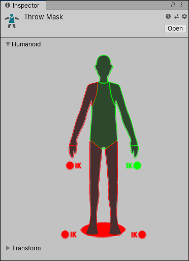

有两种方式可以定义你的动画的哪些部分应该被 mask：

- 从 Humanoid body map 中选择
- 从 Transform hierarchy 中选择哪个 bones 应该包含或排除

# Humanoid body selection

如果动画使用 Humanoid Avatar，你可以 select 或 deselect 简化的 humanoid body 图示中的部分，来指示哪些骨骼需要被 mask。

Body diagram 将 body parts 分组为以下部分：

- Head
- Left Arm
- Right Arm
- Left Hand
- Right Hand
- Left Leg
- Right Leg
- Root（脚下的阴影）

要包含来自某个身体部位的动画，请点击该部位的 Avatar 图表，直到其显示为绿色。要排除动画，请点击该身体部位，直到其显示为红色。要包含或排除所有部位，请双击 Avatar 周围的空白区域。

你还可以切换手和脚的 Inverse Kinematics（IK），该选项决定在动画混合中是否包含IK 曲线。

# Transform selection

如果动画没有使用人形 Avatar，并且希望对哪些骨骼进行 masking 有更精细的控制，可以选择或取消选择模型层级结构的各个部分：

- 指定一个你想要 mask 的 Avatar 的引用
- 点击 Import Skeleton，avatar 的 hierarchy 出现在 Inspector 中
- 可以选择 hierarchy 中的每个 bone 用作你的 mask

（Geneic 也有 Masking？Avatar 只是虚拟抽象的骨骼界面，但是它的结构命名完全和真实的骨架一样，甚至可以有和 Avatar 完全一样骨架结构、名字的模型。能为 Avatar 创建 Mask，也能为其他骨架创建 Mask？那为什么叫 Avatar Mask？）

Mask assets 可以在 Animator Controller 中使用，用于在运行时为指定的 Animation Layers 应用 Masking；也可以在动画文件的导入设置（import settings）中使用，以便在导入动画时就应用 Mask。这里只是展示如何创建 Avatar Mask 资源。如何使用，在 Animator Controller 的 Layers 中，或者在 Import Settings 中。

使用 Masks 的好处是，它们通常能够减少内存开销，因为处于非活动状态的身体部位不需要其对应的动画曲线。此外，这些未使用的曲线在播放过程中也无需计算，这往往会降低动画的CPU开销。
