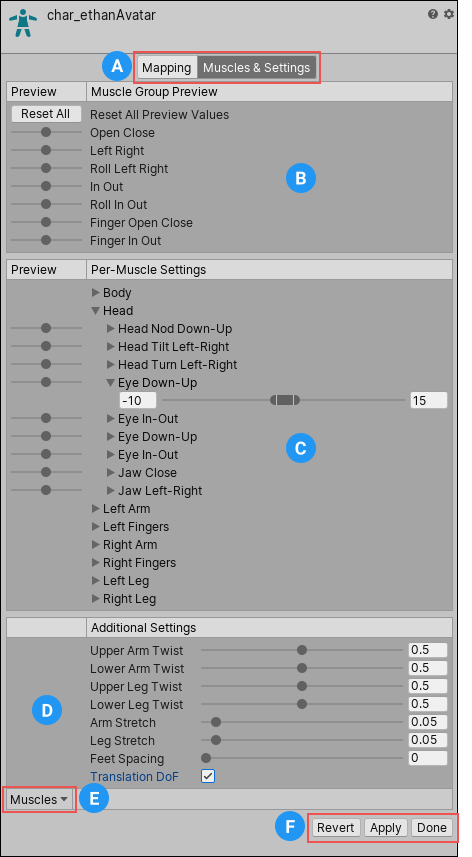

Unity 的动画系统允许你使用 Muscales 来控制不同骨骼的运动范围。

一旦 Avatar 被正确配置，动画系统就理解了骨骼结构，并允许你开始使用 Avatar Inspector 中的 Muscles & Settings tab。

使用 Muscles & Settings 来调整角色的运动范围，确保角色以可信的方式变形，不会出现视觉瑕疵或 self-overlaps（与自己身体部分重叠，胳膊旋转进身体里）。

- B. Muscle Group Preview 区域可以操纵角色使用预定义的变形。它们可以同时影响一些骨骼。
- C. Per-Muscle Settings 区域可以独立调整每个骨骼的运动范围
- D. 使用 Additional Settings 调整身体中的特殊效果

# Previewing changes

对于  Muscle Group Preview and Per-Muscle Settings 区域中的设置，可以在 Scene view 中预览修改。你可以左右拖拽滑动条来查看应用到角色上的每个设置的运动范围。

你还可以透过 mesh 看见 skeleton 的 bones。

# Translate Degree of Freedom（DoF）

骨骼动画通常应该仅有骨骼的旋转，比较骨骼不能脱离 parent 移动。但是一些特殊的情景，可能需要允许骨骼移动。

可以在 ​​Additional Settings ​​中启用 ​​Translate DoF ​​选项，以便为人形启用​​平移动画​​。如果禁用此选项，Unity 将仅使用​​旋转​​为骨骼设置动画。​

​Translate DoF ​​可用于 ​​Chest、UpperChest、Neck、LeftUpperLeg、RightUpperLeg、LeftShoulder​ ​和​ ​RightShoulder​​ 肌肉。

注意：启用 ​​Translate DoF​​ 可能会增加​​性能开销​​，因为动画系统需要执行一个额外的步骤来对​​人形动画​​进行​​重定向​​。因此，仅当您知道动画中包含角色某些骨骼的​​动画平移​​时，才应启用此选项。

骨骼的运动范围成为 Muscle，这个范围指的是旋转角度范围，因为骨骼动画通常应该仅包含骨骼旋转。
