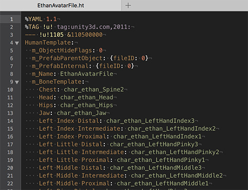

Human Template 文件可以直观感受到 Avatar 是如何工作的。虚拟抽象的骨骼有一组标准通用的名字，然后不同的模型的骨架将它们各自的对应部分骨骼映射到“标准骨骼”的相应骨骼上。

.ht 以 YAML 格式的文件保存骨骼映射。

Human Template window 这是展示了 Human Template 文件的内容，其实就是一个 .ht 文件的浏览和编辑器。

每个分组对应 YAML 文件中的一个条目，其中映射目标的骨骼名称标记为 First，而模型文件中的骨骼名称标记为 Second。

可以使用此属性编辑此文件中的大多数值，但 Unity 会立即更新对该文件所做的每一项更改。不过，在此窗口处于活动状态时，你可以撤销任何更改。
