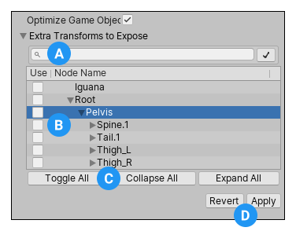

Rig tab 中的设置定义 Unity 如何映射 deformers 到导入的 model 中的 mesh，使你可以动画它。对 humanoid characters，这意味着指定或创建一个 avatar。对于 non-humanoid（generic），这意味着识别 skeleton 中的 root bone。

# Animation Type

- None：没有 animation。
- Generic：如果你的 bone rig 是 non-humanoid 的，使用 Generic Animation System。Unity 自动采用一个 root node。但是你还可以指定一个其他的 bone 来用作 Root node。
- Humanoid：如果你的 bone rig 是 humanoid 的，使用 Humanoid Animation System。Unity 通常检测 skeleton 并将它正确映射到 Avatar。一些情况下，你可能需要设置 Avatar Definition 并手动配置映射。

## Generic animation types

Generic Animations 不适用 Avatars。因为 Skeleton 可以是任意的，你必须指定哪个 bone 是 Root node。Root node 允许 Unity 为 generic model 完成 animation clips 之间的一致性，以及正确在那些不是创作为 "in place" 的 animations（即动画播放时，整个 model 在世界空间中直接移动，Root Motion）之间 blend（忽略 Root bone 的位移，否则 Root bone 的位移将被掺入到 blend 中）。

指定根节点（Root node）有助于 Unity 区分骨骼之间的相对运动与根节点在世界中的运动（由 OnAnimatorMove 控制）。

- Avatar Definition

  选择从哪里得到 Avatar 定义。但是 Generic 模型不使用 Avatar。因此不会创建 Avatar。

  它只是用来为 Generic 模型指定一个 Root Node，它就被用来指向 Root Motion。

  可以认为 Generic 也有 Avatar，但是 Avatar 的骨骼结构只有一个，就是 Root。因此为 Generic “创建” Avatar 就是为它指定 Root Node，仅此而已。

  - Create from this model：为这个 Generic Mode 指定一个 Root node。

    - Root node: 选择用作这个 Avatar 的 root node。

      这个设置仅在你设置了 Avatar Definition 为 Create From This Mode 时可用。

  - Copy from other avatar：指向另一个模型汇中的设置好的 Avatar（Single Root Bone）

    - Source：从另一个具有相同 bone rig（装置）的 Avatar 中复制，来导入它的 animation clips。

      这个设置仅在你设置了 Avatar Defintion 为 Copy from other avatar 时可用。

- Skin Weights

  设置影响一个 vertex 的最大骨骼数量。

  - Standard(4 Bones)：最多 4 个骨骼，这是默认值，也是考虑性能的建议值

  - Custom：自定义骨骼数量。选择这个选项时，会出现 Max Bones/Vertex 和 Max Bone Weight 属性

    - Max Bones/Vertex
    
      每个顶点受影响的​​最大骨骼数量上限。
      
      每个顶点可设置的范围为 ​​1 到 32​​；但用于影响某个顶点的骨骼越多，​​性能开销​​就越大。

    - Max Bone Weight

      设置用于判定骨骼权重的​​下限阈值​​。权重计算会​​忽略​​小于该值的权重；对于​​大于​​该值的骨骼权重，​​Unity​​ 会将其​​按比例放大​​，使它们的总和为​​1.0​​。
    
    - Optimize Game Object

      移除并存储导入角色 GameObject 的 Transform Hierarchy 到 Avatar 和 Animator 组件中。如果启用，角色的 SkinnedMeshRenderers 将使用 Unity 动画系统的内部骨骼，这可以提高动画角色的性能。

      默认骨骼使用 GameObject Hierarchy 表达，SkinnedMeshRenderers 使用它来计算如何编写 mesh。

      - Extra Transforms to Expose：指定你想要忽略哪些 Transform Hierarchy paths。

- Strip Bones：开启这个选项，仅添加 bones 到为它们分配 skin 权重的 Skinned Mesh Renderers 中。

  如果 Skinned Mesh 中，这个骨骼没有任何权重，也就是不影响任何 vertex，将它添加到 Skinned Mesh 中没有意义。这些骨骼只需要随着 animation 运动就可以了。

  Skinned Mesh 中，是要根据骨骼运动来计算三角面如何变形的。

## Humandoid animation types

Humandoid 模型具有相同的骨骼结构，少有例外。这个结构表示身体的注意关节部分：head 和四肢。使用 Unity animation 第一步就是设置和配置 Avatar。Unity 使用 Avatar 映射简化的人形骨骼结构到 Model 骨架的实际骨骼表示。

- Avatar Definition：选择从哪里得到 Avatar Definition

  - Create From this model

    - Configure：打开 Avatar Configuration 窗口，配置 avatar。

  - Copy from other avatar

    - Source

- Skin Weights
- Strip Bones
- Optimize GameObject
  - Extra Transforms to Expose

## Including extra Transforms

当你启用 Optimize Game Object 属性时，Unity 会忽略层级结构中任何未在 Avatar 中映射的 Transform，以提高 CPU 性能。但是，你可以使用 Extra Transforms to Expose 部分来标记 GameObject 层级中的特定节点，使其包含在计算中：

