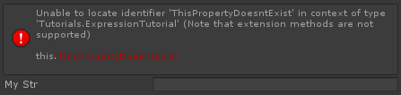

# Attribute Expressions

很多属性可以让你传递一个 string 参数，它可以引用成员字段或者包含要求值的 C# 表达式。这非常有用，因为它让你快速轻易地注入基础逻辑到你的 inspector 中。Attribute expressions 通过一个以 @ 开始的 string 标记。 

支持表达式的很多属性之一是 InfoBox，它接收一个求值为一个 string value 的表达式，然后被用于 box 的内容。

InfoBox 使用 myStr 的内容作为 box 内容

```C#
[InfoBox("@myStr")]
public string myStr;
```

你还可以编写复杂的逻辑。以下属性声明将导致一个 infobox 总是显式当前时间：


```C#
[InfoBox(@"@""The current time is: "" + DateTime.Now.ToString(""HH:mm:ss"")")]
public string myStr;
```

最外层的 @"" 是 C# 字符串语法，内层的 @ 表示这是一个属性表达式，""The current time is: "" 表示在属性表达式中将它作为一个字符串，否则就会成为表达式的 token。


Attributes like ShowIf and HideIf also support expressions:

```C#
[ShowIf("@this.someNumber >= 0f && this.someNumber <= 10f")]
public string myStr;

public float someNumber;
```

还有一些特殊表达式关键字让你可以在属性表达式中访问各种上下文的 values。例如，$property 关键字可以让你访问表达式被求值的 InspectorProperty 实例。

```C#
[Serializable]
public class Example
{
	[InfoBox(@"@""This member's parent property is called "" + $property.Parent.NiceName")]
    public string myStr;
}

// Now, anywhere you declare it, myStr will now dynamically know the name of its parent
public Example exampleInstance;
```


还有 $value 关键字，让你可以访问表达式坐在的成员字段的 value，而不需要输入 member 的名字。这让你可以在多个不同的成员上重用同一个表达式。例如，上面例子中 InfoBox 表达式的一个通用版本是：

```C#
[InfoBox("@$value")]
public string myStr;
```

这些值被称为 "named expression arguments"，对应被处理表达式的 ValueResolver 或 ActionResolver 传递给表达式的 Named Value。相关内容查看 Named Value.

它还可以很容易地使用特殊的 property query 语法 #(memberName) 来获取表达式作用域中其他成员的属性。

```C#
public List<string> someList;

[OnValueChanged("@#(someList).State.Expanded = $value")]
public bool expandList;
```

上面的表达式查找 someList member 属性，当 expandList 成员的 value 被修改时，改变 someList 的 expanded 状态。相关内容查看 state system.

Odin 的属性表达式是基于一个轻量的编译器，它支持主要的 C# 表达式语法。表达式是非常高效的，它们不被解释，而是全部编译到 emitted IL，之后被 JIT 编译到 native machine code 中。如果你编写一个无效的 expression，会为你提供一个有用的编译错误，指示发生了什么：



就像你所猜想的，属性表达式是非常灵活和强大的工具，使得为所有 Odin 属性添加自定义逻辑和行为极为容易，而不需要创建和引用无数个额外的成员。

