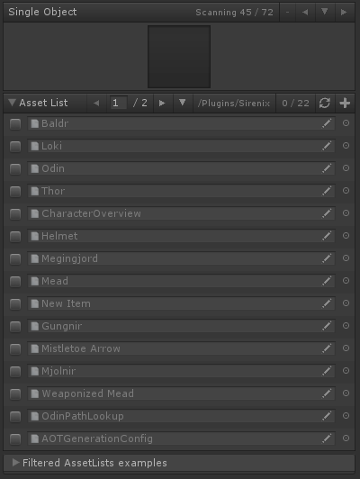
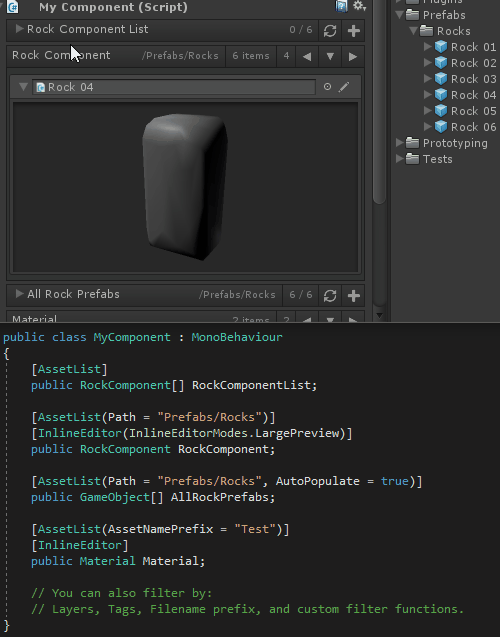
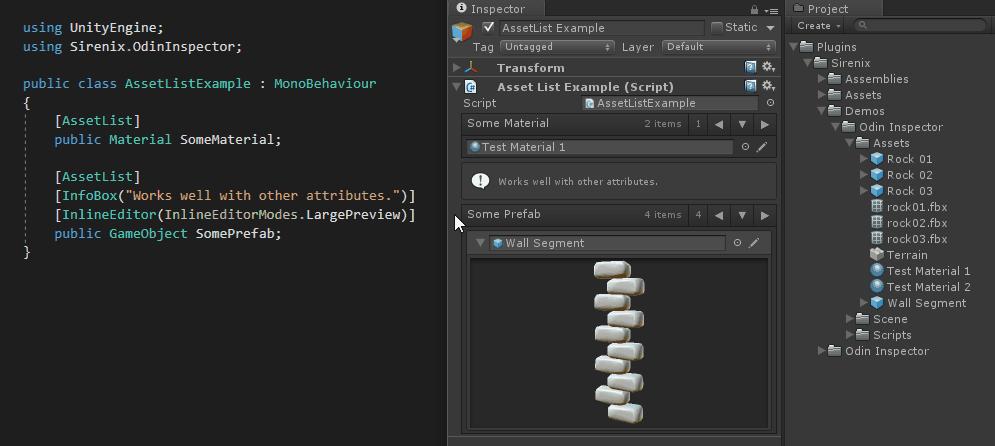

# Asset List Attribute

AssetLists 用于 lists 和 arrays，以及当个元素的 Unity 类型，并且替换默认的 list drawer 为指定 filter 下包含的所有可能的 assets 的列表。使用这个属性在 list 或 array 中包含或排除 assets，而不需要在 projects window 中导航。

自动填充 assets 到数组



```C#
[AssetList]
[PreviewField(70, ObjectFieldAlignment.Center)]
public Texture2D SingleObject; // 当个 Unity 类型元素

[AssetList(Path = "/Plugins/Sirenix/")]
public List<ScriptableObject> AssetList;

[FoldoutGroup("Filtered AssetLists examples", expanded: false)]
[AssetList(Path = "Plugins/Sirenix/")]
public UnityEngine.Object Object;

[AssetList(AutoPopulate = true)]
[FoldoutGroup("Filtered AssetLists examples")]
public List<PrefabRelatedAttributesExamples> AutoPopulatedWhenInspected;

[AssetList(LayerNames = "MyLayerName")]
[FoldoutGroup("Filtered AssetLists examples")]
public GameObject[] AllPrefabsWithLayerName;

[AssetList(AssetNamePrefix = "Rock")]
[FoldoutGroup("Filtered AssetLists examples")]
public List<GameObject> PrefabsStartingWithRock;

[FoldoutGroup("Filtered AssetLists examples")]
[AssetList(Tags = "MyTagA, MyTabB", Path = "/Plugins/Sirenix/")]
public List<GameObject> GameObjectsWithTag;

[FoldoutGroup("Filtered AssetLists examples")]
[AssetList(CustomFilterMethod = "HasRigidbodyComponent")]
public List<GameObject> MyRigidbodyPrefabs;

private bool HasRigidbodyComponent(GameObject obj)
{
    return obj.GetComponent<Rigidbody>() != null;
}
```




