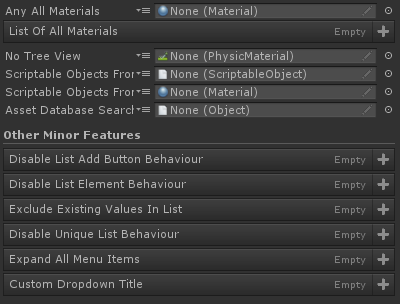
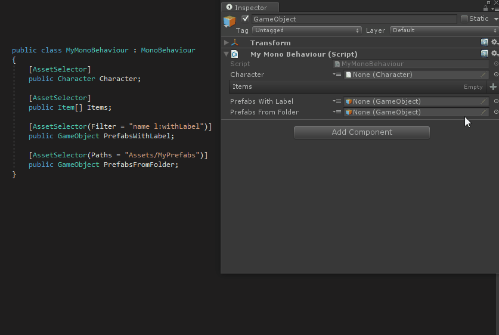

# Asset Selector Attribute

前置一个 小按钮 到 object 字段之前，为 user 呈现一个可以在 attribute 中定制的 assets dropdown 来选择 object。



指定内容到 dropdown，在 dropdown 选择 objects 填充到修饰的字段。

```C#
[AssetSelector]
public Material AnyAllMaterials;

[AssetSelector]
public Material[] ListOfAllMaterials;

[AssetSelector(FlattenTreeView = true)]
public PhysicMaterial NoTreeView;

[AssetSelector(Paths = "Assets/MyScriptableObjects")]
public ScriptableObject ScriptableObjectsFromFolder;

[AssetSelector(Paths = "Assets/MyScriptableObjects|Assets/Other/MyScriptableObjects")]
public Material ScriptableObjectsFromMultipleFolders;

[AssetSelector(Filter = "name t:type l:label")]
public UnityEngine.Object AssetDatabaseSearchFilters;

[Title("Other Minor Features")]

[AssetSelector(DisableListAddButtonBehaviour = true)]
public List<GameObject> DisableListAddButtonBehaviour;

[AssetSelector(DrawDropdownForListElements = false)]
public List<GameObject> DisableListElementBehaviour;

[AssetSelector(ExcludeExistingValuesInList = false)]
public List<GameObject> ExcludeExistingValuesInList;

[AssetSelector(IsUniqueList = false)]
public List<GameObject> DisableUniqueListBehaviour;

[AssetSelector(ExpandAllMenuItems = true)]
public List<GameObject> ExpandAllMenuItems;

[AssetSelector(DropdownTitle = "Custom Dropdown Title")]
public List<GameObject> CustomDropdownTitle;
```


