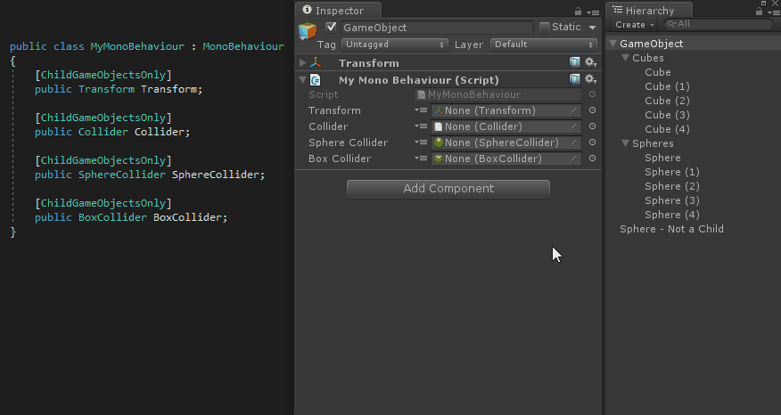

# Child Game Objects Only Attributes

用在 Components 和 GameObject 字段上，将会前置一个小按钮到 object 字段旁边，其将搜索所有 child gameobjects 以查找可以赋值的 objects，并将将它们呈现为一个 dropdown 供用户选择。

选择一个类型兼容的 child gameobjects，赋值到修饰的字段上。


```C#
[ChildGameObjectsOnly]
public Transform ChildOrSelfTransform;

[ChildGameObjectsOnly]
public GameObject ChildGameObject;

[ChildGameObjectsOnly(IncludeSelf = false)]
public Light[] Lights;
```


