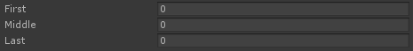

# Changing The Order of Properties

你可以很容易地改变显示的顺序，通过应用一个 PropertyOrderAttribute。它使用一个简单的顺序数字 order number。成员首先被它们的 order number 排序（默认为 0），然后被它们所在的脚本排序，尽管不同的成员类型总会被单独显式。属性按照递增顺序排序，更低的数字显示在更上面。



```C#
[PropertyOrder(1)]
public int Last;

[PropertyOrder(-1)]
public int First;

// All properties default to 0.
public int Middle;
```

就像之前提到的，使用 Odin，你可以在 inspector 上显示任何东西，不仅是 fields，还有 properties 和 methods。通常这些成员是单独显示的，按时 property ordering 可以很容易地让所有东西交织在一起。

```C#
[PropertyOrder(2)]
public int Second;

[Button]
[PropertyOrder(1)]
public void First()
{
	// ...
}
```