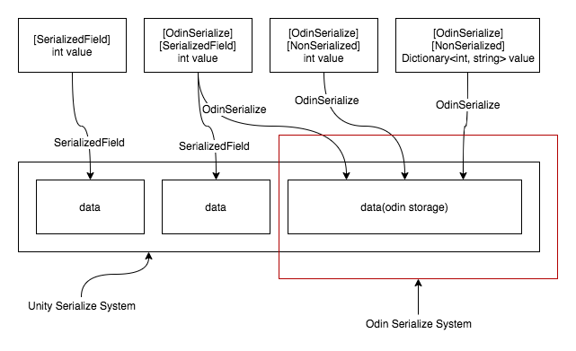

# SerializeSystem

Unity/Odin 序列化系统几乎总是工作在标记为 serializable 的字段上。但是有一个例外，脚本热重载（hot reload）。当热重载脚本时，Unity 会序列化和反序列化脚本的所有变量，不管它们是否标记为 serializable。因此在脚步 reload 时，所有变量保持它们之前的值，以确保脚本尽可能保持它的状态。但是对于其他任何情形则不是如此，例如 scene/assets 保存和加载，prefab 等等，它们只处理标记为 serializable 的状态（数据），其他数据将被重置为默认值。

脚本热重载时考虑 NonSerialized 变量，不会处理它。

SerializedField

Serializable：当 Unity 序列化一个 Unity 类（MonoBehaviour 或者 ScriptableObject）并遇到一个自定义类或结构体成员事，只有非抽象，非范型，标记为 serializable的自定义类/结构他会参与序列化。否则这些成员不被认为是可序列化的，Unity 会跳过它们。

ShowInspector：Odin attribute。Odin 系统由两部分组成。一个是 Inspector 部分，提供显示和操作各种 Unity 不能处理的类型的变量的能力。另一个是序列化部分，提供序列化和反序列化变量的能力。用于 Inspector 部分的 attribute 是 ShowInInspector，用于序列化部分的 attribute 是 OdinSerialize。ShowInInspector 不会序列化字段，因此它不依赖 Serialize Data，以及 Odin classes。它可以用在正常的 Unity classes 中，因此可以使用它们在 Inspector 中编辑变量，而变量的值真的会被修改。但是当开始序列化的时候，这些变量并不会序列化，因此在反序列化的时候会被重置为默认值。因为 ShowInspector 只是创建了一个 Inspector GUI 来编辑变量，因此它还可以用来编辑静态变量。Unity/Odin 序列化系统并不考虑静态变量，因此静态变量只是遵守正常的静态变量规则：静态变量会在内存中保持状态直到程序集重载 reload（任何脚本重新加载或者在 edit mode 和 play mode 之间切换），重新加载程序集时，变量将被重置为默认值。

使用 Inspector 修改（MonoBehavior/ScriptableObject）内存中的字段，和将内存中的字段保存到磁盘上等待反序列化是两个截然不同的工作。前者是 Inspector UI 显示的工作，后者是 serialize 序列化 的工作。Odin 将二者区分开，使得可以只使用 Inspector 的功能而不使用 Odin 的序列化，Unity 中二者是一体的，可显示的就可以序列化。

任何不使用 ShowInInspector 属性而不出现在 inspector 中的 field 或 property，都是不能序列化的。使用 Serialization Debugger 来得到你的 class 中什么不可以序列化的概览。

HideInInspector: Unity attribute 

OdinSerialize：用于 Odin class（SerializedMonoBehaviour/SerializedScriptableObject）中的属性，来使得一个字段被 Odin 序列化。OdinSerialize 之于 Odin class，就像 SerializedField 之于 Unity class。但是 Odin 是构建于 Unity 之上的，因此在 Odin class 中，OdinSerialize 和 SerializedField 都可以工作。Odin class 是 Unity class 的派生类。区别是 SerializedField 只用于 Unity 可以序列化的简单类型，而 OdinSerialize 则可以序列化大量 Unity 不能序列化的类型。

Odin 序列化系统没有替换 Unity 的序列化器，而是构建于其上，序列化那些 Unity 不能处理的很多类型。Odin 只是 hook serialize 的 callback，并转换 non-Unity 序列化的字段和属性到 Unity 可以序列化的数据格式（通常是一个 byte array，或者一个 Unity objects 列表）。Odin 存储这些数据到一个 SerializationData 字段。Unity 的序列化器将会序列化这个 odin 序列化数据，将它写到某个文件中。这就是为什么存在 SerializedMonoBehaviour 和 SerializedScriptObject（它们继承了 MonoBehavior 和 ScriptableObject，并定义了 SerializationData 字段），而 OdinSerialize 需要被用在 SerializedMonoBehaviour/SerializedScriptableObject 中（需要 SerializationData 来工作）。

Odin 序列化系统只是一个构建在 Unity 序列化系统上的一个子系统，它使用一个 Unity 序列化系统的 byte array 作为存储，并截获 Unity 序列化 callback，使用自己的协议来序列化所有使用 OdinSerialize 属性标记的变量，然后存储到 byte array



Odin 使用所有 Unity 现有系统，因此不会改变通常的 Unity workflow。

Odin 打包所有 OdinSerialize 属性的字段到一个单独的数据块中，一个 SerializationData 字段，它只是一个常规的 Unity serializable byte array，和其他所有 Unity serialized fields 一起。它有可能导致 fields 被序列化两次，一次被 Unity，一次被 Odin。

Odin 强大的序列化系统（OdinSerialize）在直接实现 Odin SerializedMonoBehaviour/SerializedScriptableObject 开始发挥作用。这种方式下，Odin 将会尝试避免序列化任何 Unity 应该序列化的字段。这在 root serialized object level 确定。

序列化过程从 root level（MonoBehavior/SerializedMonoBehaviour）到 leaf level。对每个 level 的 fields，它如何被序列化取决于 class path 上的最顶层属性（它是否应该被序列化，它使用哪个系统进行序列化，Unity or Odin）。这意味着如果到一个字段的 class path 有多个属性来决定序列化的同一个方面，最顶层的 attribute 起作用，并忽略低层的属性。

如果一个 upper 属性说这个字段不应该序列化，而一个 lower 属性说应该，则这个字段不会被序列化。

如果一个 upper 属性说这个字段应该被 Unity 序列化，而一个 lower 属性说它应该被 Odin 序列化，则它被 Unity 序列化。

在你自己的 Unity 类型中手动实现 Odin serializer。

如果一个类型可以同时被 Unity 和 Odin 序列化，有可能 Unity 和 Odin 各自序列化和反序列化一次。这不仅使序列化的数据重复，还会在两个序列化系统产生不同结果时导致古怪的错误。

或者不要使用 OdinSerialize，关闭 Odin 而只让 Unity 来进行序列化。或者使用 [OdinSerialize, NonSerialized]，OdinSerialize 开启 Odin 序列化，NonSerialized 关闭 Unity 序列化，因此只有 Odin 起作用。

OdinSerialize 之于 Odin Serialized- class 等价于 SerializedField 之于 Unity。

- Unity class 和 Odin class 中的 public fields 自动被序列化
- 将 OdinSerialize 和 SerializedField 分别用于 Odin class 和 Unity Class 的 private 字段之上，使它们出现在 Inspector 之上，并被序列化
- HideInInspector 同时工作于 Odin class 和 Unity class，隐藏 Inspector 上的字段，但仍然被序列化
- NonSerialized 只用于 Unity class，是一个字段不被序列化，OdinSerialize 覆盖 NonSerialized，因此没有办法关闭 Odin class 的 public 字段的序列化

Serializable 标记一个 custom class 或 struct 可以被 Unity 序列化，SerializedField 标记一个字段应该被 Unity 序列化。当这不适用 Odin，Odin 自动序列化所有自定义 class 和 struct。因此关闭 Unity 而打开 Odin 的一个方法是从 custom class/strcut 移除 Serializable，另一种方法就是使用 [NonSerialized, OdinSerialize]

因为 Unity 不序列化泛型类型，因此继承一个泛型类型生成一个具体类型是必要的。

默认地 Odin 诸如它自己到 inspector 中的每个还没有 custom editor 的类型中，但是 odin serialization system 更保守一点。你总是必须显式地决定使用 Odin serialization system：

- 继承 Odin Serialized- class（SerializedMonoBehavior 或 SerializedScriptableObject）。所有常见的 Unity 类型支持这种方式

- 实现 Unity 的 ISerializationCallbackReceiver 来拦截 serialization callback，然后使用 Odin 的 UnitySerializationUtility 类

  Odin 在 UnitySerializationUtility 中暴露它的序列化功能让你手动调用它来序列化 Unity class，并输出序列化数据到一个 SerializationData 变量中，这个变量然后被 Unity 序列化，因此你可以在自己的 Unity class 中声明这个变量，并让 UnitySerializationUtility 使用它

Odin 自定义 inspector gui 可以同时被 Unity class 和 Odin class 使用：

- In Odin class
  - public fields (gui and serialization)
  - private fields with ShowInInspector (only gui)
  - private fields with OdinSerialize (gui and serialization)
- In Unity class
  - public/private fields with ShowInInspector (only gui)

Odin inspector utility 在 Sirenix.OdinInspector 中，而 serialization system 在 Sirenix.Serialization 中。

Unity 不支持序列化引用，多态或 null values。这意味着当一个类型包含一个它自身类型的 value 或者 fields 为 null，Unity 可能进入无限的深度序列化循环中。但是 Odin 支持这些操作。然而，Unity infinite depth serialization loops 警告总是跳出来。要避免这个警告，标记这个字段为 [NonSerialized, OdinSerialize]，即关闭 Unity 序列化而开启 Odin 序列化。

当处理外部引用时，Unity/Odin 序列化系统不能序列化/反序列化真实的外部 object，但是 store 或 restore 一个 pointer value，它指向一个 external object。当序列化时，系统存储 pointer 的值。当反序列化时，系统通过 pointer restore object 的引用。Odin 让你可以指定一个自定义的方式来存储和恢复外部引用。

重构：Rename/Retype 字段或属性，并使用它们之前的序列化的值来恢复它们。

Unity 和 Odin 序列化系统同时运行，因此保持一个字段只被它们中的一个序列化。Unity system 受限但是非常快，如果可能，尽可能使用 Unity 序列化系统。

Unity 不会序列化任何发型类型变量，但是一个继承泛型类型的具体类型和它的具体字段则没有问题。然而，Unity 对 List 是例外的，Unity 可以序列化一个泛型的 List。

```C#
List<int> intList; // 不可序列化

class MyIntList : List<int> {} // 可以序列化
```

Odin 暴露序列化系统，使得你可以直接使用它来序列化 objects。通常，你会使用 SerializationUtility 类，它包装了 serialization 系统，并处理涉及的所有底层 code。它只是序列化和反序列化一个对象为 byte array。如果 object 包含 Unity Object 引用，它将会需要传递一个额外的 List<UnityEngine.Object> 作为输出参数给 SerializeValue，它被 SerializationUtility 使用来将所有 UnityEngine.Object 写入到其中，然后被 DeserializeValue 作为外部应用解析器使用，来重构 object。

Odin 包含一个 serialization debugging utility 显示一个给定类型的那些成员被序列化，以及它们是被 Unity 还是 Odin 还是二者同时序列化的。

Odin 在 SerializationUtility 中暴露 serialization utility，因此你可以使用它做任何事，保存 object 到 bytearray，并从其中恢复 object。例如，保存游戏。
