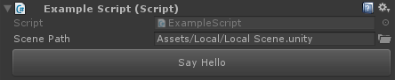
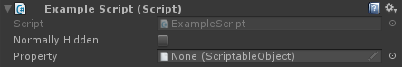
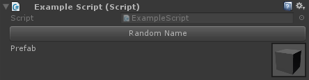
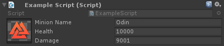
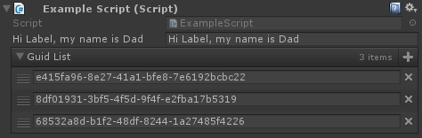
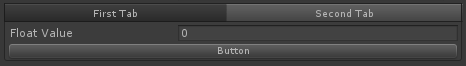
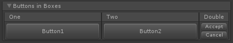
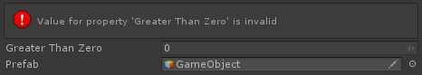
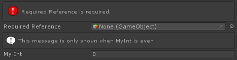

# Tutorials

## Simple Attribute Example

完全只用 attributes 设计 inspector
- 分组 grouping
- 顺序 ordering
- 复杂功能 complex functionality
- 输入验证
- 各种各样的 ease-of-life 功能
- buttons
- 以及更多



```C#
// Remember to add the following using statemnt to the top of your class. This will give you access to all of Odin's attributes.
using Sirenix.OdinInspector;

public class ExampleScript : MonoBehaviour
{
	[FilePath(Extensions = ".unity")]
	public string ScenePath;

	[Button(ButtonSizes.Large)]
	public void SayHello()
	{
		Debug.Log("Hello button!");
	}
}
```

HideInspector：隐藏字段，ShowInInspector：显式字段和属性



```C#
[HideInInspector]
public int NormallyVisible;

[ShowInInspector]
private bool normallyHidden;

[ShowInInspector]
public ScriptableObject Property { get; set; }
```

可以组合多种属性, 可以使用 PropertyOrder 改变显示顺序：



```C#
[PreviewField, Required, AssetsOnly]
public GameObject Prefab;

[HideLabel, Required, PropertyOrder(-5)]
public string Name { get; set; }

[Button(ButtonSizes.Medium), PropertyOrder(-3)]
public void RandomName()
{
    this.Name = Guid.NewGuid().ToString();
}
```

使用 group 属性属性完全改变属性的布局 



```C#
[HorizontalGroup("Split", Width = 50), HideLabel, PreviewField(50)]
public Texture2D Icon;

[VerticalGroup("Split/Properties")]
public string MinionName;

[VerticalGroup("Split/Properties")]
public float Health;

[VerticalGroup("Split/Properties")]
public float Damage;
```

很多属性可以让你引用其他字段、属性、方法，来扩展 inspector 的自定义行为，满足你的需求



```C#
[LabelText("$IAmLabel")]
public string IAmLabel;

[ListDrawerSettings(CustomAddFunction = "CreateNewGUID", CustomRemoveIndexFunction = "RemoveGUID")]
public List<string> GuidList;

private string CreateNewGUID()
{
	return Guid.NewGuid().ToString();
}

private void RemoveGUID(int index)
{
    this.GuidList.RemoveAt(index);
}
```

## Group Attributes

拥有很多 inspector variables 的非常大的 script，在 inspector 中保持对它们的追踪非常困难或无聊

Groups 对保持 inspector manageable 和 整洁外观 非常有帮助

简单将 相同名字的 group 属性放在你想 group 到一起的成员上面，相同名字 group 属性的成员被绘制为一组



```C#
[TabGroup("First Tab")]
public int FirstTab;

[ShowInInspector, TabGroup("First Tab")]
public int SecondTab { get; set; }

[TabGroup("Second Tab")]
public float FloatValue;

[TabGroup("Second Tab"), Button]
public void Button()
{
	...
}
```

将 groups 组合在一起(FoldoutGroup)



```C#
[Button(ButtonSizes.Large)]
[FoldoutGroup("Buttons in Boxes")]
[HorizontalGroup("Buttons in Boxes/Horizontal", Width = 60)]
[BoxGroup("Buttons in Boxes/Horizontal/One")]
public void Button1() { }

[Button(ButtonSizes.Large)]
[BoxGroup("Buttons in Boxes/Horizontal/Two")]
public void Button2() { }

[Button]
[BoxGroup("Buttons in Boxes/Horizontal/Double")]
public void Accept() { }

[Button]
[BoxGroup("Buttons in Boxes/Horizontal/Double")]
public void Cancel() { }
```

## Meta 属性

一些属性不做任何关于绘制外观的事情，相反，它们的天性是交互，并添加一些基本的智能到 inspector。它们允许你执行更复杂的任务，例如校验 input，当 value 改变时调用一个方法，以及很多其他类似的东西。



```C#
[ValidateInput("IsValid")]
public int GreaterThanZero;

private bool IsValid(int value)
{
	return value > 0;
}

[OnValueChanged("UpdateRigidbodyReference")]
public GameObject Prefab;

private Rigidbody prefabRigidbody;

private void UpdateRigidbodyReference()
{
	if (this.Prefab != null)
	{
		this.prefabRigidbody = this.Prefab.GetComponent<Rigidbody>();
	}
	else
	{
		this.prefabRigidbody = null;
	}
}
```

使用这些 meta 属性，任何程序员就拥有了一个强大而易于使用的工具来帮助强制必须的规则，以及通过在正确的时间提供反馈、相关信息和 tooltips 来辅助、约束和指导使用 inspector 的设计者，得到一个非常平滑的工作流，更少出现问题和错误。



```C#
[Required]
public GameObject RequiredReference;

[InfoBox("This message is only shown when MyInt is even", "IsEven")]
public int MyInt;

private bool IsEven()
{
	return this.MyInt % 2 == 0;
}
```


## 如何 reload 脚本

  Unity 将会序列化和反序列化所有可以序列化的变量，包括所有没有 SerializeField 属性的私有变量，因此私有变量在 

- Hot reload scripts
  - Unity will serialize and deserialize all variables that can be serialized by Unity, including all private variable that doesn't have SerializeField attribute, so private variables can still keep their value after scripts reloaded. This is different with scene reload. When scene is loaded, only the public fields and prirate fields with SerializeField attribute will keep their previous value, other fields will be initialized with default value. NonSerialized attribute make public fields don't show in inspector, and Unity will not serialize any field with NonSerialized attribute, means they will reset to default value when script or scene is reloaded.


