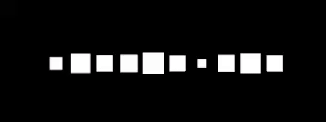

## 概念

为粒子的运动添加紊流行为（随机扰动）。

Noise = 给粒子加“自然抖动/漂移/扰动”，模拟风、湍流、随机性。

没有 Noise 时，粒子按直线 / 固定轨迹运动，很“机械”。

开启 Noise 后，粒子会受到一个类似 Perlin noise 的连续随机力，方向会缓慢变化（不是乱跳），轨迹变得“弯曲、有机”。

核心参数：

- Strength：扰动强度，小->微风，大->狂风/爆炸乱流
- Frequency：扰乱变换的“快慢/密度”，低->平静大波动，高->快速细的扰动（像噪声干扰）
- Scroll Speed：Noise 随时间移动
- Damping（阻尼）：抑制剧烈变化，让运动更平滑
- Octaves（层数）：叠加多层 Noise（类似分形），1->简单，多->更复杂、更自然
- Separate Axes（分轴控制）：可以分别控制 X/Y/Z 扰动，例如可以让 XZ 更大 -> 横向飘，Y 更小 -> 不往上飞

做自然效果必添加 Noise：烟、火、雾。

Noise 是固定的、内置的 Curl 噪声，没有设置其他噪声类型/纹理的功能。

Curl 噪声内部使用多个 Perlin 噪声采样来创建最终的 noise field。

噪声可以是 1D，也可以 2D。无论时 1D 还是 2D，都是连续的。对于 2D 噪声，2D 空间中的任何一条直线上采样的噪声值，都是连续平滑的。想要得到连续不断变化且平滑的噪声值，只需要连续的增加采样的时间值即可。例如，对于 1D 噪声，只需要 x 从 0 开始不断增加到正无穷，采样值 y 就是连续不断变化的，不需要限制在 0-1 之间，当到底 1 时回转到 0，因为噪声是由数学公式得到的，不是纹理，任何采样时间点处都有值，任何一点都是平滑连续的。对于 2D，就是 x、y，或 xy 值不断增加即可，不需要限制到 [(0, 0), (1, 1)] 之间并在 x y 超越 1 时 repeat。

Noise 本质就是为粒子在 XYZ 方向上的运动添加随机扰动，仅此而已。扰动保证是连续平滑自然的，你能做到是控制随机扰动的强度和频率。

## 参数

### Separate Axes	

  Control the strength and remapping independently on each axis.

  最大程度控制 Noise。这允许你单独控制每个轴的 strength 和 remapping。

### Strength

Strength 控制强度（振幅），定义噪声效果强度。更高的值，粒子移动的更快更远。

可以是 Constant，Curve，Random Between Two Constants，Random Between Two Curves。

### Frequency

控制噪声函数的频率。更低的频率，噪声周期更长，可以创建平缓的噪声，更高的频率，噪声周期更短，可以创建更密集变化的噪声。

这可以控制 particles 多快地改变其运动方向。

### Scroll Speed

采样时间点移动的速度（x 0->∞）。随时间移动 noise field 可以导致更难以预测的粒子运动。

Curve(Time.delta * ScrollSpeed)

### Damping

开启时，Strength 正比于 frequency。将这两个值绑定在一起，意味着noise field 可以在被缩放的同时，保持相同的行为，但是以不同的大小。

### Octaves

噪声可以叠加多层，每层使用不同的频率和强度，类似分形，创造更自然的效果。

Octaves 指示有多少个 layers 一起组合产生最终的 noise values。Layers 越多，效果越自然越有趣，但是会增加性能消耗。

### Octave Multiplier

对每个附加的 noise layer，使用这个比例减少 strength。越高层的 layer，strength 越小。

### Octave Scale

对于每个附加 noise layer，使用这个因子调整频率。越高层的 layer，频率越高。

### Quality

更低的 Quality 显著减少性能消耗，但是也会影响 noise 的趣味性。

### Remap

Noise 给出一个噪声值，Remap 将这个噪声值再次映射到另一个范围。

Noise 给出的噪声值可能超过 1，但是 Remap curve 的横坐标总是在 0-1 之间，超出 0-1 的部分被 clamp 到 0 或 1，使得超出 0-1 范围的 noise value 被强制压平到 curve(0) 或 curve(1)。这会产生一种饱和效果(Saturation)：

- 超过阈值的扰动 → 不再增加
- 全部变成“最大强度”

类似：

- 音量超过最大 → 全部爆音
- 亮度超过最大 → 全白

Remap curve 描述 NoiseValue -> RemapValue 的映射。输入是 Noise 模块计算的噪声值，输出 Curve 重新映射后的值。例如可以实现低通过滤，忽略高于指定阈值的 noise value。

### Position Amount

一个乘法因子，控制 noise 影响粒子位置的程度。

A multiplier to control how much the noise affects particle positions.

### Rotation Amount

一个乘法因子，控制 noise 影响粒子旋转的程度，单位是 degree/s。

### Size Amount

A multiplier to control how much the noise affects particle sizes.

Noise 不仅可以影响粒子的位置，还可以影响粒子的旋转和大小。Noise 只是给出一个标量的噪声值，它能影响位置、旋转、大小全看 Position Amount、Rotation Amount 和 Size Amount。

