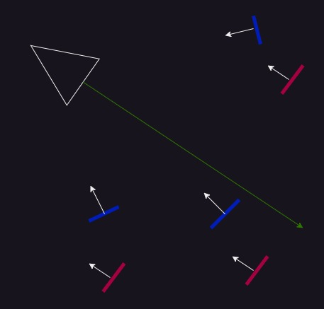

## Renderer Mode

- Billboard

  Unity 将粒子渲染为一个面片，面片的朝向（渲染面方向）由 Render Alignment 指定。

  Billboard 用于渲染从任何方向看起来是 volume 的粒子效果，例如云团。

- Stretched Billboard

  Stretched Billboard（拉伸广告牌）是 Unity 粒子系统里一种特殊的渲染模式，用来表现高速运动产生的拖尾/速度感。

  Stretched Billboard = 会沿运动方向被“拉长”的粒子。

  它和普通 Billboard 的区别：

  - 普通 Billboard
    - 永远是一个固定大小的平面
    - 面向摄像机
    - 不会变形
  - Stretched Billboard：
    - 仍然面向摄像机（类似 View/Facing）
    - 但会沿速度方向拉伸
    - 长度 ≈ 速度大小

  想象一颗高速子弹：

  - 普通 Billboard → 一个小点
  - Stretched Billboard → 一条拉长的光 streak

  Renderer 模块（和很多其他的模块，例如 Shape），很多参数依赖于选择的模式。例如 Render Alignment 只对 Billboard 和 Mesh 有意义，只在这个两个模式下出现。对于 Stretched Billboard、Horizontal Billboard、Vertical Billboard 没有 Render Alignment。

  Stretched Billboard 粒子总是沿着 velocity 拉伸，然后尽可能使渲染面朝向 Camera 的方向。最后用各种选项控制拉伸的长度。

  关键参数：

  - Camera Scale：粒子根据 Camera 的运动缩放。用于避免某些角度下变形奇怪
  - Velocity Scale：粒子的拉伸正比于它们的速度
  - Length Scale：粒子拉抻长度正比于它们沿着 velocity 的方向
  - Freeform Stretching：不使用 Freeform Stretching 时，粒子沿着 velocity 方向拉伸，并且绕着这个方向旋转，尽可能地使渲染面接近摄像机。但是当粒子的 velocity 方向正朝向摄像机时，即从头尾观察粒子时，粒子如论如何无法面向摄像机，此时粒子就变成了一个薄片，甚至不可见。开启 Freeform Stretching 时可以解决这个问题，即使从头尾观察粒子，也不会看见一个薄片。
    
    开启 Freeform Stretching 选项后，可以选择是否开启 Rotate With Stretch 选项。它指示是否基于拉伸的方向旋转粒子。它会添加到其他 particle rotation 之上。

- Horizontal/Vertical Billboard

  Horizontal/Vertical Billboard 是轴锁定的 billboard。Horizontal Billboard 永远水平躺着（像地面贴片）。Vertical Billboard 永远垂直地面（像广告牌/树）。

  Horizontal Billboard 固定保持水平（平行地面），只绕着 Y 轴旋转面对摄像机。从上向下看正常，从侧面看像一张薄片。典型应用：水面效果/涟漪/水花贴地扩散/爆炸后地面烧焦区域/燃烧的地面/冲击波。本质就是贴地特效。

  Vertical Billboard 保持与地面垂直，只绕着 Y 轴旋转面对摄像机。不会躺下、倾斜。典型应用：植被/草/树（billboard 树）/远处 NPC/2.5D 人物/建筑贴片（远景城市、假体积物）。

  因为 Horizontal Billboard 和 Vertical Billboard 被锁定平行或垂直地面，因此没有 Render Alignment 选项。

- Mesh

  注意当 Render Mode = Mesh 时，View/Facing 这些 Alignment 基本不起作用。粒子的朝向主要由以下属性决定：

  - 粒子自身 rotation
  - Start Rotation/Rotation over Lifetime
  - Shape/Velocity/Transform

  反过来 Start Rotation / Rotation over Lifetime 可以影响 Billboard 的旋转，但是默认只影响 Z 轴的旋转，即不影响 Billboard 的朝向，只会绕着朝向轴旋转。但是 Rotation Over Lifetime 选择 separate axes 的话，可以设定每个轴的旋转速度，此时，Billboard 就会绕着任意轴旋转了，不一定朝向指定的方向（Camera 的 forward/position）。

  Billboard 本质就是一个 Quad。Mesh 使 Unity 使用一个 3D mesh 渲染粒子，而不是 Quad。

  Meshes 可以指定一组 mesh 用来渲染粒子。每个粒子可以使用不同的 mesh。Mesh Distribution 指示 Unity 用于随机分配不同的 mesh 给 particles 的方法。	

  - Uniform Random

    Unity 使用一个平等权重随机分配 meshes 给 particels。即每个 mesh 有平等的机会分配给 particle。

  - Non-uniform
  
    可以为每个 mesh 指定一个权重，决定这个 mesh 被使用的概率。

- None

  Unity 不渲染任何粒子。它可以配合 Trails 模块使用，如果你只想渲染 trails，不想渲染粒子本身。

## Render Alignment

Billboard 就是一个面片，Quad。它的朝向由 Render Alignment 决定，它不一定总是朝向 Camera。

这个属性决定 particle billboard face 的方向（渲染面的方向）

- View：Billboard Particle 的渲染面朝向 Camera Plane

  粒子始终正对摄像机的视线方向（camera forward）。

  - 粒子会完全“贴着屏幕”显示
  - 无论摄像机怎么旋转，粒子都会跟着转
  - 看起来像是一个始终朝向屏幕的平面（典型 billboard）

- Facing：粒子会朝向一个指定的方向（通常是摄像机位置，而不是视线方向）。

  View（红色 Billboard）和 Facing（蓝色 Billboard）的区别：

  

  - View：Billboard 的 forward 方向与 Camera 的 forward 的方向对齐，但是 Billboard 不会朝向 Camera 的位置，所有 billboard 都是平行的
  - Facing：Billboard 的 forward 总是朝向 Camera的位置，但是不一定与 Camera 的方向一致。绝大多数 billboard 不会平行。

World/Local 定义粒子朝向在哪个坐标系定义。Start Rotation、Shape、Rotation Over Lifetime 给出粒子的最终朝向后，World 和 Local 决定在哪个坐标系解释这个旋转。World 表示忽略 Particle System 的坐标空间，直接应用到世界空间中。Local 表示旋转定义在局部空间，使用 ParticleSystem.InverserTransformDirection 才应用到世界空间中。

注意 Simulation 空间和 Alignment 空间的区别，前者定义粒子的位置，后者定义粒子的旋转。例如：

- 情况 A：

  - Simulation = World
  - Alignment = Local

  粒子位置在世界空间，但朝向会跟着 Particle System 转。

- 情况 B：

  - Simulation = Local
  - Alignment = World

  粒子跟着物体移动，但方向始终固定。

- Velocity

  粒子始终朝“运动方向”对齐，粒子的“前方”（通常是 Z轴 / forward），会对齐到 当前速度方向

  如果是普通 Billboard，粒子会旋转，让贴图的“朝向”指向移动方向。

  如果是 Stretched Billboard 效果会更明显，粒子被拉长，长轴 = 速度方向，看起来像拖尾 / 速度线。

  当使用 Velocity Alignment 时，仍然可以旋转，但 Rotation 只是在“沿速度方向轴”上旋转。

  粒子正在向右飞，它会先“面朝右”，然后你设置 Rotation：只会绕“向右这个方向”自转。

  典型的应用场景：

  - 子弹拖尾 / 轨迹
    - 粒子沿路径拉长
    - 看起来有速度感
  - 火焰喷射：火焰顺着喷射方向流动
  - 风 / 气流：粒子顺风方向排列
  - 爆炸碎片尾迹：每个碎片带一条“运动方向尾巴”

  注意，如果粒子没有速度（或速度很小）：Velocity Alignment 会失效或表现异常。例如：静止粒子或速度接近 0，没有“方向”可以对齐。

  当 Render Mode = Mesh + Alignment = Velocity 时，粒子（整个 Mesh）的朝向会旋转，使它的 forward 方向对齐速度方向。在 Billboard 下，只是“贴图方向”对齐速度，本质还是一个平面。在 Mesh 下，是整个3D模型真的在旋转，前后、上下、侧面都会变有真实的空间感。换句话说：Mesh 不再是固定朝向，而是会“像导弹一样”跟着运动方向转。

  Mesh 的“forward方向”必须正确，Unity 默认认为：Z +（forward）是“朝前方向”。

## Normal Direction

指示如何为 billboard 计算 lighting。0 意味着 Unity 将 billboard 视为 sphere 来计算光照。这导致 billboard 看起来像一个 sphere。1 意味着 Unity 将 billboard 作为一个 flat quad 计算光照。

这个属性只对 Billboard, Stretched Billboard, Horizontal Billboard or Vertical Billboard 有效。对于 Mesh，直接使用 Mesh 的 Normal。

## Material

Unity 用来渲染 particles 的 material。

## Trail Materials

Unity 用来渲染 particle trails 的 material。这个选项只对 Trails 模块有效。

## Sort Mode

Unity 绘制和重叠 particles 的顺序。

- None：开启后，Unity 不排序粒子
- By Distance：根据粒子到相机的距离排序，近处的粒子比远处的粒子渲染更靠上
- Oldest in Front：越早的粒子渲染越靠上
- Youngest in Front：越新的粒子渲染越靠上
- By Depth：根据粒子到相机近平面的距离渲染粒子

## Sorting Fudge（回避，捏造，篡改）

Particle System 排序粒子的偏移（bias）。越小的值会增加 Unity 绘制粒子在其他透明 GameObjects 之上的概率，包括其他 Particle Systems。这个设置只影响整体的 Particle System，它不对内部的单独粒子进行排序。

## Min/Max Particle Size

最小/最大的粒子大小（无视、覆盖其他 size 相关的设置），解释为相对于 viewport 的大小。只对 Billboard（Billboard, Stretched Billboard, Horizontal Billboard or Vertical Billboard）有效。

## Enable Mesh GPU Instancing

只对 Mesh render mode 有效。

控制 Unity 是否使用 GPU instancing 渲染粒子系统。这需要使用兼容的 shader。Particle Mesh GPU Instancing.

## Flip

沿着指定的 axes 镜像翻转一定比例的 particles。更高的值，翻转更多的粒子。

每个轴一个概率值。

## Allow Roll

控制 camera-facing particles 是否可以绕着 camera 的 Z 轴旋转。

对 VR 应用，如果 HMD（head-mounted display，头显）的 roll 可能导致意料之外的粒子旋转，可以这个选项。

## Pivot

修改i旋转的粒子的 pivot point。Value 是 particle size 的一个因子，控制 pivot 相对于粒子中心的偏移。

## Visualize Pivot

在 Scene View 中预览 particle pivot。

## Masking

当场景存在 Sprite Mask 时，设置 Particle System 渲染的粒子如何与其交互。

### Sprite Mask

Sprite Mask 是 Unity 2D 里用来做“遮罩显示”的功能，用一个精灵（Sprite）当“模板”，控制哪些区域可见 / 不可见。

Sprite Mask = 用一张图形决定别的 Sprite 哪些部分能被看到。

Sprite Mask 是一个全局功能。可以场景中一个 GameObject 仅带一个 Sprite Mask 组件，然后它就能遮罩场景中所有设置了 Visible Inside Mask 的 SpriteRenderer，无论它们在哪里。

所有带有 Mask Interaction 设置的都可以被 Sprite Mask 遮罩，无论它们在哪里，它们是什么。比如 SpriteRenderer 和 ParticleSystem 都可以被 Sprite Mask 遮罩。

使用 Sprite Mask 需要 2 个东西：

- Sprite Mask 组件

  - 放在一个 GameObject 上
  - 指定一张 Sprite（作为遮罩形状）

- 场景中其他被遮罩的 SpriteRenderer

  在 Sprite Renderer 里设置：Mask Interaction

Mask Interaction（关键设置）

在 SpriteRenderer 里有 3 个选项：

- None（默认）

 不受 Mask 影响

- Visible Inside Mask

  只显示在 Mask 内部，Mask 外 → 不显示

- Visible Outside Mask

  只显示在 Mask 外部，Mask 内 → 被挖空

### 如何使用 Masking

- No Masking	The Particle System does not interact with any Sprite Masks
 in the Scene. This is the default option.
- Visible Inside Mask	The particles are visible where the Sprite Mask overlays them, but not outside of it.
- Visible Outside Mask	The particles are visible outside of the Sprite Mask, but not inside it. The Sprite Mask hides the sections of the particles it overlays.

## Apply Active Color Space	

When rendering in Linear Color Space, the system converts particle colors from Gamma Space before it uploads them to the GPU.

## Custom Vertex Streams

Configure which particle properties are available in the Vertex Shader
 of your Material. For more information, see Particle System vertex streams and Standard Shader support.

## Cast Shadows

If this property is enabled, the Particle System creates shadows when a shadow-casting Light shines on it.

- On	Enables shadows for this Particle System.
- Off	Disables shadows for this Particle System.
- Two-Sided	Select Two Sided to allow shadows to be cast from either side of the Mesh. Backface culling is not taken into account when this property is enabled.
- Shadows Only Select Shadows Only to make it so that the shadows are visible, but the Mesh itself is not.

## Shadow Bias

沿着 light 的方向移动 shadows。这可以移除由于使用 billboards 模拟 volumes 导致的瑕疵。

## Motion Vectors

Set whether to use motion vectors to track the per-pixel, screen-space motion of this Particle System’s Transform component from one frame to the next.

Note: Not all platforms support motion vectors. See SystemInfo.supportsMotionVectors for more information.

- Camera Motion Only	Use only Camera movement to track motion.

- Per Object Motion	Use a specific pass to track motion for this Renderer.

- Force No Motion	Do not track motion.

## Receive Shadows

Dictates whether particles in this system can receive shadows from other sources. Only opaque materials can receive shadows.

## Sorting Layer ID

The name of the Renderer’s sorting layer.

## Order in Layer

This Renderer’s order within a sorting layer.

## Light Probes

Probe-based lighting interpolation mode.

## Reflection Probes

If enabled, and if reflection probes are present in the Scene, Unity assigns a reflection texture from the nearest reflection probe to this GameObject and sets the texture as a built-in Shader uniform variable.
Anchor Override	A Transform that determines the interpolation position when you use the Light Probe or Reflection Probe systems.
